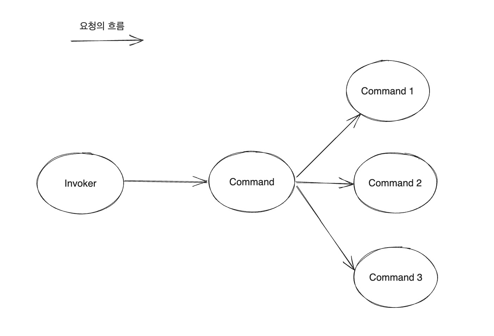

**:white_check_mark: ChatGPT 요약**   

<!-- truncate -->
<br></br>


## Command Pattern은 무엇인가?
---
> Command Pattern은 요청 내역을 객체로 캡슐화 한다.   
> 다양한 요청을 캡슐화된 객체로 만들어 매개변수로 넘긴다.  
> 이러한 구조는 요청하는 쪽과 작업을 처리하는 쪽을 분리할 수 있다는 장점을 가진다.  

Command Pattern은 요청 객체와 수행 객체를 분리할 때 사용한다. 두 객체를 분리하면 어떤 장점이 생길까? 
<br></br>


Command Pattern에는 Client를 제외하고 4가지 역할이 존재한다.  
1. **Invoker**: setCommand()로 사용할 Command들을 설정하고 Client가 특정 Command의 execute()를 호출할 수 있는 기능을 제공한다.  
2. **Command**: 여러 종류의 Command 구현체의 공통 인터페이스이다.   
3. **ConcreteCommand**: Command의 구현체로 execute() 수행 시 실제 Receiver를 동작시킨다.   
4. **Receiver**: 실제 요청을 수행하는 객체이다.   
<br></br>


앞서 Command Pattern의 장점은 요청하는 쪽(Invoker)과 수행하는 쪽(ConcreteCommand, Receiver)이 분리된다. 
이 구조에서 변경과 확장이 일어날 수 있는 부분은 수행하는 쪽(ConcreteCommand, Receiver)일 것이다. 
하지만 Command라는 인터페이스를 통해 DIP를 만족하기 때문에 요청부는 수행부의 변경 및 확장에 영향을 받지 않는다.
<br></br>

### 코드로 알아보는 Decorator Pattern

#### (1) Invoker
```java
/**
 * Invoker: Command가 포함되어 있으며 execute()를 사용해 Command 객체에게 작업을 요청하게 된다.
 */
public class SimpleRemoteControl {
    private Command onCommand;
    private Command offCommand;

    public void setCommand(Command onCommand, Command offCommand) {
        this.onCommand = onCommand; // 배열에 값 할당
        this.offCommand = offCommand; // 배열에 값 할당
    }

    public void onButtonWasPushed(int slot) {
        if (onCommand != null) {
            onCommand.execute();
        }
    }

    public void offButtonWasPushed() {
        if (offCommand != null) {
            offCommand.execute();
        }
    }
}
```
코드 예시에서 Invoker는 리모콘이다. Invoker는 내부 필드로 2개의 Command를 가지고 이 필드를 설정하고 사용할 수 있는 메서드들을 제공한다. 
Client에서 Invoker를 사용하려면 원하는 ConcreteCommand를 설정하고 사용해야 한다.
<br></br>

#### (2) Command
```java
/**
 * Command: 모든 ConcreteCommand가 구현해야 하는 인터페이스
 */
public interface Command {
    /**
     * Receiver에 특정 작업을 처리하라는 지시를 전달한다.
     */
    void execute();
}
```
모든 ConcreteCommand가 구현해야 하는 인터페이스이다. Command 덕분에 Command Pattern은 DIP를 만족할 수 있다. 
Invoker는 내부 필드로 Command를 가지고 있기 때문에 다양한 요청을 처리할 수 있게 된다.
<br></br>

#### (3) Receiver
```
/**
 * Receiver : 실제 작업을 수행하는 객체
 */
public class Light {

    public void on() {
        System.out.println("조명이 켜졌습니다!");
    }

    public void off() {
        System.out.println("조명이 꺼졌습니다.");
    }
}
```
실제 작업이 수행되는 객체로 Command 구현체의 execute()가 실행되면 연쇄적으로 Receiver가 특정 동작을 하게 된다.
<br></br>

#### (4) ConcreteCommand
```java
/**
 * ConcreteCommand: 특정 행동과 Receiver를 연결해주는 역할을 한다.
 */
public class LightOffCommand implements Command {
    private final Light light;

    public LightOffCommand(Light light) {
        this.light = light;
    }


    @Override
    public void execute() {
        light.off();
    }
}

public class LightOnCommand implements Command {
    private final Light light;

    public LightOnCommand(Light light) {
        this.light = light;
    }


    @Override
    public void execute() {
        light.on();
    }
}
```
ConcreteCommand는 Command의 구현체로 execute() 메서드를 구현한다. 
구현 과정에서 각 요청에 알맞은 Receiver의 동작을 정의하게 된다.
<br></br>

## Command Pattern과 Queue

현재 요청의 흐름을 보면 위 흐름도와 같다. 이전 예시에서는 Invoker에서 미리 ConcreteCommand를 Command 타입으로 가지고 있고 해당 Command만 사용했다. 
반면 Runnable이나 Callable 형태로 Client에서 요청을 정의해 Invoker로 넘겨 처리하도록 할 수도 있다. 어떤 형식으로든 요청은 Invoker를 거쳐서 수행된다. 
<br></br>


때문에 위 흐름도 속 특정 구간에 작업 Queue를 두고 작업을 저장해두고 Command 처리량을 제한할 수도 있고, 작업의 순서를 만들 수도 있다. 
이러한 특성 덕분에 Command Pattern은 스레드 풀, 작업 큐와 같은 다양한 작업에 적용될 수 있다.

## Command Pattern 실제 사용 예시: TaskExecutor
```java
@FunctionalInterface
public interface TaskExecutor extends Executor {
    void execute(Runnable task);
}

public class SyncTaskExecutor implements TaskExecutor, Serializable {
    public SyncTaskExecutor() {
    }

    public void execute(Runnable task) {
        Assert.notNull(task, "Runnable must not be null");
        task.run();
    }
}
```
Command Pattern의 실제 사용 예시로 TaskExecutor를 들 수 있다. TaskExecutor는 Spring Framework에서 비동기 작업을 실행할 수 있게 해주는 인터페이스이고 여러 구현체가 존재한다. 
가장 간단한 구현체로 SyncTaskExecutor가 있는데 별도의 Thread Pool을 가지고 있지 않고 메서드르 호출한 스레드로 매개변수로 넘어온 task를 처리한다. (Spring Batch의 Default TaskExecutor이다.) 
요청을 매개변수로 받아 실행한다는 점에서 Invoker에 해당한다.
<br></br>

```java
@FunctionalInterface
public interface Runnable {
    /**
     * Runs this operation.
     */
    void run();
}
```
Invoker의 Parameter로 넘어가는 Runnable은 Command이고 Runnable의 구현체가 ConcreteCommand이다. 
이전 예시와 조금 다른 점은 정의된 Command를 사용해도 되지만 매 요청마다 Runnable을 구현해서 매개변수로 넘길 수 있다. 
또한 요청 처리를 담당하는 Receiver 객체는 존재할 수도, 존재하지 않을 수도 있다.

## 정리
Command Pattern을 처음 접했을 때는 낯설었지만 생각보다 친숙한 패턴이었다. 특히 TaskExecutor 예시를 확인하고 나니 오래 기억에 남을 것 같다.


