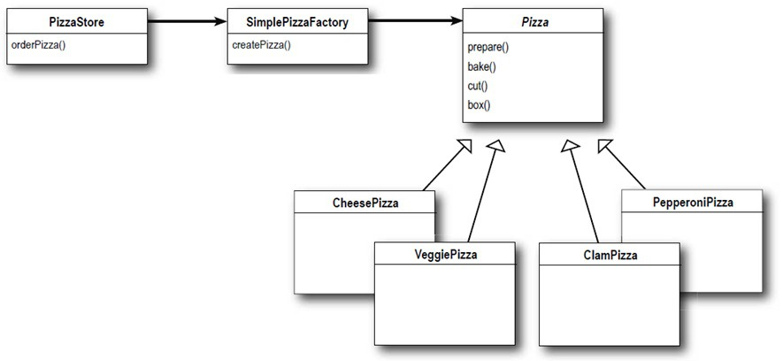
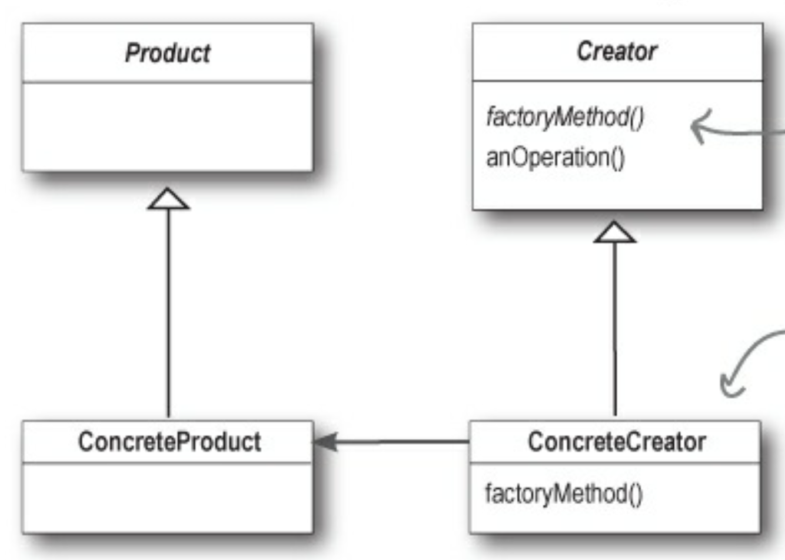
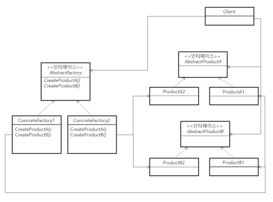
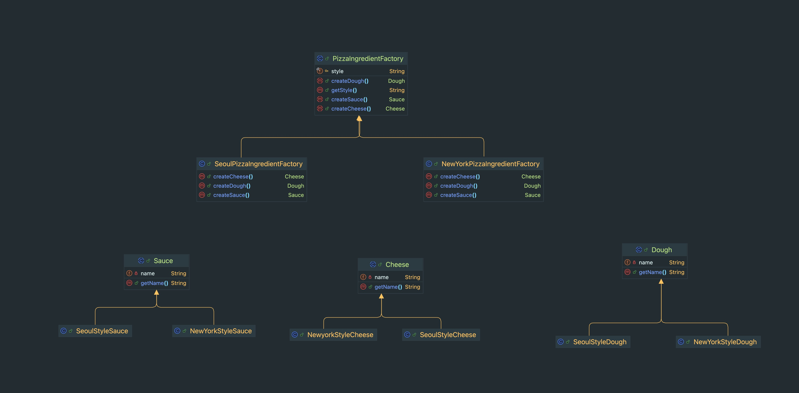

**:white_check_mark: ChatGPT 요약**   
이 글은 Factory Pattern의 정의와 그 다양한 방식들에 대해 설명합니다. 기본적으로 Factory Pattern은 클래스 인스턴스를 생성하는 책임을 전담하는 인터페이스를 두어, 클라이언트가 구체적인 구현체에 의존하지 않도록 하는 디자인 패턴입니다. 이를 통해 코드의 변경 없이 다양한 구현체를 사용할 수 있게 됩니다.
<!-- truncate -->
<br></br>

## Factory Pattern은 무엇인가?
--- 
```java
public class PizzaStore {

    public Pizza orderPizza(String region, String type) {
        Pizza pizza = createPizza(region, type);

        pizza.prepare();
        pizza.bake();
        pizza.cut();
        pizza.packaging();

        return pizza;
    }

    private Pizza createPizza(String region, String type) {
        if (region.equals("SEOUL")) {
            if (type.equals("CHEESE")) {
                // return a Seoul style cheese pizza
            }

            if (type.equals("BASIC")) {
                // return a Seoul style basic pizza
            }
        }

        if (region.equals("NEWYORK")) {
            if (type.equals("CHEESE")) {
                // return a New York style cheese pizza
            }

            if (type.equals("BASIC")) {
                // return a New York style basic pizza
            }
        }

        throw new IllegalArgumentException("Invalid region or type: " + region + ", " + type);
    }
}
```
orderPizza(...) 메서드는 지역과 피자 타입을 받아 적절한 피자를 반환해주는 메서드이다.
orderPizza는 Pizza 인터페이스에 의존하기 때문에 Pizza 구현체의 변경 및 확장에도 코드 변경이 필요 없다. 하지만 createPizza(...)는 다르다.
new 키워드를 통해 Pizza 인터페이스의 구현체에 의존하기 때문에 구현체의 변경 및 확장 시에 코드 변경이 불가피하다.
이 정도 수준에서는 그냥 사용할 수 있다고 생각한다. 하지만 피자 종류가 계속해서 증가한다면? createPizza(...) 메서드는 계속해서 변경이 필요하고 더 많은 구현체에 의존하게 될 것이다.
이런 상황에서 고려할 수 있는 패턴이 `팩토리 패턴이다.`
<br></br>

> Factory Pattern은 클래스 인스턴스를 만드는 일을 전담하는 인터페이스(Factory)를 두어 Client가 구현체에 의존하지 않도록 만드는 방식이다. 
> 즉, 객체 생성을 캡슐화해서 결합을 느슨하게 만들고, 특정 구현에 덜 의존하도록 만들 수 있다. (+ 객체 변경 및 확장에 따른 변경 지점 통일)

팩토리 패턴에는 아래와 같은 3가지 방식이 존재한다.
- Simple Factory Pattern (사실 이 방식을 디자인 패턴이 아니라고 한다.)
- Factory Method Pattern
- Abstract Factory Pattern  

이 방식들을 순서대로 알아보도록 하자.
<br></br>


### (1) Simple Factory Pattern

가장 간단한 방식으로 사실은 디자인 패턴도 아니라는 Simple Factory Pattern은 단순히 구현체를 생산하는 역할을 책임지는 Factory 객체를 만드는 방식이다. 
현재 예시에서는 PizzaStore의 createPazza(...) 메서드가 Pizza 구현체를 만들어주는 역할을 한다. 이 책임을 PizzaStore에서 분리하고 새로운 Factory 객체를 만들어보자.
<br></br>
```java
public class PizzaFactory {
    public Pizza createPizza(String region, String type) {
        if (region.equals("SEOUL")) {
            if (type.equals("CHEESE")) {
                // return a Seoul style cheese pizza
            }

            if (type.equals("BASIC")) {
                // return a Seoul style basic pizza
            }
        }

        if (region.equals("NEWYORK")) {
            if (type.equals("CHEESE")) {
                // return a New York style cheese pizza
            }

            if (type.equals("BASIC")) {
                // return a New York style basic pizza
            }
        }

        throw new IllegalArgumentException("Invalid region or type: " + region + ", " + type);
    }
}
```
PizzaStore의 createPizza를 복붙하면 PizzaFactory를 만들 수 있다. PizzaFactory를 만들면 더이상 PizzaStore에서는 Pizza의 구현체를 몰라도 무방하다.
<br></br>

```java
public class PizzaStore {
    private final PizzaFactory pizzaFactory = new PizzaFactory();

    public Pizza orderPizza(String region, String type) {
        Pizza pizza = pizzaFactory.createPizza(region, type);

        pizza.prepare();
        pizza.bake();
        pizza.cut();
        pizza.packaging();

        return pizza;
    }
}
```
이제 PizzaStore에서는 추상체인 Pizza에만 의존하고 그 구현체가 무엇인지에 영향을 받지 않는다. 
만약 PizzaStore의 종류가 여럿인 상태에서 Pizza의 구현체가 추가된다면 PizzaFactory 한 곳만 수정하면 된다는 이점이 생긴다.
<br></br>


현재 구조를 도식화 하면 위 그림과 같다. PizzaStore는 더이상 클래스 인스턴스를 생산하지 않고 Pizza 구현체에 의존하지 않는다.
<br></br>

### (2) Factory Method Pattern
Simple Factory Pattern을 적용하는 과정에서 PizzaStore와 Pizza를 만드는 로직은 분리가 됐다. 장점이 있지만 아쉬운 부분도 존재한다.
만약 여러 개의 PizzaStore가 생겨나고 각 PizzaStore 별로 PizzaFactory가 생겨야 한다면 Store와 Factory가 함께 늘어나며 관리할 객체들도 늘어나게 된다. 
그렇다면 Simple Factory Pattern처럼 Store가 구체적인 Pizza 구현체에 의존하지 않으면서 Store객체 내에서 Pizza를 생산해 Store객체와 Factory 객체가 동시에 늘어나는 상황을 막을 수는 없을까?
<br></br>

```java
public abstract class PizzaStore {
    public Pizza orderPizza(PizzaType type) {
        Pizza pizza = createPizza(type);

        pizza.prepare();
        pizza.bake();
        pizza.cut();
        pizza.packaging();

        return pizza;
    };

    protected abstract Pizza createPizza(PizzaType type);
}
```
Factory Method Pattern을 사용하면 가능한다. 
Store 추상 클래스를 두고 추상 클래스에는 Pizza를 주문하는 책임만 부여한다.
<br></br>

```java
public class NewYorkPizzaStore extends PizzaStore {
    @Override
    protected Pizza createPizza(PizzaType type) {
        return switch (type) {
            case CHEESE -> new CheesePizza();
            case BASIC -> new BasicPizza();
        };
    }
}

public class SeoulPizzaStore extends PizzaStore {
    @Override
    protected Pizza createPizza(PizzaType type) {
        return switch (type) {
            case CHEESE -> new CheesePizza();
            case BASIC -> new BasicPizza();
        };
    }
}
```
Store 추상 클래스의 구현체에서 createPizza(...)를 구현하여 클래스 인스턴스 생성의 책임을 전담하게 된다.
<br></br>


이 관계를 도식화하면 위 그림과 같다. 기존에 Factory 클래스가 전담하던 역할을 Creator 추상 클래스의 추상 메서드로 정의하고, 구현체에서 이 책임을 전담하는 것이다. 
이렇게 되면 Client 측에서는 Creator만 사용하기 때문에 ConcreteCreator 사용법을 몰라도 되고 클래스 인스턴스 생성을 담당하는 Factory 클래스를 만들지 않아도 된다.
- Creator(Store 추상 클래스)
- ConcreteCreator(Store 구현체)
- Product(Pizza)
- ConcreteProduce(CheesePizza, BasicPizza)

### (3) Abstract Factory Pattern
```java
public abstract class Pizza {
    protected String name;
    protected final Dough dough;
    protected final Sauce sauce;

    protected Pizza(Dough dough, Sauce sauce) {
        this.dough = dough;
        this.sauce = sauce;
    }

    public abstract void prepare();

    public void bake() {
        System.out.println("175도에서 25분 간 굽는 중...");
    }

    public void cut() {
        System.out.println("피자를 조각내는 중입니다...");
    }

    public void packaging() {
        System.out.println("포장 중입니다...");
    }
}
```
또 다른 Factory Pattern을 알아보기 위해 Pizza 클래스를 살펴본다. Pizza 클래스를 살펴보면 공통적으로 Dough, Sauce가 존재한다. 
또한 Pizza의 구현체에서 개별적으로 필요한 재료들도 필드로 가지고 있게 된다. 예를 들면 CheesePizza는 별도의 Cheese 필드를 가지고 있다. 
만약 어떤 Store인지에 따라 재료가 달라진다면? 구체적인 (재료) 인스턴스 클래스를 생산하는 역할의 Factory Pattern을 생각할 수 있다.
<br></br>

  
Abstract Factory Pattern과 Method Factory Pattern은 유사하지만 다르다. 
둘의 차이는 인스턴스 클래스를 생산하는 Factory의 역할을 Abstract Class 단위로 부여할 것인가, Method 단위로 부여할 것인가의 차이로 이해했다.
또한 두 Factory를 이용하는 방식도 다른데, Factory Method Pattern은 상속을 통해 구현된 Method로 Factory 기능을 제공하는 반면 Abstract Factory Pattern은 Factory 클래스를 구성(Composite)하여 사용한다.
때문에 유사한 유형의 클래스들을 한 곳에서 생산하고 싶다면 Abstract Factory Pattern을 적용하면 된다. 지금 예시처럼 Dough, Sauce, Cheese 클래스를 생산해야 하는 상황이 그 예시이다.
<br></br>


Abstract Factory Pattern을 활용해 Pizza 재료를 생산하는 클래스를 만들면 위와 같다. 
방식은 Factory Method Pattern와 동일하지만 Abstract Factory Pattern는 더 많은 종류의 클래스를 생산하고 Factory가 클래스 단위인 것을 확인할 수 있다.
<br></br>

```java
public class NewYorkPizzaStore extends PizzaStore {
    private final PizzaIngredientFactory ingredientFactory = new NewYorkPizzaIngredientFactory();
    @Override
    protected Pizza createPizza(PizzaType type) {
        return switch (type) {
            case CHEESE -> new CheesePizza(ingredientFactory);
            case BASIC -> new BasicPizza(ingredientFactory);
        };
    }
}

public class CheesePizza extends Pizza {
    private final Cheese cheese;
    public CheesePizza(PizzaIngredientFactory ingredientFactory) {
        super(ingredientFactory.createDough(), ingredientFactory.createSauce());
        this.name =  "%s 꼬소한 치즈 피자".formatted(ingredientFactory.getStyle());
        this.cheese = ingredientFactory.createCheese();
    }

    @Override
    public void prepare() {
        System.out.println(name + ": 피자를 준비 중입니다...");
        System.out.println(dough.getName() + ": 도우를 돌리고...");
        System.out.println(sauce.getName() + ": 소스를 뿌리고...");
        System.out.println(cheese.getName() + ": 치즈 피자에는 치즈를 뿌려야죠...");
    }
}
```
이제 각 PizzaStore 구현체에서는 원하는 PizzaIngredientFactory를 구성(Composite)하여 피자를 생산할 수 있다. 
또한 CheesePizza 클래스를 보면 Pizza 재료의 구현체에는 전혀 영향을 받지 않는 것을 확인할 수 있다.

## Factory Pattern 실제 사용 예시: BeanFactory
---
```java
public interface BeanFactory {
    String FACTORY_BEAN_PREFIX = "&";

    Object getBean(String name) throws BeansException;

    <T> T getBean(String name, Class<T> requiredType) throws BeansException;

    Object getBean(String name, Object... args) throws BeansException;

    <T> T getBean(Class<T> requiredType) throws BeansException;

    <T> T getBean(Class<T> requiredType, Object... args) throws BeansException;

    <T> ObjectProvider<T> getBeanProvider(Class<T> requiredType);

    <T> ObjectProvider<T> getBeanProvider(ResolvableType requiredType);

    boolean containsBean(String name);

    boolean isSingleton(String name) throws NoSuchBeanDefinitionException;

    boolean isPrototype(String name) throws NoSuchBeanDefinitionException;

    boolean isTypeMatch(String name, ResolvableType typeToMatch) throws NoSuchBeanDefinitionException;

    boolean isTypeMatch(String name, Class<?> typeToMatch) throws NoSuchBeanDefinitionException;

    @Nullable
    Class<?> getType(String name) throws NoSuchBeanDefinitionException;

    @Nullable
    Class<?> getType(String name, boolean allowFactoryBeanInit) throws NoSuchBeanDefinitionException;

    String[] getAliases(String name);
}
```
Spring Framework의 BeanFactory는 Bean 생성 및 조회 역할을 전담하는 Factory 인터페이스이다.
<br></br>


인터페이스에 정의된 메서드를 구현한 객체는 3가지를 찾아볼 수 있었는데 Bean을 찾아 사용해야 하는 Client 객체에서는 BeanFactory에만 의존하여 Bean 생성 및 조회가 가능하다.

## 정리
---
Factory란 단어는 평소 Spring Framework 내에서 쉽게 접할 수 있던 네이밍이다. 네이밍에 Factory가 들어갔다는 건 Factory 패턴이 적용되었다는 의미일 것이고 그만큼 자주 사용되는 패턴이라 생각한다. 
특정 인스턴스를 생성하는 과정이 복잡해지고 있다면 고려해보면 좋을 것 같다.