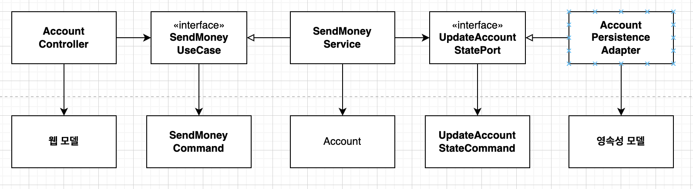

## 경계 간 매핑하기
- 매핑에 찬성하는 개발자
  - 다른 계층 간에 모델을 공유한다는 건 두 계층이 강하게 결합된다는 뜻!
- 매핑에 반대하는 개발자
  - 계층 간 매핑은 보일러플레이트 코드를 많이 만들게 된다.
  - 대부분 CRUD만 수행하기에 계층 사이의 매핑은 과하다.

### 1. 매핑하지 않기 전략
- 웹 계층과 영속성 계층 모두 도메인 모델에 접근하는 방식
- 도메인 모델에 웹/영속성 계층을 위한 코드가 추가될 수 있다.
  - 예시: JSON 직열화를 위한 애너테이션, DB 매핑을 위한 애너테이션
- 웹, 애플리케이션, 영속성 계층과 관련된 이유로 변경되어야 하기 때문에  `단일 책임 원칙`을 위반한다.
- 하지만 모든 계층이 같은 구조를 가지거나 간단한 CRUD일 경우 매핑하지 않기 전략은 완벽한 선택지일 수 있다.

### 2. 양방향 매핑 전략
- 각 계층이 전용 모델을 가지는 전략
- 각 계층의 전용 모델을 변경하더라도 다른 계층에는 영향이 없다
- 각 계층의 모델이 자신의 계층 관심사에만 집중하기 때문에 `단일 책임 원칙`을 따른다.
- 단, 보일러 플레이트 코드 생산된다는 점과 도메인 모델이 계층 경계를 넘어 통신하는데 사용된다는 점이 단점이다.
- 또한 개발을 더디게 만든다는 점도 고려해야 한다.

### 3. 완전 매핑 전략

- 각 연산마다 별도의 입출력 모델을 사용함
- 당연히 매핑에 필요한 코드는 늘어나지만 여러 유스 케이스의 요구사항을 함께 다뤄야 하는 매핑에 비해 구현과 유지보수가 훨씬 쉽다(UseCase별로 모델이 생성되니)
- 전역 패턴 보다는 웹 계층과 애플리케이션 계층 사이에서 상태 변경 유스케이스의 경계를 명확히할 때 빛을 발한다.
- 어떤 경우에는 입력 모델에 대해서만 매핑하고 출력 모델은 도메인 모델을 사용하는 것도 고려해볼 수 있다.

### 4. 단방향 매핑 전략

- 모든 계층의 모델들이 같은 인터페이스를 구현한다.
- 매핑 없이 도메인 객체 전달이 가능하며 전달 받은 계층에서 인터페이스를 이용할지 전용 모델로 매핑해야 할지 결정할 수 있다.
- 계층 간의 모델이 비슷할 때 가장 효과적이다.

### 5. 결론
- 만능 매핑 전략은 없다. 언제나 상황에 맞게.