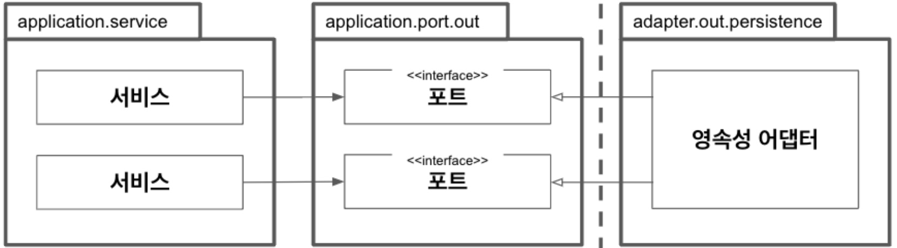

## 영속성 어댑터 구현하기

### 1. 의존성 역전

- 영속성 어뎁터는 주도되는(Out) 포트이다.
- Service 계층은 더이상 영속성 계층을 의존하지 않는다.
- 포트의 계약을 만족하는 한 코어에 영향을 미치지 않으면서 영속성 코드를 마음껏 수정할 수 있게 된다.

### 2. 영속성 어댑터의 책임
```
1. 입력을 받는다
2. 입력을 데이터베이스 포맷으로 매핑한다
3. 입력을 데이터베이스로 보낸다
4. 데이터베이스 출력을 애플리케이션 포맷으로 매핑한다
5. 출력을 반환한다
```
- 현 구조에서는 입력 모델을 DB 모델로 변환해야 하는데, 이 과정이 불필요하다고 느낀다면 매핑하지 않는 전략을 고민해볼 필요가 있다 (8장)
- 중요한 점은 입/출력 모델이 영속성 계층에 없고 Core에 존재하기에 Core는 영속성 계층의 기술 변화에 영향을 받지 않는다.

### 3. 포트 인터페이스/영속성 어댑터 나누기
- 포트 인터페이스를 정의할 때는 인터페이스 분리 원칙(ISP)을 생각하는 것을 권장한다.
  - 이렇게 설계된 App에서는 Service가 꼭 필요한 메서드에만 의존하게 된다.
- 하나의 영속성 어댑터가 여러 포트 인터페이스를 구현해도 된다.
- 즉, 포트 인터페이스는 최대한 분리하고 영속성 어댑터는 도메인 경계에 따라 분리가 가능해진다.

### 4. 트랜잭션은 어떻게 해야할까
- 대개 @Transactional을 사용할 것이다.
- 하지만 Core 계층에 @Transactional을 사용하지 않고 싶다면 AspectJ와 같은 도구를 사용해 트랜잭션 경계를 구분할 수 있다고 한다.