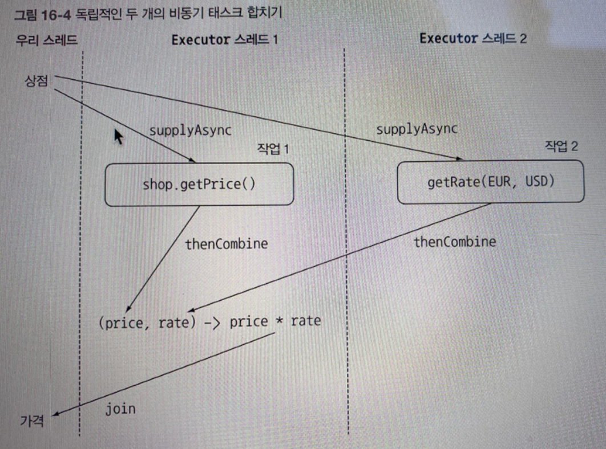

## 1. Future의 단순 활용
### Future란?
```java
public class Test {

    private static long TWO_SEC = 2000;
    private static long FIVE_SEC = 5000;

    public static void main(String[] args) throws InterruptedException {
        ExecutorService executor = Executors.newCachedThreadPool();

        // 시간이 오래 걸리는 로직 다른 스레드에서 비동기로 실행
        Future<Integer> future = executor.submit(new Callable<Integer>(){
            @Override
            public Integer call() throws Exception {
                Thread.sleep(TWO_SEC);
                return 1;
            }
        });

        //
        Thread.sleep(FIVE_SEC);
        Integer result = 5;

        try {
            // 비동기 작업 반환 값 가져오기
            // Main Thread가 영원히 block되지 않도록 Timeout은 설정하는 것이 좋다...
            result += future.get(2, TimeUnit.SECONDS);
        } catch (ExecutionException ee) {
            System.out.println(ee);
        } catch (InterruptedException ie) {
            System.out.println(ie);
        } catch (TimeoutException te)  {
            System.out.println(te);
        } catch (Exception ex) {
            System.out.println(ex);
        }


        System.out.println(result);
        // 6이 출력

        return;
    }
}
```
- 미래 어느 시점에 결과를 얻는 모델 
- 작업을 설정하고 Thread를 할당해주면 비동기로 작업이 수행된다.
- 이후 원하는 시점에 get()을 통해 결과 값을 받아올 수 있다.

### Future의 한계
- Future는 아래와 같은 상황을 간결하게 구현하기에 무리가 있다.
  - Future A의 결과를 Future B로 전달
  - Future A 결과와 Future B의 결과 조합

### 동기 / 비동기 API
- 동기 API
  - 메서드 호출 이후 반환을 기다리고, 값을 받은 후 다음 메서드가 수행된다. (다른 Thread를 이용했더라도 순서가 유지됨)
  - 이를 블록 호출이라고 한다.
- 비동기 API
  - 메서드가 즉시 반환되며, 끝내지 못한 나머지 작업을 다른 스레드에 할당한다
  - 나머지 작업은 콜백 메서드를 호출해서 전달하거나, 호출자가 계산 결과를 기다리는 메서드를 추가로 호출하여 전달된다.
  - 이를 비블록 호출이라고 한다

### 비동기 API 구현 (예시를 통한 설명)
```java
public class Shop {
    public double getPrice(String product) {
        return calculatePrice(product);
    }

    private double calculatePrice(String product) {
        delay();
        return new Random().nextDouble() * product.charAt(0) + product.charAt(1);
    }

    private void delay() {
        try {
            Thread.sleep(1000L);
        } catch (InterruptedException e) {
            throw new RuntimeException(e);
        }
    }
}
```
- getPrice를 통해 가격을 구하는 메서드를 비동기로 만들 예정
- 계산을 구현하기 어려우니 sleep()으로 대체...

#### 1. 동기 메서드를 비동기 메서드로 변환
```java
public Future<Double> getPriceAsync(String product) {
    CompletableFuture<Double> futurePrice = new CompletableFuture<>();

    new Thread( () -> {
        double price = calculatePrice(product);
        futurePrice.complete(price);
    }).start();

    return futurePrice; // 계산 완료를 기다리지 않고 Future 반환
}
```
1. 비동기 메서드로 변환하기 위해서 메서드 명부터 바꿔야 한다. getPrice -> getPriceAsync
2. 반환값도 바꿔야 한다. double -> Future<Double>
   - Future는 결과값의 핸들일 뿐
   - 계산이 완료되면 get()을 통해 결과를 얻을 수 있다.

#### 2. 비동기 에러 처리 방법
- 가격을 계산하다가(calculatePrice) 에러가 발생하면 해당 Thread에만 영향을 미친다.
- 즉, Client는 get 메서드 반환을 영원히 기다릴 수도 있다.
- 해결책
  - get 메서드에 Timeout 설정
  - completeExceptionally()를 이용해 발생 예외를 Client에 전달

```java
  public Future<Double> getPriceAsyncWithError(String product) {
        CompletableFuture<Double> futurePrice = new CompletableFuture<>();

        new Thread( () -> {
            try {
                double price = calculatePrice(product);
                futurePrice.complete(price);
            } catch(Exception ex) {
                futurePrice.completeExceptionally(ex);
            }
        }).start();

        return futurePrice;
    }
```
```java
public Future<Double> getPriceAsyncWithError(String product) {
    return CompletableFuture.supplyAsync(() -> calculatePrice(product));
}
```
- 위 2가지 방법은 모두 동일하게 동작한다.

#### 3. 비블록 코드 만들기
```java
    public List<String> findPrices(String product) {
        return shops.stream()
                .map(shop -> String.format("%s price is %.2f", shop.toString(), shop.getPrice(product)))
                .collect(Collectors.toList());
    }

    public List<String> findPricesWithParallel(String product) {
        return shops.parallelStream()
                .map(shop -> String.format("%s price is %.2f", shop.toString(), shop.getPrice(product)))
                .collect(Collectors.toList());
    }

    public List<CompletableFuture<String>> findPricesWithCompleteFuture(String product) {
        return shops.parallelStream()
                .map(shop -> CompletableFuture.supplyAsync(()
                        -> String.format("%s price is %.2f", shop.toString(), shop.getPrice(product))))
                .collect(Collectors.toList())
    }
```
- 모든 상점을 돌며 특정 제품의 가격을 가져오는 로직이 있다고 가정할 때 3가지 구현 방법이 있다.
  - 단순 for문
  - 병렬 스트림
  - CompletableFuture로 비동기 호출

```java
public List<String> findPricesWithCompleteFuture2(String product) {
    List<CompletableFuture<String>> priceFutures = shops.stream()
                    .map(shop -> CompletableFuture.supplyAsync(()
                            -> String.format("%s price is %.2f", shop.toString(), getPrice(product))))
                    .collect(Collectors.toList());
            
    return priceFutures.stream()
                    .map(CompletableFuture::join)
                    .collect(Collectors.toList());
}
```

- CompletableFuture의 경우 반환 타입이 List<CompletableFuture<String>>이다.
- 때문에 모든 동작이 완료된 후에 List<String>을 반환해야 한다.
- 모든 비동기 동작이 끝나길 기다리고 List<String> 타입을 반환하도록
- 스트림 파이프라인을 2개로 가져갔는데, 1개로 가져갈 경우 비동기 처리의 의미가 없어진다.
  - (1) 1번 상점에서 가격 구하기 -> join()
  - (2) 2번 상정에서 가격 구하기 -> join() ...

#### 4. 더 좋은 해결 방법: CustomExecutor
- Thread를 4개 이용하고 있다고 가정했을 때 2번(병렬 스트림)과 3번(CompletableFuture) 구현 방법은 크게 차이가 없다.
- 그럼에도 불구하고 CompletableFuture를 선택할 이유가 있다면 바로 Executor를 지정할 수 있다는 점이다.
##### (1) Thread 수 정하기
`N = Runtime.getRunetime().availableProcessors() * CPU 활용 비율 (0 ~ 1 사이 값) * (1 + 대기 시간/계산 시간)`
- 위 공식을 이용하면 된다. 하지만 추가로 고려할 것은 필요한 Thread 수이다.
- 위 로직에서 상점 수가 5개라면 200개의 Thread는 낭비일 수 있다.
- 또한 Thread가 너무 많으면 서버가 다운될 수 있으니, 하나의 Executor에 100개 이하로 설정하는 것이 바람직하다.
```java
private final Executor executor = Executors.newFixedThreadPool(
            Math.min(SHOP_SIZE, 100),
            new ThreadFactory() {
                @Override
                public Thread newThread(@NotNull Runnable r) {
                    Thread t = new Thread(r);
                    t.setDaemon(true);
                    return t;
                }
            }
    );

// 사용부
public List<CompletableFuture<String>> findPricesWithCompleteFuture(String product) {
    return shops.parallelStream()
                 .map(shop -> CompletableFuture.supplyAsync(()
                           -> String.format("%s price is %.2f", shop.toString(), getPrice(product)),
                               executor))
                 .collect(Collectors.toList());
}
```
- 병렬 스트림,CompletableFuture 선택 시 참고사항
  1. I/O가 포함되지 않은 계산 중심의 동작에서는 병렬 Stream이 가장 간단하고 효율적일 수 있음.
     - 모든 스레드가 계산 작업을 수행하는 상황에서는 Process Core 수 이상의 스레드를 가질 필요가 없다,
  2. I/O를 기다리는 작업을 병렬로 실행할 때는 CompletableFuture가 더 많은 유연성을 제공함.

#### 5. 비동기 작업 파이프라인 만들기 (thenApply, thenCompose, thenCombine)
- 3개의 메서드는 모두 동기/비동기 버전이 존재한다.
- 상황에 맞게, Thread 전환 비용을 감수하면서까지 비동기로 처리할 이유가 있는지 고민하고 사용하면 된다.
##### thenApply
```java
CompletableFuture<Integer> future = 
    CompletableFuture.supplyAsync(() -> 1)
                     .thenApply(x -> x+1);
```
- 비동기 연산 결과 값에 추가적인 처리를 수행할 때 사용한다.
  - 이전 연산 이후에 동작함
- CompletableFuture<>의 값 타입을 바꿀 수도 있다.
- 동기적인 처리가 필요할 때 사용한다.

##### thenCompose
```java
CompletableFuture<Integer> future = 
    CompletableFuture.supplyAsync(() -> 1)
                     .thenCompose(x -> CompletableFuture.supplyAsync(() -> x+1));
```
- 비동기 연산 결과 값에 추가적인 처리를 수행할 때 사용한다.
  - 이전 연산 이후에 동작함
- 비동기적인 처리가 필요할 때 사용한다.

##### thenCombine

- 두 연산을 비동기로 처리하고, 2개의 결과값을 바탕으로 연산이 필요할 때 사용한다.
```java
var future = list.stream().map(item -> CompletableFuture.supplyAsync(
                () -> 1
        ).thenCombine(
                CompletableFuture.supplyAsync(() -> 2),
                (one, two) -> one+two))
                .toArray();
```
- 1을 반환하는 메서드와 2를 반환하는 메서드가 비동기로 처리된 이후, 두 값을 더해서 반환하는 연산이 수행된다.


#### 6. 타입아웃 효과적으로 사용하기
```java
var future = list.stream().map(item -> CompletableFuture.supplyAsync(
                () -> 1
        ).thenCombine(
                CompletableFuture.supplyAsync(() -> 2)
                        .completeOnTimeout(2, // timeout 시 반환 값
                                1, TimeUnit.SECONDS),
                (one, two) -> one+two)
                .orTimeout(3, TimeUnit.SECONDS)) // 3초 뒤, 작업이 완료되지 않으면 TimeoutException 반환
        .toArray();
```
- 위 예시를 보면 2가지 타임 아웃 전략 메서드를 확인할 수 있다.
  - orTimeout: 제한된 시간이 지나면 예외 발생
  - completeOnTimeout: 제한된 시간이 지나면 DEFAULT값 반환

#### 7. CompletableFuture의 종료에 대응하는 방법
##### 결과 소비하기: thenAccept(Async)
```java
CompletableFuture[] future =  list.stream().map(item -> CompletableFuture.supplyAsync(
                () -> Thread.currentThread().toString() + item.toString())
        .thenAccept(thread -> System.out.println(Thread.currentThread().toString() + "???" + thread)))
        .toArray(CompletableFuture[]::new);
```
- CompletableFuture의 생산 결과를 소비 방식을 지정한다.
- 생산 결과를 소비하는 메서드이기에 반환 객체는 CompletableFuture<Void>
- 결과를 확인해보면 supplyAsync와 thenAccept는 1개의 Thread에서 실행됨

##### 모든 작업 완료 기다리기: allOf()
```java
CompletableFuture.allOf(future).join();
```
- 위 작업에 이어서 작성된 코드이다.
- 모든 CompletableFuture의 작업 완료를 기다리려면 allOf()가 반환하는 CompletableFuture<Void> 객체에서 join()을 실행하면 된다.

##### 최초 작업 완료 기다리기: allOf()
```java
CompletableFuture.anyOf(future).join();
```
- 하나라도 CompletableFuture 작업이 완료됐을 때까지 기다리려면 anyOf를 사용하면 된다.
- anyOf는 Completable배열을 입력으로 받아 CompletableFuture<Object>를 반환 받는다.
  - 반환 객체가 처음으로 완료된 CompletableFuture