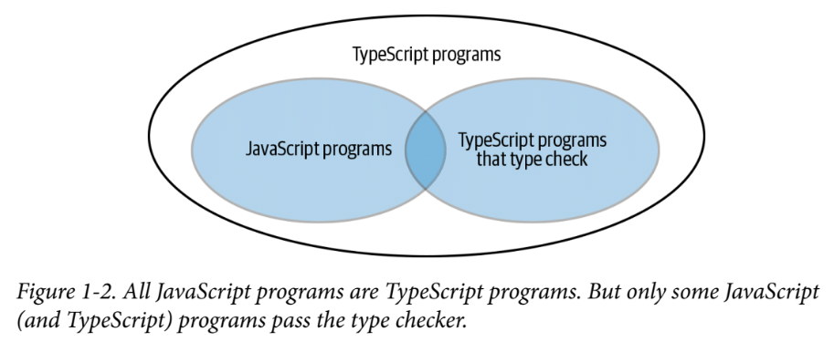

## Item 1: 타입스크립트와 자바스크립트의 관계 이해하기
### JS는 TS이다.

- typescript는 javascript의 상위 집합이다.
- 즉, .js 파일의 코드는 이미 타입스크립트인 것이다.
- 이러한 특성 덕분에 js를 ts로 바꿀 때 원하는 부분만 변환이 가능해진다.
- 또한 js파일은 ts 컴파일러의 도움을 받을 수도 있다. (타입 체크 기능)

### TS는 JS가 아니다.
```typescript
function greet(message: string) {
    console.log(message)
}
```
- TS는 JS의 상위 집합이기 때문에 TS이지만 JS가 아닌 프로그램 또한 존재한다. (위 코드 예시)
- 예를 들어 타입 구문을 사용하는 순간부터 타입스크립트만의 영역으로 들어가게 된다.

### TS 컴파일러 런타임 오류를 미리 잡아낼 수 있도록 돕는다 (JS파일도)
```typescript
// 예시 1
let message = 'hello';
message.toUppercase() // JS는 실행을 해봐야 오류가 있다는 것을 알 수 있다. (실제는 toUpperCase())

// 예시 2
const state = {name: 'Korea', capital: 'Seoul'};
console.log(state.capitol) // 오류를 찾기는 하지만 capital, capitol 중 무엇이 맞는 건지 알려주진 않는다.

// 예시 3 Type 구문 적용
interface State {
    name: string,
    capital: string,
}
const state: State = {name: 'Korea', capital: 'Seoul'};
console.log(state.capitol) // 이제는 이 라인에 오류가 있다는 것을 명확히 알려줌
```
- 위 JS파일을 TS 컴파일러로 돌리면 TS컴파일러의 타입 체커가 message의 초기값을 바탕으로 타입을 추론하여 toUppercase 메서드가 존재하지 않는다는 것을 알려준다. (예시 1)
- state object 내에 capitol속성이 없다는 것을 미리 알려준다. (예시 2)
- 위와 같이 TS를 적용하지 않은 JS파일도 TS 컴파일러의 도움을 받을 수 있다.
- 하지만 타입 구문을 추가하면 개발자의 의도를 더 명확히 할 수 있다.


### TS 컴파일러는 내가 원하는 방향으로 동작하지 않을 수도 있다.
```typescript
// 예시 1
const x = 2 + '3' // '23'

// 예시 2
const a = null + 7 // 7
const b = [] + 12 // 12

// 예시 3
cosnt array = ['a', 'b']
console.log(array[2].toUpperCase())
```
- 위 코드는 모두 JS에서 정상 동작하지만 TS 컴파일러는 (1)을 오류로 잡지 않고 (2)를 오류로 잡는다.
- (3)은 실행되지만 오류를 뱉는다.
- 이처럼 타입 스크립트를 사용할 경우 기존 JS 프로그램과 다른 방식으로 코드를 짜야할 수 있다.
- TS를 사용할 거라면 TS의 특성을 잘 이해하고, 나에게/팀에게 맞는지 고려가 필요할 것이다.


### 내 생각 정리
- TS를 사용하면 TS와 JS 파일 모두 런타임 이전에 오류를 잡아내기 용이해진다.
- 단, TS를 사용할 경우 기존 JS와 다른 방향으로 코드를 작성해야 하는 부분이 생기기 때문에 TS의 특성을 잘 이해하는 것이 중요해 보임.
