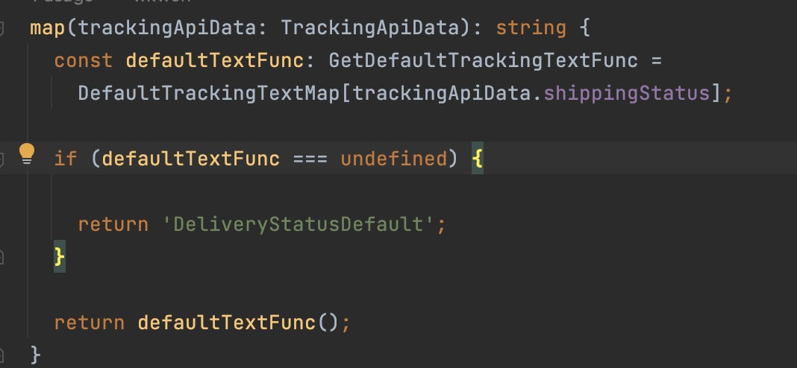

## Item 6: 편집기를 사용하여 타입 시스템 탐색하기
### 코드 위치에 따라 타입이 어떻게 추론되는지 파악해볼 것

- 조건문 내부와 외부에서 defaultTextFunc는 다른 타입을 가진다.
- 편집기에서는 미리 타입스크립트가 코드 위치에 따라 변수의 타입을 어떻게 추론하는지 알 수 있다.
- 이를 통해 타입 스크립트의 타입 추론 방식에 익숙해질 수 있다.
- 연산자 체인 중간의 추론된 제네릭 타입을 알고 싶다면 연산자의 예상 반환값을 확인해보면 된다.

### 정의로 이동하여 타입 스크립트에 포함된 타입 선언들을 확인할 것
- 타입 선언 파일을 찾아보다보면 타입스크립트가 동작을 어떻게 모델링하는지 알 수있다.

### 내 생각 정리
- 이번 Item은 편집기를 이용해 타입 스크립트와 가까워지는 방법을 말해준다.
- 개발을 하면서도 한번씩 타입이 어떻게 추론되었는지 확인해보는 습관을 가지면 좋을 것 같다.
- 또한 항상 정의로 이동하여 정의된 타입을 확인하는 습관을 가져보자.

## Item 7: 타입이 값들의 집합이라고 생각하기
```typescript
interface Identified {
    id: string
}
```
- Java에서 어떤 객체가 Identified 타입으로 할당되기 위해서는 Identified를 implements한 객체를 생성해야 한다.
- 하지만 타입스크립트에서 한 객체가 string으로 할당된 id속성을 가지면 모두 Identified가 될 수 있다.
- 이는 타입 스크립트에서 타입을 상속의 개념보다는 집합의 개념으로 봐야하는 이유이다.
- 타입 체크 기능을 집합이 다른 집합의 부분 집합인지 검사하는 기능으로 이해해도 좋다. (책에서 권장하고 개념도 맞아 떨어짐)

### Unit(Literal)과 Union
```typescript
type A = 'A' // A타입은 'A'만을 가질 수 있는 unit 타입이다.
type B = 'B' // B타입은 'B'만을 가질 수 있는 unit 타입이다.

type AB = A | B // AB타입은 'A' 또는 'B'를 가질 수 있는 Union 타입이다.
```
- Unit과 Union 타입은 집합 관계로 이해하기 명확하다.
- Unit은 원소이고 Union은 합집합을 뜻한다.
- 때문에 A, B의 합집합인 AB에는 A, B가 모두 포함되니 할당도 가능하다.

### Intersection
```typescript
interface Person {
    name: string
}

interface Lifespan {
    birth: Date;
    death?: Date;
}

type PersonSpan = Person & Lifespan
```
- Intersaction(&)은 교집합을 뜻한다.
- 즉, Person의 속성과 Lifespan의 속성을 모두 가진 객체는 PersonSpan 타입으로 할당이 가능하다.
- 당연히 더 많은 속성을 가져도 할당은 가능하다.

### keyof (예외)
```typescript
type Key1 = keyof(Person | Lifespan) // = (keyof A) & (keyof B) = never
type Key2 = keyof(Person & Lifespan) // = (keyof A) | (keyof B) = 'name' | 'birth' | 'death'
```
- 여기서 생각이 조금 꼬인다.
- 주석의 등식처럼 생각하는 것이 조금 더 낫다.

### extends 키워드
```typescript
interface Person {
    name: string
}

interface PersonSpan extends Person {
    birth: Date;
    death?: Date;
}
```
- extends 또한 잡힙 관계로 이해할 수 있다.
- 즉, PersonSpan은 Person의 부분 집합으로 이해하면 명료해 보인다.

```typescript
function getKey<K extends string>(val: any, key: K) {
    // ...
}
```
- extends는 제네릭 타입에서 한정자로도 쓰이는데, 이때도 똑같이 이해할 수 있다.
- K는 string의 부분 집합이어야 한다. (상속 개념으로 이해하면 이상하단 걸 바로 느낄 수 있음)

### 배열과 튜플
```typescript
const list = [1, 2]; // 타입은 number[]
const tuple: [number, number] = list // 오류 발생
```
- [number, number]는 number[]의 부분집합이지만 반대는 성립하지 않는다.
- 때문에 오류가 발생했고 타입을 현재 list와 tuple 반대로 가져간다면 오류는 발생하지 않는다.

```typescript
const triple: [number, number, number] = [1, 2, 3]; 
const double: [number, number] = triple // 오류 발생
```
- 이 경우 타입을 반대로 가져가도 성립하지 않는다.
- 튜플의 경우 타입 스크립트는 배열의 length를 기준으로 타입을 구별한다.


### 타입이 되지 못하는 값이 있다는 것을 기억해야 한다.
```typescript
type T = Exclude<string|Date. string|number> // T: Date
type nonZeroNumber = Exclude<number, 0> // nonZeroNumber: number
```
- 예를 들어 0을 제외한 numbers type을 구현할 수 없기 때문에 이를 강제할 방법이 없다.
- Exclude를 생각할 수 있지만 Exclude는 타입 스크립트 type일 경우에만 유효하다

### 내 생각 정리
- 구조적 타이핑이라는 특성을 고려했을 때 타입 스크립트의 타입 시스템은 상속, 할당 가능성 보다는 집합의 개념으로 이해하고 적용하는 게 적절할 것 같다.

## Item 8: 타입 공간과 값 공간의 심벌(식별자) 구분하기
```typescript
type Symbol1 = number
const Symbol2 = 2;
```
- Item 8에서 나오는 심벌은 식별자를 뜻하며 class, type, interface, const, let 뒤에 나오는 명을 나타낸다.

### 타입 공간과 값 공간
```typescript
interface T1 {
    attribute: string;
}

type T2 = {
    attribute: string;
}

const V1 = 1;

const V2: {attribute: string} = {attribute: 'value'}; // {attribute: string}은 타입 공간에 존재하는 반면 V2, {attribute: 'value'}는 값 공간에 존재하는 것이다.

```
- 위 코드 중 T1, T2는 타입 공간에, V1은 값 공간에 존재한다.
- 둘을 쉽게 구분하는 방법은 컴파일 이후 코드를 생각해보면 된다.
- 컴파일 과정에서 타입 공간의 코드들은 모두 제거되기 때문에 이후에도 존재하는 심볼은 값, 사라진 심볼은 타입으로 이해할 수 있다.


### typeof 메서드
```typescript
const person: {name: string} = {name: 'woosuk'};

type P1 = typeof person; // {name: string}

const P2 = typeof person; // object
```
- typeof는 값 공간과 타입 공간에서 다르게 동작한다.
- 타입 공간에서는 타입 스크립트 타입을 반환하는 반면 값 공간에서는 자바스크립트 런타임의 typeof 연산자가 된다.
- 자바스크립트 런타임 타입
  - string
  - number
  - boolean
  - undefined
  - object
  - function

### class와 typeof
```typescript
class Person {
    name: string;
}

const V1 = typeof Person; // V1 = 'function'

type T1 = typeof Person; // T1 - typeof Person, same as t

const person: T1 = {name: 'woosuk'} // 오류 발생, T1 = typeof Person
```
- 자바스크립트에서 class는 함수로 구현되기 때문에 값 공간에서 typeof Person은 'function'을 반환한다.
- 이해가 어려웠던 건 타입 공간에서 class의 typeof파트이다.
- Person을 반환할 것 같았지만 결과는 typeof Person을 반환한다.
- Person은 인스턴스가 아니라 new 키워드를 사용할 때 볼 수 있는 생성자 함수이다.
- 때문에 Person을 반환할 것 같지만 T1은 typeof Person이 설정된다.

```typescript
const person: Person = {name: 'woosuk'};

type T2 = typeof person;

type T3 = InstanceType<typeof Person>;
```
- typeof person은 인스턴스의 타입이기 때문에 쉽게 예상할 수 있는 반환값인 Person 타입을 반환한다.
- InstanceType을 활용하면 인스턴스를 생성하지 않고도 Person 클래스의 인스턴스 타입을 반환 받을 수 있다.


### 속성 접근자와 타입
```typescript
class Person {
  name: string;

  constructor(name: string) {
    this.name = name
  }
}

const person: Person = {name: 'woosuk'}

const personName: Person['name'] = person['name'];
console.log(personName) // 'woosuk'

const personName1: Person['name'] = person.name;
console.log(personName) // 'woosuk'

const personName2: Person.name = person.name; // 오류, Person.name 방식으로는 속성의 type에 접근 불가능
```
- 객체 속성에 접근하는 방식은 `.속성명` 또는 `[속성명]`
- 하지만 타입 속성(의 타입)에 접근할 때는 `[속성명]` 방식만 사용 가능하다.

### 구조 분해 할당에서 값과 타입 실수
```typescript
// (1) 기본 코드. option 객체를 매개변수로 받고 있었다.
function email(option: {person: Person, subject: string, body: string}) {
    
}

// (2) JS였다면 아래와 같이 구조 분해 할당이 가능하다.
function email({person, subject, body}) {

}

// (3) 하지만 TS에서 아래와 같이 구조 분해 할당을 받으려 하면 오류가 발생한다.
//     이유는 Person과 string을 값의 관점에서 해석되기 때문이다.
//     {person: Person, subject: string, body: string}을 값 객체로 인식해버림
function email({person: Person, subject: string, body: string}) {

}


// (4) TS에서 구조 분해 할당을 적용하려면 아래 코드처럼
function email({person, subject, body}:{person: Person, subject: string, body: string}) {

}
```


### 내 생각 정리
- 타입 스크립트 컴파일러의 기능 중 컴파일과 타입 체크 기능은 독립적으로 수행된다는 부분이 생각난다.
- 타입 공간은 컴파일과는 상관 없고 컴파일 결과물에서도 제거된다.
- 타입 스크립트의 이 원리의 연장선이라는 느낌이 든다. 값 공간은 컴파일과 관련된 영역, 타입 공간은 타입 체크와 관련된 영역.
- 둘을 구분해야 하는 건 어쩌면 당연한 얘기이고, 타입스크립트 개발을 하면 할수록 자연스럽게 익혀질 것 같다.

## Item 9: 타입 단언보다는 타입 선언을 사용하기
```typescript
interface Person {
    name: string;
}

const woosuk: Person = {name: 'woosuk'}; // 타입 선언
const minjung = {name: 'minjung'} as Person // 타입 단언

const wrongWoosuk: Person = {} // 오류 발생!
const wrongMinjung = {} as Person // 오류 발생하지 않음
```
- 타입 스크립트에서 타입을 지정하는 방식에는 위와 같이 2가지가 존재한다. (선언과 단언)
- wrongWoosuk은 Person interface를 만족하지 못하기 때문에 오류가 발생한다.
- wrongMinjung의 경우 타입 단언을 사용했기 때문에 타입 체커가 오류를 무시하여 오류가 발생하지 않는다.


### 타입 단언이 문제가 되는 예시들
```typescript
// 1. 잘못된 속성이 추가되어도 오류가 발생하지 않는다.
const woosuk: Person = {
    name: 'woosuk',
    age: 28  // Person interface는 age 속성을 가지지 않지만 오류가 발생하지 않는다.
} as Person;

// 2. 같은 맥락에서 화살표 함수에서도 오류를 발견해주지 못한다.
const people: Person[] = ['alice', 'bob'].map(
    name => ({} as Person)
); // 단언을 사용하면 오류가 발생하지 않는다.

const people2: Person[] = ['alice', 'bob'].map(name => {
    const person: Person = {name};
    return person;
}); // 타입 선언 사용 예시 1

const people3: Person[] = ['alice', 'bob'].map(
    (name): Person => ({name})
) // 타입 선언 사용 예시 1
```


### 타입 단언이 꼭 필요한 곳
1. 타입 스크립트가 알지 못하는 정보를 사용해야 할 때 단언문 사용이 필요하다. (예를 들면 DOM 타입 사용)
2. !을 사용하여 null이 아님을 단언할 수도 있다. (타입 체크 기능이기 때문에 런타임에는 동작하지 않는다.)

### 단언문을 통한 타입 변환
```typescript
const body = document.body; // HTMLElement | null 타입

const el = body as Person; // 서브 타입이 아니기 때문에 전환이 안 된다.
const el2 = body as HTMLElement; // 서브 타입이기 때문에 전환 가능

// 서브 타입이 아니라도 타입 전환을 할 수 있는 방법 (사용하지 않는 것이 좋아 보임..)
const el3 = body as unknown as Person;
```
- A가 B의 부분집합인 경우 단언문을 통해 타입 전환이 가능해진다.
- unknown은 모든 타입의 서브 타입이기 때문에 unknown을 활용하면 모든 타입을 전환이 가능하다.

### 내 생각 정리
- 기본적으로 타입 선언문을 사용하되 타입 스크립트가 알지 못하는 정보 혹은 null이 아니라고 정의하는 부분은 단언문을 사용할 것.
- 하지만 타입스크립트가 알지 못하는 내용도 타입으로 정의한 후에 사용하면 단언문을 쓰는 경우를 줄일 수 있을 것 같다.

## Item 10: 객체 래퍼 타입 피하기
- JS의 기본 자료형: string, number, boolean, symbol, bigint, null, undefined
- JS의 래퍼 자료형: String, Number, Boolean, Symbol, Bigint

### 기본 자료형은 메서드가 없다.
- string을 생각해보면 charAt()과 같은 메서드를 사용할 수 있어서 기본 자료형에도 메서드가 있다고 생각하기 쉽다.
- 하지만 실제로는 String에 메서드가 정의된 것이고, charAt을 사용하면 기본형 -> 래핑 자료형 -> 메서드 호출 -> 래핑 자료형 버림와 같은 과정을 거친다.

```typescript
x = "hello"
x.language = "English"
x.language // undefined
```
- 기본형 <-> 래핑형의 자유로운 변환은 이상한 결과를 만들기도 한다.
- x는 string이다.
- x에 속성을 추가하면 x -> String 객체로 변환 -> language 속성 추가 -> String 객체 버림 순서로 동작하여 x.language 값은 undefined가 된다.


### 래핑 자료형은 오직 자기 자신하고만 동일하다.
```typescript
"hello" === new String("hello") // false
new String("hello") === new String("hello") // false
```
- 이 특징은 직관적인 생각과 다른 결과를 도출한다는 점을 얘기하고 싶었던 것 같다.


### String은 string에 할당될 수 없다.
```typescript
const phrase: String = new String("non");

'nonMember'.includes(phrase) // 오류 발생 (String은 string에 할당할 수 없음)
```
- string은 String에 할당 가능하지만, String은 string에 할당할 수 없다.
- 또한 대부분의 lib은 기본 자료형을 사용한다.

### new 없는 Bigint와 Symbol
- new 없이 Bigint와 Symbol을 사용하면 기본형을 반환한다.


### 내 생각 정리
- 래핑 자료형은 기본 자료형을 돕기 위해 만들어졌지 그 자체로 사용되기 위해서 생성된 건 아니라고 생각했다.
- 이전처럼 기본 자료형을 사용하자

## Item 11: 잉여 속성 체크의 한계 인지하기

### 타입 체크와 별개로 동작하는 잉여 속성 체크
```typescript
interface Person {
    name: string
}

const person: Person = {
    name: 'woosuk',
    age: 28,
} // 오류 발생, Person 형식에는 age라는 속성이 없습니다.
```
- 구조적 타이핑, 집합 개념을 생각했을 때 {name: 'woosuk', age: 28}은 Person 타입의 부분 집합이기에 할당이 가능해야 한다.
- 하지만 위와 같은 오류가 발생한다.
- 타입 스크립트에서 타입 체크와 별개로 `잉여 속성 체크`라는 기능이 있고, 오직 `객체 리터럴`을 할당할 때 사용된다.
- 이는 객체 리터럴에 알 수 없는 속성을 허용하지 않아 개발자 의도와 다른 객체가 타입에 할당되는 것을 막는다.

### 잉여 속성 체크를 피하는 방법
```typescript
const person2 = {name: 'woosuk', age: 28} as Person;

interface Person {
    name: string,
    [otherOptions: string]: unknown,
}
```
- 단언문이나 인덱스 시그니처를 사용하면 잉여 속성 체크 기능을 피할 수 있다.
- 하지만 이를 피할 이유는 없어 보인다.
- 속성이 너무 적거나 너무 많으면, 잘못된 필드를 가지기 쉽고 찾아내기 어려운데 이때 잉여 속성 체크는 큰 힘을 발휘한다.

### 내 생각 정리
- 구조적 타이핑, 집합 개념을 생각하되 객체 리터럴을 할당할 때는 잉여 속성 체크 과정이 있다는 것을 생각하자.
- 아직까지 단언문이나 인덱스 시그니처를 사용해 잉여 속성 체크 과정을 생략할 이유나 상황을 알지 못하는 것 보면,
- 이 기능을 적극 확용하는 것이 좋을 것 같다.

## Item 12: 함수 표현식에 타입 적용하기

### 함수를 구현하는 3가지 방식
```typescript
function rollDice(sides: number): number {/* 로직 */}          // 함수 문장
const rollDice2 = function(side: number): number {/* 로직 */}  // 함수 표현식
const rollDice3 = (side: number): number => {/* 로직 */}       // 함수 표현식
```

### 함수 표현식의 장점
```typescript
type DiceRollFn = (sides: number) => number;
const rollDice: DiceRollFn = sides => {/* 로직 */}
```
- 함수 타입으로 선언하여 동일한 매개변수와 반환값을 가지는 메서드에 재사용이 가능하다.
- 또한 함수 구현부가 따로 분리되어 로직이 더 분명해진다.

### 시그니처가 일치하는 다른 함수에 타입 적용하기 (fetch 예시)
```typescript
const checkedFetch: typeof fetch = async (input, init) => {
    const response = await fetch(input, init);
    if(!response.ok) {
        throw new Error('Request failed: ' + response.status);
    }
    
    return resposne;
}
```
- lib.dom.d.ts에 있는 fetch 타입을 이용해 요청 성공 여부를 체크하는 fetch 메서드이다.
- 타입을 이용했기 때문에 인자와 반환값 매개변수가 보장된다.
- 만약 Error를 return문으로 작성해도 오류가 발생하여 수정이 가능하다. (fetch 결과와 동일한 반환값을 보장할 수 있다.)

### 내 생각 정리
- 로직만 다른 여러 구현체가 존재하는 상황에서 공통된 함수 타입을 추려내는 것을 생각해보자.
- fetch 예시처럼 기존에 존재하는 함수 타입에 대해서도 잘 활용한다면 런타임 오류를 줄일 수 있을 것 같다.

## Item 13: 타입과 인터페이스 차이점 알기

### type과 interface의 공통점
```typescript
type TState = {
    name: string;
    capital: string;
}

interface IState {
    name: string;
    capital: string;
}
```
- type과 interface는 모두 객체의 타입을 명시해준다.
- 타입 체크와 함께 잉여 속성 체크도 모두 적용된다.
- 함수 타입 혹은 인덱스 시그니처 또한 type과 interface 모두 가능하다.
- 제너릭 또한 모두 가능하며 type과 interface는 서로를 확장할 수 있습니다.
  - 단 type이 interface를 확장할 때는 & 연산자를, 반대는 implements를 사용합니다

### type과 interface의 차이점

#### 1. 유니온 타입
```typescript
type AorB = 'a' | 'b'

type Input = {/* 생략 */}
type Output = {/* 생략 */}
type NamedVariable = (Input | Output) & {name: string};
```
- 유니온 타입은 존재하지만 유니온 인터페이스는 존재하지 않는다.
- 또한 NamedVariable과 같이 유니온 타입을 확장할 수도 있다.

#### 2. 튜플 구현
```typescript
type Paior = [number, number];
type StringList = string[];
type NamedNums = [string, ...number[]];

interface Tuple {
    0: number;
    1: number;
    length: 2
}
```
- type을 활용하면 튜플, 배열 타입을 간결하게 표현할 수 있따.
- interface도 비슷하게 구현은 가능하지만 tuple에서 사용 가능한 concat과 같은 메서드들을 사용할 수 없다.
- 결론은 튜플, 배열 타입을 정의하려면 type을 사용할 것.

#### 3. 선언 병합
```typescript
interface IState {
    name: string;
    capital: string;
}

interface IState {
    population: number
}

const korea: IState = {
    name: korea,
    capital: 'seoul',
    population: 50000000,
}
```
- 위 코드와 같이 동일한 이름으로 interface가 정의되어 있다면 속성들은 병합된다.
- type의 경우 오류가 발생한다.
- 타입 스크립트는 여러 JS 표준 라이브러리 타입을 함께 사용할 수 있는데, 여러 라이브러리에 공통으로 존재하는 interface의 경우 병합되어 모든 메서드, 속성에 접근이 가능해진다.


### 내 생각 정리
- 글 마지막에 type과 interface를 어떻게 적절히 적용할 것인가에 대해 잘 정리가 되어 있다.
- 복잡한 타입이라면 type 사용을 추천하지만 그렇지 않다면 일관성과 보강의 관점에서 고민해볼 것.
- 기본적으로 기존 코드 스타일과 일관성 있게 작성하는 것을 고려해야 하지만 그렇지 않다면 아래와 같은 보강 가능성을 고려할 것
  - 어떤 API에 대한 타입 작성이라면 API 변경에 따라 사용자가 새로운 필드를 병합할 수 있도록 interface를 선택하는 것이 좋다.
  - 반면 내부적으로만 사용되는 타입이라면 선언 병합을 피하기 위해 타입을 사용하는 것을 추천한다.