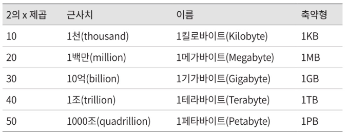
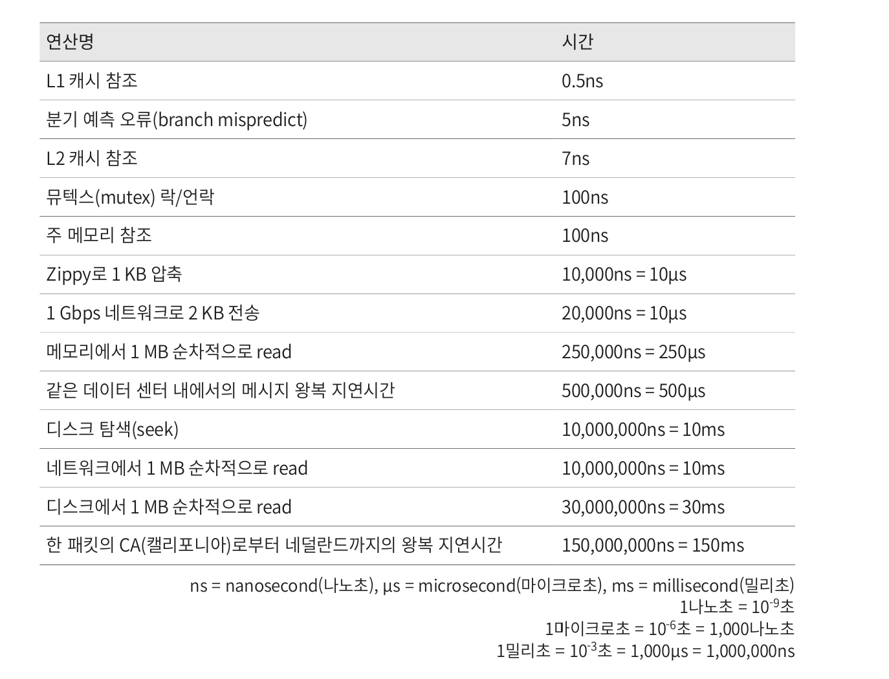
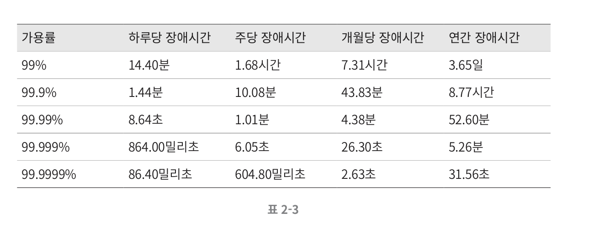

- 어떤 설계가 요구사항에 부합할 것인지 보기 위한 것
-
### 2의 제곱 수 - 데이터 양 추정

- 데이터 단위는 2의 제곱수로 표현된다.
- 각 단위들이 2의 몇  제곱인지 어느 정도 규모를 뜻하는지 파악해두면 좋을 것 같다.
- 실제 업무에서는 1개라 부를 수 있는 데이터 양을 측정해보고 이를 바탕으로 전체 저장소 용량을 추정하게 되지 않을까.

### 응답 지연

- 표준화된 연산별 응답 지연 표, 설계할 때 유용하게 사용하게 될 것 같다.

### 가용성에 관계들 수치

- 99% 가용률이면 괜찮은 거 아니야?라고 생각했으나... 기간을 늘려서 생각할 수록 가볍게 넘길만한 일은 아닌 것 같다.

