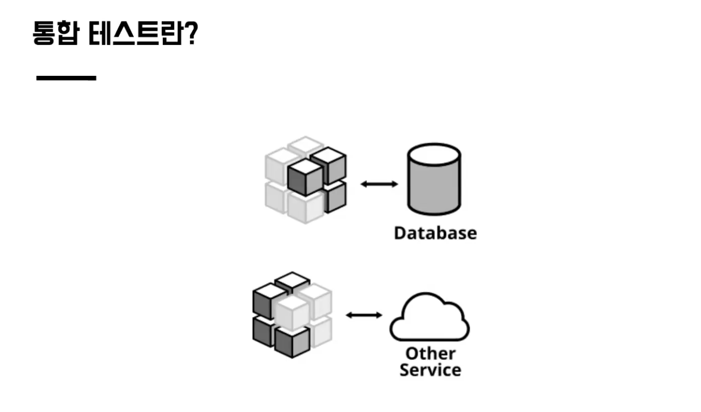

# 강의 중 생각 정리
---
## 단위 테스트로 충분한가?
- 인수 테스트로 전반적인 이해와 API의 큰 그림을 구성하고 테스트했다.
- 이후 단위 테스트를 통해 디테일한 부분들을 추가했다.
- `그렇다면 외부와의 유기적인 동작은 어떻게 검증할까?`

## 통합 테스트란?

- 다양한 정의가 있지만...
- 구현한 APP과 외부 모듈의 유기적인 동작에 대한 테스트
  - 모듈이 2개일 수도 혹은 여러개를 한번에 테스트 할 수도
- ATDD 과정에서는 실사용에 필요한 모든 모듈을 테스트하는 걸 `인수테스트`로 정의하고
- 외부 모듈과의 연동 정도의 테스트를 `통합 테스트`로 정의한다.

### 예시
- DB
- 외부 라이브러리
  - 외부 라이브러리의 동작은 필요하지 않다고 생각할 수도 있다.
  - 즉, 활용하는 로직만 검증이 필요할 수 있음
  - 단, 외부 라이브러리는 변경 불가하기에 실제 객체를 활용 추천

### 관리 의존성 vs 비관리 의존성
