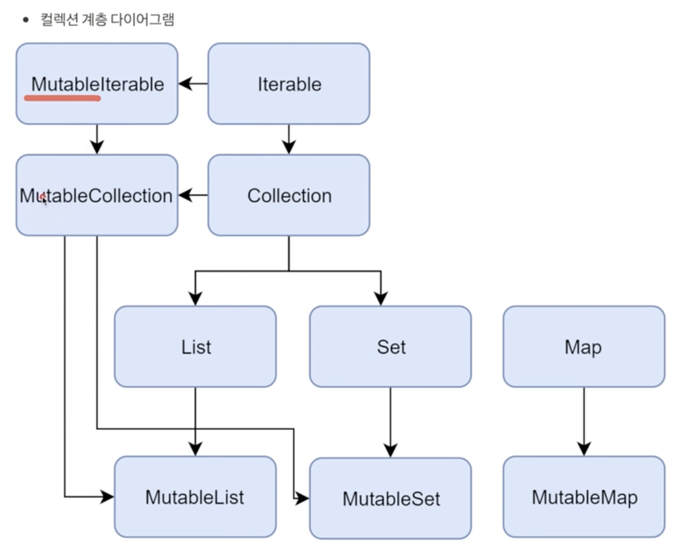
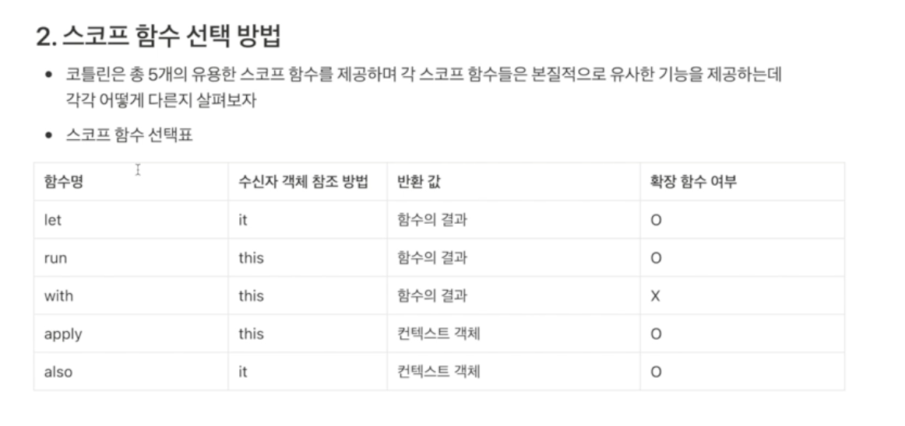

## 컬렉션

- Mutable(변할 수 있는)은 읽기/쓰기 모두 가능
- Mutable이 없는 Collection은 읽기 전용
- List / Map / Set에는 다양한 구현체가 존재
```kotlin
fun main(){

    // (1) List / Set은 다를 게 크게 없다
    // immutable
    val currencyList = listOf("달러", "유로")
    // currencyList.add()

    // mutable
    val mutableList = mutableListOf<String>("달러", "유로")
    mutableList.add("원")

    // apply - 블럭 안에서 this.가 적용된 것
    mutableList.apply {
        add("환")
        add("엔")
    }

    // (2) Map에 값 할당
    // immutable
    val numberMap = mapOf<String, Int>().apply {
        "one" to 1
        "two" to 2
        "three" to 3
    }

    // mutable
    val mutableNumberMap = mutableMapOf<String, Int>()
    mutableNumberMap["one"] = 1
    mutableNumberMap["two"] = 2


    // (3) Collection Builder
    // apply와 유사
    // buildList mutableList로 List를 만들고 immutable을 반환함
    val numberList = buildList{
        add(1)
        add(2)
    }

    // (4) 코틀린 Collection 상위 객체가 iterable
    // 반복문이 가능하다
    val iterator = currencyList.iterator()
    while(iterator.hasNext()){
        println(iterator.next())
    }

    // (5) Java Stream 메서드를 기본적으로 제공 forEach/map/filter
    // terminal Operator를 활용하기 위해서는 .asSequence를 사용해야 함
    currencyList.forEach {
        println(it)
    }

    val lowerList = listOf("a", "b", "c")
    val upperList = lowerList.map{it.uppercase()}

    // filter 메서드 사용 횟수만큼 Collection 객체를 만드는 것을 고려해야 함.
    val filterList = upperList.filter { it == "A"  || it == "B"}
}
```


## 데이터 클래스
- DTO와 같이 데이터를 보관/전달하기 위한 객체를 만들 때 사용
- equals / hashCode / toString / componentN / copyOf 메서드가 자동 생성됨
```kotlin
data class Person(
    var name: String,
    var age: Int){}
    
    
// 위 코드는 java 코드로    
public final class Person {
   @NotNull
   private final String name;
   private final int age;

   @NotNull
   public final String getName() {
      return this.name;
   }

   public final int getAge() {
      return this.age;
   }

   public Person(@NotNull String name, int age) {
      Intrinsics.checkNotNullParameter(name, "name");
      super();
      this.name = name;
      this.age = age;
   }

   @NotNull
   public final String component1() {
      return this.name;
   }

   public final int component2() {
      return this.age;
   }

   @NotNull
   public final Person copy(@NotNull String name, int age) {
      Intrinsics.checkNotNullParameter(name, "name");
      return new Person(name, age);
   }

   // $FF: synthetic method
   public static Person copy$default(Person var0, String var1, int var2, int var3, Object var4) {
      if ((var3 & 1) != 0) {
         var1 = var0.name;
      }

      if ((var3 & 2) != 0) {
         var2 = var0.age;
      }

      return var0.copy(var1, var2);
   }

   @NotNull
   public String toString() {
      return "Person(name=" + this.name + ", age=" + this.age + ")";
   }

   public int hashCode() {
      String var10000 = this.name;
      return (var10000 != null ? var10000.hashCode() : 0) * 31 + Integer.hashCode(this.age);
   }

   public boolean equals(@Nullable Object var1) {
      if (this != var1) {
         if (var1 instanceof Person) {
            Person var2 = (Person)var1;
            if (Intrinsics.areEqual(this.name, var2.name) && this.age == var2.age) {
               return true;
            } 
         }

         return false;
      } else {
         return true;
      }
   }
}

// component 메서드는 내부적으로 아래의 경우에 사용됨
val person1 = new Person("우석", 28)
val(name, age) = person
// name = "우석"
// age = 28
```


## 싱글톤과 동반객체
- `싱글톤`
  - 인스턴스를 1개로 제한하는 디자인 패턴
  - 구현 방식
    - Enum
    - 이른 초기화
    - 지연 초기화
 
- 코틀린에서는 `object` 키워드로 싱글톤 객체를 만들 수 있음
```kotlin
object Singleton{
    val a = 1234;

    fun pring() = println(a)
}
```


- `동반 객체`
  - 클래스 내부에서 생성되는 객체
  - companion object 키워드 사용

```kotlin
fun main(){
    println(TempClass.a)
    println(TempClass.Companion.a)
    println(TempClass.newInstance())
    println(TempClass.Companion.newInstance())
}


class TempClass{

    private constructor()

    // 이름을 가질 수도 있음
    companion object{
        val a = 1234

        fun newInstance() = TempClass()
    }
}
```


## 실드 클래스
- 상위 클래스 / 인터페이스에서 하위 클래스에 대한 정의를 제한할 수 있음
- seald 클래스는 제한 조건에 따라 상속이 이루어져야 한다.
- 컴파일러가 컴파일 시점에 상속 객체들에 대한 판단이 가능해진다.
- seald 객체를 기준으로 when식을 쓰면 분기 조건을 강제하여 실수를 줄일 수 있음

## 확장 함수
- 클래스 외부에서 클래스 메서드를 정의할 수 있음
- 확장 함수는 static final 메서드이다.
- 첫 인자는 기본적으로 대상 객체이다.
- 기존에 존재하는 메서드 확장 시 확장 함수는 실행되지 않는다.
- 확장 함수 내부에 null 처리가 있으면, 안전 연산자 없에 메서드 사용 가능 (신기하다..)
```kotlin
// 사용법: 객체.메서드명
fun String.first() : Char(){
    return this[0]
}
``` 


## 제네릭 (다시 공부해야 함)
```kotlin
fun main(){
    var generic1 = MyGeneric("테스트")
    var generic2 = MyGeneric(3)
    
    // 다양한 제네릭 타입 초기화 방법
    val list1: MutableList<String> = mutableListOf()
    val list2 = mutableListOf<String>()
    val list3 = mutableListOf<>("안녕")
    val list4: List<*> = mutableListOf<String>()
}


class MyGeneric<T>(val t: T) {}
```
### 공변성
- 공변성은 Java Generic의 extends 코틀린에서 out
- 반공변성은 Java Generic의 super 코틀린에서 in


## 지연 초기화
- 사용 시점에 초기화를 진행하는 것
- `by lazy` 키워드로 지연 초기화를 구현할 수 있음
  - val 변수에만 사용 가능
  - 기본적으로 멀티 쓰레드 환경에서 안전하게 동작함
  - 즉, 멀티 쓰레드 환경에서도 1번만 초기화 진행
  - 단, lock을 풀고 사용할 수도 있음 - lazy(LazyThreadSafetyMode.NONE)
```
fun main(){
    val greeting: String by lazy { getHello() }
}

fun getHello() = "안녕하세요"
```
- `lateinit` 키워드
  - var 객체에도 지연 초기화 가능 (NonNull 타입)
  - 예를 들어 Spring @Autowired이면서
  - 변경이 필요할 때
  - 외부 주입을 염두에 두었기에, 초기화 전에 사용해도 컴파일 에러가 발생하지 않음
    - isInitialized = 초기화 여부 확인 가능 (private 메서드)


## 페어와 구조분해할당
- 페어란? (3개는 Triple)
  - 데이터 묶음
  - 불변임
  - 데이터 클래스임
  - toList() = 데이터를 리스트로 반환(immutable)
  - 구조분해할당
    - 페어, 트리플을 활용해 2/3개 변수에 값을 한번에 할당 가능. (component() 이용)
    - list도 가능 -> list도 component 함수가 내장되어 있다는 뜻 (앞에서 부터 5개까지)
    - ```kotlin
      // map의 구조 분해 할당
      // to도 내부적으로 Pair로 되어 있다.
      val map = mutableMapOf("이상훈" to "개발자")
      for ( (key, value) in map){
        println(map + " " + value)
      }
      ```
      

## 스코프 함수

- 객체의 컨텍스트 내에서 코드 블록을 실행하기 위해 존재하는 몇 가지 함수를 뜻한다.
- 잘 사용하면 불필요한 변수 선언이 사라지고
- 코드가 간결해짐