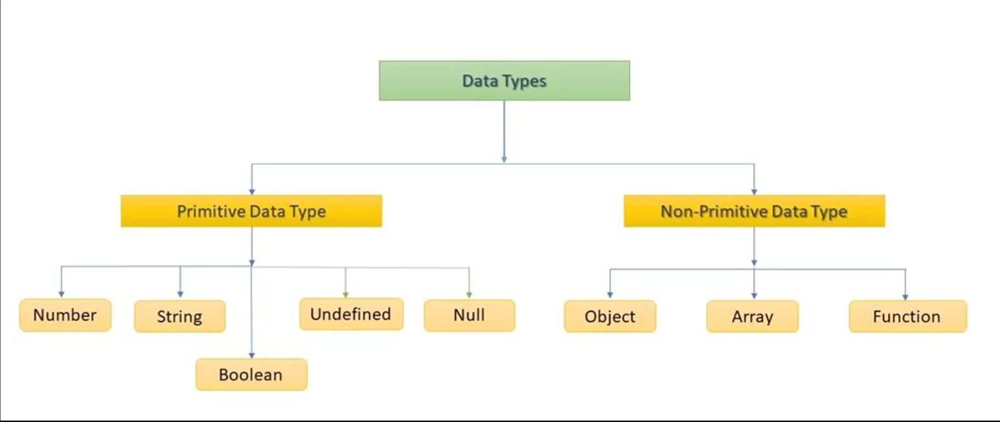

## 변수
``` javascript
/**
* let, var, const를 사용해서 변수를 저장할 수 있음
* 차이점
* let은 변수 중복 생성이 불가능
* var는 가능
* const는 값 변경 불가 (read-only)
*/ 

let age1 = 27;
var age2 = 27;
const age3 = 27;


let age1 = 28; (X)
var age2 = 28; (O)

age3 = 28 (X)
```


## 자료형


- JS의 null
  - JS에서 null은 의도적으로 넣은 값이다.
  - 값이 할당되지 않은 변수는 `undefined`

## 연산자
```javascript
var temp = 1 == "1"; // true, 값만 비교 (!=)
var temp = 1 === "1"; // flase, type도 비교(!==)
```

## 함수 표현식
```javascript
// (1) 함수 선언식 
// 선언식으로 만들어진 함수들은 프로그램 실행 전 최상단으로 올라간다고 생각하면 됨 (hoisting)
function method(param1, param2){
    return "return";
}

// (2-1) 함수 표현식
let method = function(param1, param2){
    return "return";
}

// (2-2) 함수 표현식
let method = (param1, param2) => "return";
let method = (param1, param2) => {
    return "return";
}
```

## 콜백 함수
- 함수의 매개변수로 넘겨진 함수

## 콜백함수