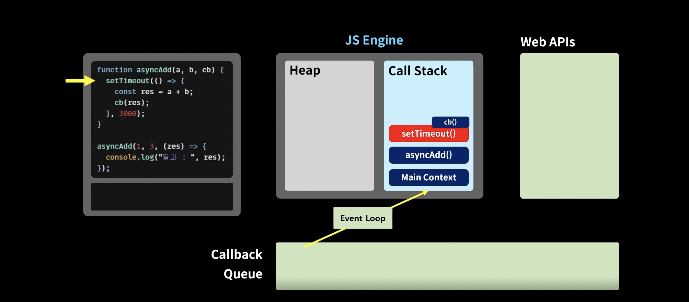

## Truthy & Falsy
```javascript
let a = {};

if(a){
    console.log("TRUE")
}else{
    console.log("FALSE")
}
```
- 위 코드는 TRUE를 콘솔 창에 출력한다.
- JS는 boolean값이 아니라도 True로 인식하거나 False로 인식하는 것들이 있는데...
  - Truthy
    - {}
    - 숫자
    - 문자열
  - Falsy
    - null
    - undefined
    - 0, -0, NaN
    - ""
- 왜 필요할까?
  - undefined, null에 대한 예외 처리
  - 예를 들어 if(!객체)를 하면 Falsy들에 대한 예외처리가 한번에 됨.


## 비 구조화 할당
```javascript
let [variable1, variable2, variable3] = ["value1", "value2", "value3"]


// 아래 케이스에서 variable4는 undefined가 됨.
// 이때 = "" 형식으로 default값을 지정해줄 수 있다.
let [variable1, variable2, variable3, variable4] = ["value1", "value2", "value3"]


// 비구조화 할당 swap 활용
let a = 10;
let b = 20;

[a, b] = [b, a]


// 객체의 비 구조화 할당
let obj = {one: "one", two: "JPA-Native-Query-DTO-매핑하기.md"};

let {one, two} = obj; // oboj key값을 기준으로 할당
let {one: anotherName, two} = obj; // :변수명을 넣으면 key값이 아닌 다른 이름으로 변수 선언 가능
```


## spread 연산자(상속 개념)
```javascript
const cookie = {
    base: "cookie",
    madeIn: "korea"
}

const chcochipCookie = {
    ...cookie, // 쿠키 객체의 프로퍼티를 모두 가져온다.
  toping: "chocochip"
}
```
- 배열 간에도 사용이 가능하다.


## 동기 & 비동기
- JS는 싱글 쓰레드로 실행된다.
- 때문에 성능 향상을 위해 싱글 쓰레드를 비동기 방식으로 사용하여 성능을 향상시킬 수 있다.

```javascript
function taskA(cb) {
  // setTimeout()은 비동기 메서드이다.
  setTimeout(() => {
    const res = 3;
    cb(res);
  }, 2000);
}

taskA((res) => {
  console.log(res);
});
console.log("finish all");

// 결과
// finish all
// 3
```
- setTimeout()은 비동기 메서드로
- taskA()를 실행하고 결과를 확인하지 않고 console.log("finish")를 실행하게 된다.


- 작성 순서대로 Call Stack에 쌓인다.
- 단, 비동기 메서드의 경우 Web APIs로 넘어간다.
- 즉, setTimeout(cb)는 Web APIs로 넘어가고 처리가 끝나면 Calback Queue로 이동한다.
- 이후 Event Loop가 Call Stack이 비었을 때 Callback Queue의 작업을 Call Stack으로 옮겨 놓는다(선입 선출)

## Promise
- 비동기 함수를 조금 더 편리하게 사용할 수 있도록 만들어준다.

```javascript
function isPositiveP(number) {
  const executor = (resolve, reject) => {
    setTimeout(() => {
      if(typeof number === "number"){

        resolve(number >= 0 ? "양수" : "음수");
      } else {
        reject("실패");
      }
    }, 2000)
  }

  return new Promise(executor);
}

// Promise 객체 반환
const res = isPositiveP(12);


// 결과 처리
res
.then((res) => {console.log(res)}) // resolve 콜백 함수
.catch((err) => {console.log(err)}) // reject 콜백 함수
```
- [자바스크립트 Promise 쉽게 이해하기](https://joshua1988.github.io/web-development/javascript/promise-for-beginners/)


## async & await
```javascript
async function alwaysTrue() {
  return true;
}

// Promise 객체 반환
console.log(alwaysTrue())

// 결과
// Promise {<pending>}
```
- async를 붙이면 Promise를 반환하는 비동기 함수로 바뀐다.

```javascript
function delay(ms) {
  return new Promise((resolve) => {
    setTimeout(() => {console.log("대기중...")}, ms)
  });
}

async function helloAsync() {
  delay(2000);
  console.log("helloAsync 완료")
}

helloAsync()
// 결과 
// 대기중...
// helloAsync 완료
 

function delay(ms) {
  return new Promise((resolve) => {
    setTimeout(() => {console.log("대기중...")}, ms)
  });
}

async function helloAsync() {
  await delay(2000);
  console.log("helloAsync 완료")
}

helloAsync()
// 결과
// helloAsync 완료
// 대기중...
```
- await는 Promise 앞에 사용할 수 있다.
- Promise가 완료될 때까지 기다린다.

## API 호ㅊㅜㄹ
