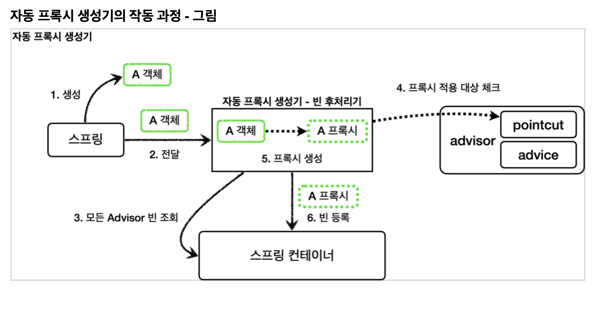

## 현재의 문제점...
- 설정 파일(~Config)이 너무 많다..
- 컴포넌트 스캔을 이용할 수 없다.
  - 컴포넌트 스캔을 이요할 경우 target객체도 함께 Bean으로 등록하기 때문..


## 빈 후처리기

- 스프링이 저장소에 빈을 등록하기 전 조작이 필요할 때 사용하는 것
- 기능
  - 객체 조작
  - 다른 객체로 변환

### 예제 1
```java
// 빈 후처리기 Interface
public interface BeanPostProcessor {

    // 초기화 발생 이전 처리 로직
	@Nullable
	default Object postProcessBeforeInitialization(Object bean, String beanName) throws BeansException {
		return bean;
	}
    
    // 초기화 발생 이후 처리 로직
	@Nullable
	default Object postProcessAfterInitialization(Object bean, String beanName) throws BeansException {
		return bean;
	}
}
```


```java
    @Test
    void basicConfig() {
        ApplicationContext applicationContext = new AnnotationConfigApplicationContext(BeanPostProcessorConfig.class);

        B b = applicationContext.getBean("beanA", B.class);
        b.helloB();

        Assertions.assertThrows(NoSuchBeanDefinitionException.class, () -> applicationContext.getBean(A.class));
    }

    @Slf4j
    @Configuration
    static class BeanPostProcessorConfig {
        @Bean(name = "beanA")
        public A a() {
            return new A();
        }
        
        // 후처리기 등록
        @Bean
        public AToBPostProcessor helloPostProcessor() {
            return new AToBPostProcessor();
        }
    }
    

    @Slf4j
    static class A {
        public void helloA() {
            log.info("hello A");
        }
    }

    @Slf4j
    static class B {
        public void helloB() {
            log.info("hello B");
        }
    }

    @Slf4j
    static class AToBPostProcessor implements BeanPostProcessor {

        @Override
        public Object postProcessAfterInitialization(Object bean, String beanName) throws BeansException {
            log.info("beanName={} bean={}", beanName, bean);
            if (bean instanceof A) {
                return new B();
            }
            return bean;
        }
    }
```
- 위 코드에서 후처리기를 통해 A 클래스일 경우 B를 반환하도록 했다
- 후처리기를 Bean으로 등록하면 A를 등록해도 B가 등록되는 것을 확인할 수 있다.
- 빈 후처리기를 사용하면 Target 객체를 프록시로 교체하는 것도 가능하다.
- 참고
  - @PostConstruct도 빈 후처리기를 통해 호출되는 것


### 예제 2
```java
// 실제 적용 파트
@Slf4j
public class PackageLogTracePostProcessor implements BeanPostProcessor {

    private final String basePackage;
    private final Advisor advisor;

    public PackageLogTracePostProcessor(String basePackage, Advisor advisor) {
        this.basePackage = basePackage;
        this.advisor = advisor;
    }

    @Override
    public Object postProcessAfterInitialization(Object bean, String beanName) throws BeansException {
        log.info("param beanName={} bean={}", beanName, bean.getClass());

        // 패키지 경로 체크
        String packageName = bean.getClass().getPackageName();
        if (!packageName.startsWith(basePackage)) {
            return bean;
        }
        
        // 프록시 생성
        ProxyFactory proxyFactory = new ProxyFactory(bean);
        proxyFactory.addAdvisor(advisor);

        Object proxy = proxyFactory.getProxy();
        log.info("create proxy: target={} proxy={}", bean.getClass(), proxy.getClass());
        return proxy;
    }
}

@Slf4j
@Configuration
@Import({AppV1Config.class, AppV2Config.class})
public class BeanPostProcessorConfig {

    @Bean
    public PackageLogTracePostProcessor logTracePostProcessor(LogTrace logTrace) {
        return new PackageLogTracePostProcessor("hello.proxy.app", getAdvisor(logTrace));
    }

    private Advisor getAdvisor(LogTrace logTrace) {
        //pointcut
        NameMatchMethodPointcut pointcut = new NameMatchMethodPointcut();
        pointcut.setMappedNames("request*", "order*", "save*");
        //advice
        LogTraceAdvice advice = new LogTraceAdvice(logTrace);
        return new DefaultPointcutAdvisor(pointcut, advice);
    }
}
```


## 스프링이 제공하는 빈 후처리기
- 현재 후처리기 로직 내부에 프록시 적용 대상을 검증하는 로직이 포함되어 있다.
- 이 부분을 Pointcut으로 대체할 수 있다.
  - classfilter로 프록시 적용 대상을 검증
  - MethodMatcher로 적용 메서드 검증


### (1) AutoProxyCreator
```
build.gradle
implementation 'org.springframework.boot:spring-boot-starter-aop'
```
- aop 라이브러리르 추가하면 aspectJ관련 라이브러리가 자동 등록되고 AOP관련 클래스를 자동으로 Bean으로 등록해줌

#### AnnotationAwareAspectJAutoProxyCreator
- AnnotationAwareAspectJAutoProxyCreator은 빈 후처리기이다
- 이 후처리기는 스프링 빈으로 등록된 Advisor를 찾아 프록시가 필요한 곳에 자동으로 프록시를 적용해준다.
- 즉, Advisor만 Bean으로 등록되어 있으면 Pointcut 기반으로 자동 프록시 적용이 가능하다.

#### 동작 과정

- AnnotationAwareAspectJAutoProxyCreator가 Bean으로 등록된 모든 Advisor를 조회
- Advisor의 Pointcut을 바탕으로 프록시 적용 대상을 필터링 한다.
- 적용 대상이 된 객체를 Target으로 하는 Proxy를 생성하고
- Proxy를 대신 Bean으로 등록한다.


#### 예제 1
```java
@Configuration
@Import({AppV1Config.class, AppV2Config.class})
public class AutoProxyConfig {

//    @Bean
    public Advisor advisor1(LogTrace logTrace) {
        //pointcut
        NameMatchMethodPointcut pointcut = new NameMatchMethodPointcut();
        pointcut.setMappedNames("request*", "order*", "save*");
        //advice
        LogTraceAdvice advice = new LogTraceAdvice(logTrace);
        return new DefaultPointcutAdvisor(pointcut, advice);
    }

}
```


#### [참고] Pointcut의 사용 시점
1. 프록시 적용 여부 판단 - 생성 시점
2. 어드바이스 적용 여부 판단 - 사용 시점


### (2) AspectJExpressionPointcut
```java
    @Bean
    public Advisor advisor2(LogTrace logTrace) {
        //pointcut
        AspectJExpressionPointcut pointcut = new AspectJExpressionPointcut();
        
        // AspectJ 표현식
        pointcut.setExpression("execution(* hello.proxy.app..*(..))");
        //advice
        LogTraceAdvice advice = new LogTraceAdvice(logTrace);
        return new DefaultPointcutAdvisor(pointcut, advice);
    }
```
- AOP에 특화된 Pointcut 표현식
- 자세한 설명은 추후에...


### 참고: Pointcut 여러개를 만족하는 Bean은?
- 생각해보면 ProxyFactory는 여러 Advisor를 가질 수 있다.
- 때문에 Proxy도 1개만 생성됨
