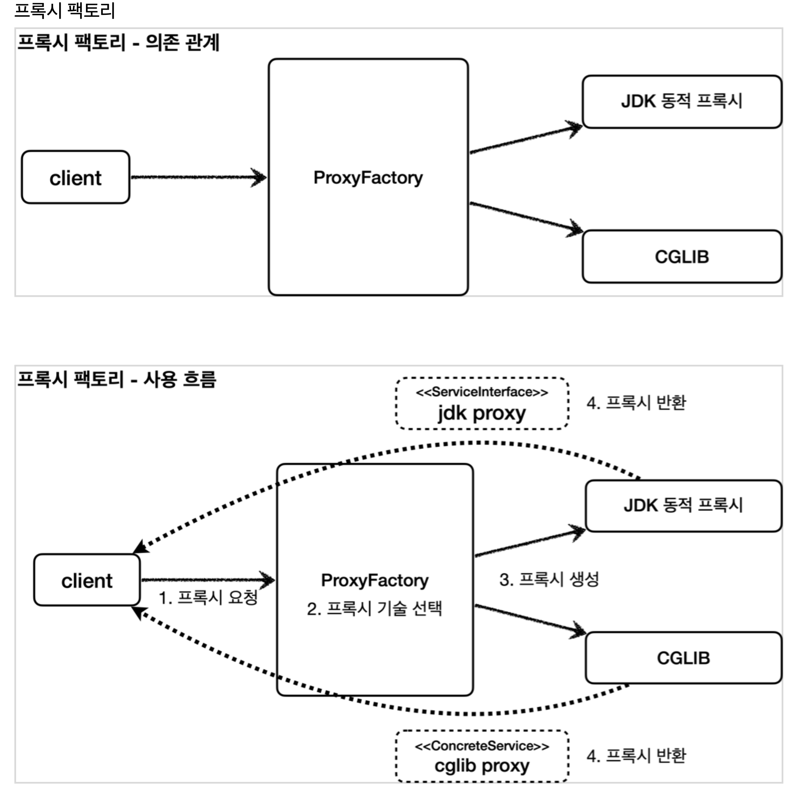
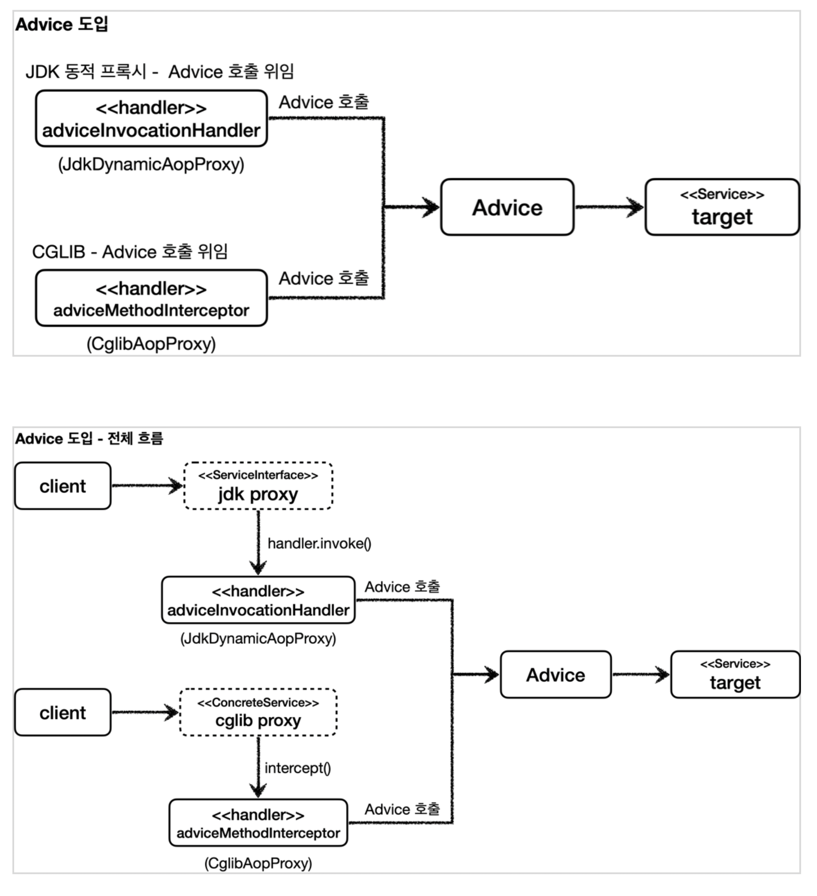
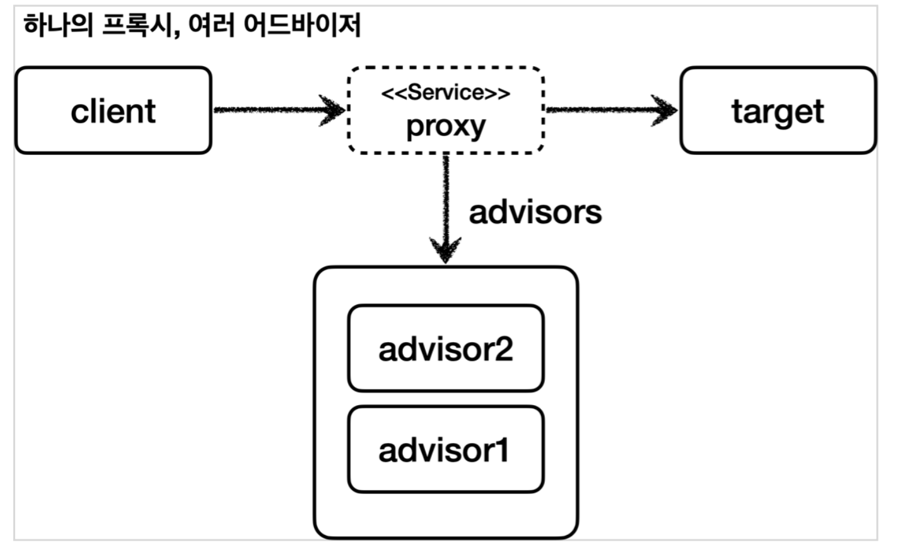

## 동적 프록시의 문제점
- 인터페이스일 경우 JDK, 구체 클래스일 경우 CGLIB을 사용하기 위해서는 각각의 Interface를 구현한 프록시 객체가 필요했다.
- 특정 조건에 맞을 때 프록시 로직을 적용하는 기능도 공통으로 묶을 수 있었으면


## 프록시 팩토리

- 개발자는 InvocationHandler / MethodInterceptor를 구현하지 않고 Advice만 구현하면 됨


- 프록시 팩토리는 Advice를 사용해 필요에 맞는 동적 프록시를 생성하여 반환해준다.
- 또한 Pointcut 개념을 도입해서 원하는 조건에 해당할 때만 프록시의 부가 기능이 적용되도록 구현할 수 있다.


### 예제 1
```java
// Advice 생성을 위해 구현해야 하는 Interface

@FunctionalInterface
public interface MethodInterceptor extends Interceptor {

	@Nullable
	Object invoke(@Nonnull MethodInvocation invocation) throws Throwable;

}
```
- Advice를 만드는 가장 기본적인 방법은 위 인터페이스를 구현하는 것이다.
- MethodInterceptor는 JDK와 CGLIB의 프록시 객체를 위한 Interface를 추상화한 것.


```java 
// Advice 구현 예시

@Slf4j
public class TimeAdvice implements MethodInterceptor {

    @Override
    public Object invoke(MethodInvocation invocation) throws Throwable {
        log.info("TimeProxy 실행");
        long startTime = System.currentTimeMillis();

        Object result = invocation.proceed();

        long endTime = System.currentTimeMillis();
        long resultTime = endTime - startTime;
        log.info("TimeProxy 종료 resultTime={}", resultTime);
        return result;
    }
}
```
- 위 구현이 이전과 다른 점은 프록시 객체임에도 불구하고 실제 로직을 수행할 target 객체가 없다는 점이다.
- invoke 메서드의 인자 MethodInvocation 내부에 target 클래스 정보가 모두 포함되어 있기에 때문이다.
  - 프록시 팩토리로 프록시를 생성하는 단계에 target 정보를 파라미터로 전달 받음


```java
    @Test
    @DisplayName("인터페이스가 있으면 JDK 동적 프록시 사용")
    void interfaceProxy() {
        ServiceInterface target = new ServiceImpl();
        
        // target을 주입하여 ProxyFactory 생성
        ProxyFactory proxyFactory = new ProxyFactory(target);
        proxyFactory.addAdvice(new TimeAdvice());
        
        //프록시 객체 생성
        ServiceInterface proxy = (ServiceInterface) proxyFactory.getProxy();
        log.info("targetClass={}", target.getClass());
        log.info("proxyClass={}", proxy.getClass());

        proxy.save();

        assertThat(AopUtils.isAopProxy(proxy)).isTrue();
        assertThat(AopUtils.isJdkDynamicProxy(proxy)).isTrue();
        assertThat(AopUtils.isCglibProxy(proxy)).isFalse();
    }

    @Test
    @DisplayName("구체 클래스만 있으면 CGLIB 사용")
    void concreteProxy() {
        ConcreteService target = new ConcreteService();
        ProxyFactory proxyFactory = new ProxyFactory(target);
        proxyFactory.addAdvice(new TimeAdvice());
        ConcreteService proxy = (ConcreteService) proxyFactory.getProxy();
        log.info("targetClass={}", target.getClass());
        log.info("proxyClass={}", proxy.getClass());

        proxy.call();

        assertThat(AopUtils.isAopProxy(proxy)).isTrue();
        assertThat(AopUtils.isJdkDynamicProxy(proxy)).isFalse();
        assertThat(AopUtils.isCglibProxy(proxy)).isTrue();
    }

    @Test
    @DisplayName("ProxyTargetClass 옵션을 사용하면 인터페이스가 있어도 CGLIB를 사용하고, 클래스 기반 프록시 사용")
    void proxyTargetClass() {
        ServiceInterface target = new ServiceImpl();
        ProxyFactory proxyFactory = new ProxyFactory(target);
        proxyFactory.setProxyTargetClass(true);
        proxyFactory.addAdvice(new TimeAdvice());
        ServiceInterface proxy = (ServiceInterface) proxyFactory.getProxy();
        log.info("targetClass={}", target.getClass());
        log.info("proxyClass={}", proxy.getClass());

        proxy.save();

        assertThat(AopUtils.isAopProxy(proxy)).isTrue();
        assertThat(AopUtils.isJdkDynamicProxy(proxy)).isFalse();
        assertThat(AopUtils.isCglibProxy(proxy)).isTrue();
    }
```
- 위 테스트를 보면
- Interface 유무에 따라 자동적으로 JDK / CGLIB이 사용되는 것을 확인할 수 있다.
- 추가로 proxyTargetClass = true로 설정하면 인터페이스가 있어도 CGLIB을 사용한다.


## Pointcut, Advice, Advisor

`Pointcut`: 부가기능 적용 위치를 판단하는 필터링 로직
`Advice`: 프록시가 호출하는 부가 기능
`Advisor`: 하나의 Pointcut과 하나의 Advice를 가지고 있는 것을 뜻함
- * 프록시에 맞추어 설명한 것이라 실제 구현은 다를 수 있다...


### 예제 1
```java
    @Test
    void advisorTest1() {
        ServiceInterface target = new ServiceImpl();
        ProxyFactory proxyFactory = new ProxyFactory(target);
        
        // 항상 true를 반환하는 pointcut과 TimeAdvice를 가진 Advisor 생성
        DefaultPointcutAdvisor advisor = new DefaultPointcutAdvisor(Pointcut.TRUE, new TimeAdvice());
        
        // proxyFactory에 advisor 설정
        proxyFactory.addAdvisor(advisor);
        ServiceInterface proxy = (ServiceInterface) proxyFactory.getProxy();

        proxy.save();
        proxy.find();
    }
```


### 직접 만든 Pointcut
```java
    // 실행 부분
    @Test
    @DisplayName("스프링이 제공하는 포인트컷")
    void advisorTest3() {
        ServiceInterface target = new ServiceImpl();
        ProxyFactory proxyFactory = new ProxyFactory(target);
        NameMatchMethodPointcut pointcut = new NameMatchMethodPointcut();
        pointcut.setMappedNames("save");
        DefaultPointcutAdvisor advisor = new DefaultPointcutAdvisor(pointcut, new TimeAdvice());
        proxyFactory.addAdvisor(advisor);
        ServiceInterface proxy = (ServiceInterface) proxyFactory.getProxy();

        proxy.save();
        proxy.find();
    }

    // Custom Pointcut
    static class MyPointcut implements Pointcut {

        @Override
        public ClassFilter getClassFilter() {
            return ClassFilter.TRUE;
        }

        @Override
        public MethodMatcher getMethodMatcher() {
            return new MyMethodMatcher();
        }
    }

    // Pointcut에 사용될 MethodMatcher
    static class MyMethodMatcher implements MethodMatcher {

        private String matchName = "save";

        @Override
        public boolean matches(Method method, Class<?> targetClass) {
            boolean result = method.getName().equals(matchName);
            log.info("포인트컷 호출 method={} targetClass={}", method.getName(), targetClass);
            log.info("포인트컷 결과 result={}", result);
            return result;
        }

        @Override
        public boolean isRuntime() {
            return false;
        }

        @Override
        public boolean matches(Method method, Class<?> targetClass, Object... args) {
            return false;
        }
    }
```
- Pointcut은 Class를 필터링하는 ClassFIlter와 Method를 필터링하는 MethodMatcher를 가진다.
- 둘을 사용해 적용 대상이 될 Class / Method를 구분할 수 있다.
- MethodMatcher 구현부의 isRuntime
  - isRuntime이 true이면 public boolean matches(Method method, Class<?> targetClass, Object... args) 메서드가 실행됨
  - 동적으로 넘어오는 매개변수로 판단이 가능
  - false인 경우 스프링 내부에서 클래스 정적 정보를 캐싱하여 성능 향상이 가능
  - 동적 매개변수에 의한 판단이 필요하지 않다면 false 사용이 좋겠다

### Spring이 제공하는 무수히 많은 Pointcut들
- NameMatchMethodPointcut: 메서드 이름 기반
- JdkRegexpMethodPointcut JDK 정규 표현식 기반
- TruePointcut: 항상 적용
- AnnotationMatchingPointcut: 애노테이션 기반
- *AspectJexpressionPointcut*: aspectJ 표현식에 의한 매칭


### 하나의 target에 여러 Advisor(Advice, Pointcut)를 적용하려면?

```java
    // 가장 단순히 생각해보면...
    // 각각의 Advisor로 ProxyFactory를 만들면 될 것 같다...
    @Test
    @DisplayName("여러 프록시")
    void multiAdvisorTest1() {
        //client -> proxy2(advisor2) -> proxy1(advisor1) -> target

        //프록시1 생성
        ServiceInterface target = new ServiceImpl();
        ProxyFactory proxyFactory1 = new ProxyFactory(target);
        DefaultPointcutAdvisor advisor1 = new DefaultPointcutAdvisor(Pointcut.TRUE, new Advice1());
        proxyFactory1.addAdvisor(advisor1);
        ServiceInterface proxy1 = (ServiceInterface) proxyFactory1.getProxy();

        //프록시2 생성, target -> proxy1 입력
        ProxyFactory proxyFactory2 = new ProxyFactory(proxy1);
        DefaultPointcutAdvisor advisor2 = new DefaultPointcutAdvisor(Pointcut.TRUE, new Advice2());
        proxyFactory2.addAdvisor(advisor2);
        ServiceInterface proxy2 = (ServiceInterface) proxyFactory2.getProxy();

        //실행
        proxy2.save();

    }
```
- 실행해보면 proxy2는 advice2를 호출하고 proxy1을 호출한다.
- proxy1은 advice를 호출하고 target을 호출한다.
- Pointcut.TRUE이기에 둘 다 적용된 것.
- 하지만 이건 pointcut이 겹친 문제일 뿐
- 가장 큰 단점은 적용할 Advisor만큼 ProxyFactory가 필요하다는 것

#### 하나의 프록시 팩토리에 여러 Advisor를 적용해도 됨
```java
    @Test
    @DisplayName("하나의 프록시, 여러 어드바이저")
    void multiAdvisorTest2() {
        //client -> proxy -> advisor2 -> advisor1 -> target

        DefaultPointcutAdvisor advisor1 = new DefaultPointcutAdvisor(Pointcut.TRUE, new Advice1());
        DefaultPointcutAdvisor advisor2 = new DefaultPointcutAdvisor(Pointcut.TRUE, new Advice2());

        //프록시1 생성
        ServiceInterface target = new ServiceImpl();
        ProxyFactory proxyFactory1 = new ProxyFactory(target);

        proxyFactory1.addAdvisor(advisor2);
        proxyFactory1.addAdvisor(advisor1);
        ServiceInterface proxy = (ServiceInterface) proxyFactory1.getProxy();

        //실행
        proxy.save();
    }
``` 

- 이렇게 구현해도 가장 단순한 방법과 같게 동작한다.