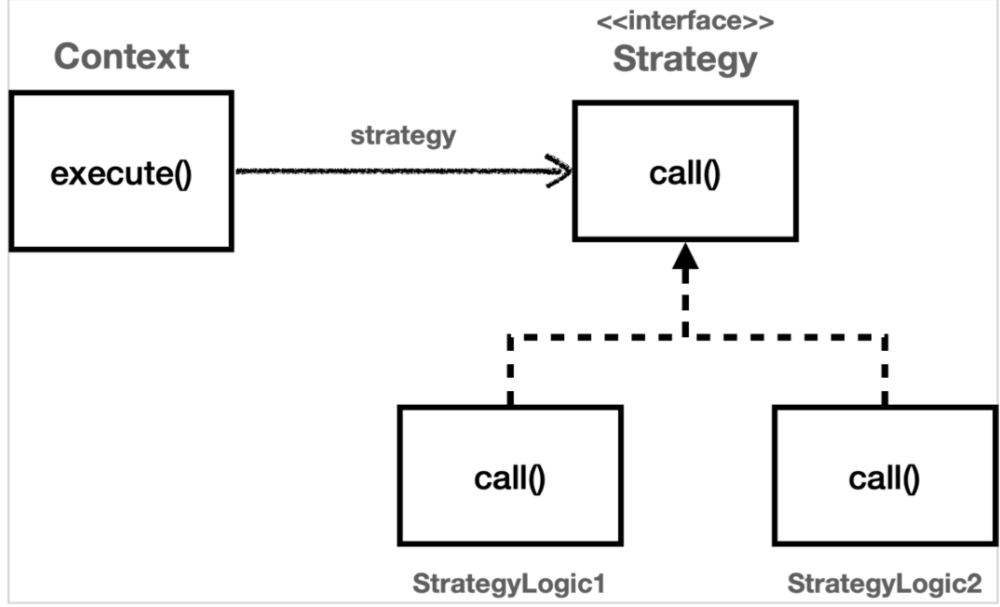

## 템플릿 메서드 패턴의 문제
- 상속의 문제를 고스란히 가진다.
- 자식 클래스는 부모 코드를 전혀 사용하지 않는데 강한 의존을 가짐(잘못된 의존 관계 형성)

## 전략 패턴

### 언제
- 템플릿 메서드 패턴과 동일
  - 전체적으로 동일하지만 일부만 다른 구문이 곳곳에 존재할 때

### 효과
- 템플릿 메서드 패턴과 동일
  - 코드 중복을 줄일 수 있다.
  - 반복되는 코드가 부가 기능일 경우 핵심 로직만 남길 수 있다.
  - 공통 로직을 한 곳에서 관리할 수 있다.

### 어떻게
- 공통 로직을 담당하는 `Context`가 존재
- `Context`는 변하는 부분을 메서드로 가진 `Strategy` interface를 의존함
- `Strategy`를 구현한 다양한 클래스가 존재
- Context에 원하는 구현체를 담아 사용하여 `공통 로직`과 `변하는 로직`을 관리한다.


#### 1. 필드에 Strategy를 보관하는 방식 
```java
// Context
public class ContextV1 {

    private Strategy strategy;

    public ContextV1(Strategy strategy) {
        this.strategy = strategy;
    }

    public void execute() {
        long startTime = System.currentTimeMillis();
        //비즈니스 로직 실행
        strategy.call(); //위임
        //비즈니스 로직 종료
        long endTime = System.currentTimeMillis();
        long resultTime = endTime - startTime;
        log.info("resultTime={}", resultTime);
    }
}


// Strategy
public interface Strategy {
    void call();
}


// Strategy 구현체
public class StrategyLogic1 implements Strategy {
    @Override
    public void call() {
        log.info("비즈니스 로직1 실행");
    }
}


// 사용 예시 (1)
StrategyLogic1 strategyLogic1 = new StrategyLogic1();
ContextV1 context1 = new ContextV1(strategyLogic1);
context1.execute();


// 사용 예시 (2) - 익명 내부 클래스 (Strategy생성 후 Context 생성자에 주입)
Strategy strategyLogic1 = new Strategy() {
    @Override
    public void call() {
                log.info("비즈니스 로직1 실행");
    }
};
ContextV1 context1 = new ContextV1(strategyLogic1);
log.info("strategyLogic1={}", strategyLogic1.getClass());
context1.execute();


// 사용 예시 (3) - 익명 내부 클래스 (Context 생성자에서 Strategy 생성)
ContextV1 context1 = new ContextV1(new Strategy() {
    @Override
    public void call() {
        log.info("비즈니스 로직1 실행");
    }
});
context1.execute();


// 사용 예시 (4) - 람다 활용
ContextV1 context1 = new ContextV1(() -> log.info("비즈니스 로직1 실행"));
context1.execute();
```
- 먼저 Context와 Strategy를 조립해두고, 실행하는 방식에서 유용함
- Spring APP에서 로딩 시점에 의존 관계를 주입한 후 사용하는 것과 유사
- 단점
  - 전략 변경이 번거로움
  - 특히 Context를 싱글톤으로 사용할 때 전략 변경은 동시성 이슈를 고려해야 함

#### 2. `템플릿 콜백 패턴`: 전략을 파라미터로 받는 방식
##### 콜백이란?
- 다른 코드의 인수로 넘겨주는 실행 가능한 코드를 뜻한다.
    - call: 인수를 넘기고 / back: 뒤에서 실행됨
    - 전략 패턴에서 인자로 Strategy를 넘겨주는 경우도 여기에 해당함


```java
// Context
public class ContextV2 {

    public void execute(Strategy strategy) {
        long startTime = System.currentTimeMillis();
        //비즈니스 로직 실행
        strategy.call(); //위임
        //비즈니스 로직 종료
        long endTime = System.currentTimeMillis();
        long resultTime = endTime - startTime;
        log.info("resultTime={}", resultTime);
    }
}

// Strategy와 구현체는 1번 방식과 동일

// 사용 예시  (1) 
ContextV2 context = new ContextV2();
context.execute듯new StrategyLogic1());

// 사용 예시 (2)
ContextV2 context = new ContextV2();
context.execute(new Strategy() {
    @Override
    public void call() {
        log.info("비즈니스 로직1 실행");
    }
});


// 사용 예시 (3)
ContextV2 context = new ContextV2();
context.execute(() -> log.info("비즈니스 로직1 실행"));
```
- 선 조립 후 실행의 단점을 보완한 방식
- 실행 시점에 원하는 전략으로 유연하기 변경할 수 있음
- 단점
  - 실행할 때마다 전략을 지정해주어야 한다는 점


## 정리
- 템플릿 메서드, 전략, 템플릿 콜백 패턴을 통해
  - 변하는 코드와 변하지 않는 코드를 분리하고
  - 더 적은 코드로 결과물을 만들었음

### 하지만
- 기존 코드에 로그 추적기를 적용하기 위해서는 원본 코드를 수정해야 했었다.
- 원본 코드를 손대지 않고 로그 추적기를 적용할 수 있는 방법은 없을까...?
- 프록시 예고...