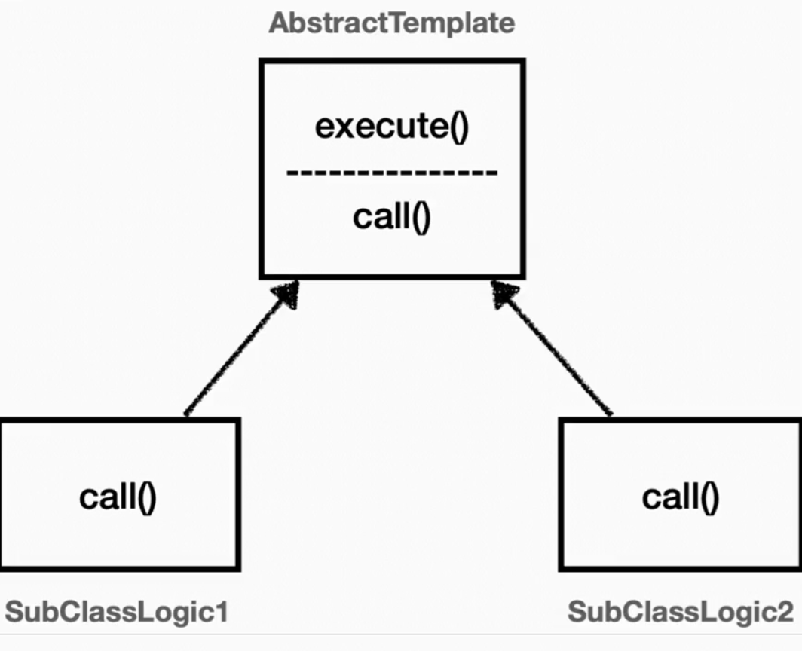

## 현재 코드의 문제점
```java
public void orderItem(TraceId traceId, String itemId) {

  TraceStatus status = null;
  try {
    status = trace.begin("OrderService.orderItem()") // 로그를 위한 코드
    orderRepository.save(status.getTraceId(), itemId);
    trace.end(status); // 로그를 위한 코드
  } catch (Exception e) {  // 로그를 위한 코드
    trace.exception(status, e); // 로그를 위한 코드
    throw e; // 로그를 위한 코드
  }
}
```
- 로컬 쓰레드를 활용해 멀티 쓰레드 환경에서도 정상 동작하는 로그 추적기를 만들었다.
- 하지만 로그 추적기를 실행하기 위해 `핵심 로직 이외의 코드를` 담고있다.
- 즉, 핵심 기능과 부가 기능이 혼재하는 코드이다.


## 템플릿 메서드 패턴


### 언제
- 전체적으로 동일하지만 일부만 다른 구문이 곳곳에 존재할 때
### 효과 
  - 코드 중복을 줄일 수 있다.
  - 반복되는 코드가 부가 기능일 경우 핵심 로직만 남길 수 있다. 
### 어떻게
##### 1. 추상 클래스와 상속
```java
@Slf4j
public abstract class AbstractTemplate {

    public void execute() {
        long startTime = System.currentTimeMillis();
        //비즈니스 로직 실행
        call(); //상속
        //비즈니스 로직 종료
        long endTime = System.currentTimeMillis();
        long resultTime = endTime - startTime;
        log.info("resultTime={}", resultTime);
    }

    protected abstract void call();
}

@Slf4j
public class SubClassLogic1 extends AbstractTemplate {
    @Override
    protected void call() {
        log.info("비즈니스 로직1 실행");
    }
}
```
- 추상 클래스에 반복되는 부분과 변하는 부분을 분리된 메서드로 가지고 있는다.
- 필요할 때마다 추상 클래스를 상속하는 클래스를 만들어 달라지는 부분만 구현하고 사용한다.

#### 2. 익명 내부 클래스 이용하기
```java
    @Test
    void templateMethodV2() {
        AbstractTemplate template1 = new AbstractTemplate() {
            @Override
            protected void call() {
                log.info("비즈니스 로직1 실행");
            }
        };
        log.info("클래스 이름1={}", template1.getClass());
        template1.execute();

        AbstractTemplate template2 = new AbstractTemplate() {
            @Override
            protected void call() {
                log.info("비즈니스 로직2 실행");
            }
        };
        log.info("클래스 이름2={}", template2.getClass());
        template2.execute();
    }
```
- 익명 내부 클래스를 이용하여 클래스 정의 없이 그떄 그때 만들어서 사용할 수도 있다.
- 단, 이 경우 클래스 재사용은 불가

### 단점
- 부모 클래스를 사용하든 사용하지 않든 자식 클래스는 부모 클래스를 강하게 의존하게 된다.
- 자식 클래스는 부모 클래스의 모든 코드를 가지게 된다.

## 디자인 패턴을 통한 문제점 해결
```java  
public abstract class AbstractTemplate<T> {

    private final LogTrace trace;

    public AbstractTemplate(LogTrace trace) {
        this.trace = trace;
    }

    public T execute(String message) {

        TraceStatus status = null;
        try {
            status = trace.begin(message);
            //로직 호출
            T result = call();

            trace.end(status);
            return result;
        } catch (Exception e) {
            trace.exception(status, e);
            throw e;
        }
    }

    protected abstract T call();
}
```
- 반복되는 로그 추적 파트는 구현된 메서드로
- 매번 바뀌는 핵심 기능은 추상 메서드로


```java  
    public void orderItem(String itemId) {

        AbstractTemplate<Void> template = new AbstractTemplate<>(trace) {
            @Override
            protected Void call() {
                orderRepository.save(itemId);
                return null;
            }
        };
        template.execute("OrderService.orderItem()");

    }
```
- 익명 내부 클래스를 활용해 로그 추적하는 파트를 제거할 수 있었음.
  - 즉, 핵심 기능에 집중하는 코드가 됨.


## ETC
### 좋은 설계란?
- 좋은 설계는 변경이 생길 때 알 수 있다.
- 만약 템플릿 메서드 패턴을 사용하지 않은 상태에서 로그 추적 파트를 변경해야 한다면?
  - 로그 추적 파트를 찾아다니며 모두 수정해줘야 한다.
  - 반면 템플릿 메서드 패턴을 사용했다면 추상 클래스만 수정하면 모두 적용됨

### 단일 책임 원칙(SRP)
- 디자인 패턴을 통해 소스 코드를 몇 줄 줄인 것보다 변경 지점을 모은 것이 더 중요한 결과이다.