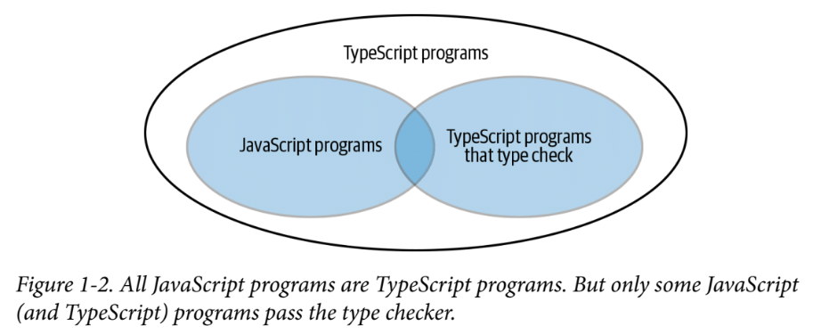

## Item 1: 타입스크립트와 자바스크립트의 관계 이해하기
### JS는 TS이다.

- typescript는 javascript의 상위 집합이다.
- 즉, .js 파일의 코드는 이미 타입스크립트인 것이다.
- 이러한 특성 덕분에 js를 ts로 바꿀 때 원하는 부분만 변환이 가능해진다.
- 또한 js파일은 ts 컴파일러의 도움을 받을 수도 있다. (타입 체크 기능)

### TS는 JS가 아니다.
```typescript
function greet(message: string) {
    console.log(message)
}
```
- TS는 JS의 상위 집합이기 때문에 TS이지만 JS가 아닌 프로그램 또한 존재한다. (위 코드 예시)
- 예를 들어 타입 구문을 사용하는 순간부터 타입스크립트만의 영역으로 들어가게 된다.

### TS 컴파일러 런타임 오류를 미리 잡아낼 수 있도록 돕는다 (JS파일도)
```typescript
// 예시 1
let message = 'hello';
message.toUppercase() // JS는 실행을 해봐야 오류가 있다는 것을 알 수 있다. (실제는 toUpperCase())

// 예시 2
const state = {name: 'Korea', capital: 'Seoul'};
console.log(state.capitol) // 오류를 찾기는 하지만 capital, capitol 중 무엇이 맞는 건지 알려주진 않는다.

// 예시 3 Type 구문 적용
interface State {
    name: string,
    capital: string,
}
const state: State = {name: 'Korea', capital: 'Seoul'};
console.log(state.capitol) // 이제는 이 라인에 오류가 있다는 것을 명확히 알려줌
```
- 위 JS파일을 TS 컴파일러로 돌리면 TS컴파일러의 타입 체커가 message의 초기값을 바탕으로 타입을 추론하여 toUppercase 메서드가 존재하지 않는다는 것을 알려준다. (예시 1)
- state object 내에 capitol속성이 없다는 것을 미리 알려준다. (예시 2)
- 위와 같이 TS를 적용하지 않은 JS파일도 TS 컴파일러의 도움을 받을 수 있다.
- 하지만 타입 구문을 추가하면 개발자의 의도를 더 명확히 할 수 있다.


### TS 컴파일러는 내가 원하는 방향으로 동작하지 않을 수도 있다.
```typescript
// 예시 1
const x = 2 + '3' // '23'

// 예시 2
const a = null + 7 // 7
const b = [] + 12 // 12

// 예시 3
cosnt array = ['a', 'b']
console.log(array[2].toUpperCase())
```
- 위 코드는 모두 JS에서 정상 동작하지만 TS 컴파일러는 (1)을 오류로 잡지 않고 (2)를 오류로 잡는다.
- (3)은 실행되지만 오류를 뱉는다.
- 이처럼 타입 스크립트를 사용할 경우 기존 JS 프로그램과 다른 방식으로 코드를 짜야할 수 있다.
- TS를 사용할 거라면 TS의 특성을 잘 이해하고, 나에게/팀에게 맞는지 고려가 필요할 것이다.


### 내 생각 정리
- TS를 사용하면 TS와 JS 파일 모두 런타임 이전에 오류를 잡아내기 용이해진다.
- 단, TS를 사용할 경우 기존 JS와 다른 방향으로 코드를 작성해야 하는 부분이 생기기 때문에 TS의 특성을 잘 이해하는 것이 중요해 보임.


## Item 2: 타입스크립트 설정 이해하기
### noImplicitAny와 strictNullChecks 설정
- noImplicityAny 설정은 코드에서 타입을 명시적으로 나타내도록 강제한다.
    - 타입 명시는 문제 발견을 수월하게 만들고 가독성과 생산성을 향상시킨다. (의도를 분명히 하는 코드)
- strictNullChecks는 모든 타입에 null 또는 undefined 초기화가 가능하도록 할 지 여부를 나타낸다.
    - 런타임 오류를 줄이고 타입을 더 명확히 할 수 있지만, 코드 작성을 까다롭게 한다.

### 내 생각 정리
- noImplicityAny를 통해 타입을 남기는 것이 의도를 더 명확히 전달하는 방향일 것 같다.
- strictNullChecks를 사용하는 건 좋지만, 사실상 쉽지 않다.
    - 특히 외부 API를 사용할 때 API Response의 모든 케이스를 고려해야하기 때문이다.
    - 그게 아니라면 결국 모든 타입에 | null과 같은 문법을 추가하게 된다.


## Item 3: 코드 생성과 타입이 관계 없음을 이해하기
### 타입 오류가 있어도 컴파일은 가능하다.
- TS 컴파일러의 역할은 2가지이고 둘의 역할은 독립적이다.
    - 최신 TS/JS를 브라우저에서 동작하도록 구버전 JS파일로 Transpile
    - 코드의 타입 오류를 체크
- Compile이란 코드를 생성하는 과정을 뜻한다. 즉, 타입 체크는 Compile 오류와는 무관하고 타입 오류가 있어도 컴파일은 가능하다.
- 단, noEmitOnError 설정을 통해 타입 오류 시 빌드를 멈추도록 할 수도 있다.

### 타입 체크는 런타임에는 불가능하다.
``` typescript
interface Square {
    width: number;
}

interface Rectangle extends Square {
    height: number;
}

type Shape = Square | Rectangle;

function calculateArea(shape: Shape) {
    if (shape instanceof Rectangle) {
        // shape를 Rectangle로 가정한 코드
    }

    // shape를 Rectangle이 아니라고 가정한 코드
}
```
- 위 코드는 컴파일 이전에 오류가 나온다.
- instanceof 체크는 런타임에 일어나지만 Rectangle은 type이기 때문에 런타임에 존재하지 않는다.
- 인터페이스, 타입, 타입 구문은 JS로 컴파일되는 과정에서 모두 삭제된다.

#### 런타임에 타입을 체크하기 위한 방법

##### (1) 속성 존재 여부로 타입 구분
```typescript
if('height' in shape) {
    // shape를 Rectangle로 가정한 코드
}
```
- 위 코드와 같이 Rectangle만이 가지는 속성을 통해 런타임에 타입을 체크할 수 있다.


##### (2) 타입 속성을 두기
```typescript
interface Square {
    kind: 'square';
    width: number;
}

interface Rectangle {
    kind: 'rectangle';
    width: number;
    height: number;
}

type Shape = Square | Rectangle;

function calculateArea(shape: Shape) {
    if (shape.kind === 'rectangle') {
        // shape를 Rectangle로 가정한 코드
    }

    // shape를 Rectangle이 아니라고 가정한 코드
}
```
- 타입 정보를 명시적으로 저장하는 `태그` 기법이다.

##### (3) class 활용
```typescript
class Square {
    width: number;
}

class Rectangle {
    width: number;
    height: number;
}

type Shape = Square | Rectangle;

function calculateArea(shape: Shape) {
    if (shape instanceof Rectangle) {
        // shape를 Rectangle로 가정한 코드
    }

    // shape를 Rectangle이 아니라고 가정한 코드
}
```
- class로 선언한 경우 타입과 값으로 모두 사용할 수 있다.
- type Shape = Square | Rectangle; 라인에서는 타입으로 참조되지만, instanceof에서는 값으로 참조됨


### 타입 연산은 런타임에 영향을 주지 않는다.
- 타입 연산은 컴파일 과정에서 모두 사라진다.
- 즉, 런타임에는 전혀 영향을 주지 못하고 심지어 선언된 타입과 다른 타입이 초기화될 수도 있다.

### 타입 스크립트 타입만으로는 함수를 오버로드 할 수 없음
```typescript
function add(a: number, b: number) {
    return a + b;
}

function add(a: string, b: string) {
    return a + b;
}
```
- 타입 문법은 컴파일 과정에서 모두 사라진다.
- 즉, 위 두 메서드는 컴파일 이후 다를 게 없는 함수가 된다는 뜻이다.


### 내 생각 정리
- 타입 체크 기능은 실제 코드와는 독립적으로 타입 안정성을 보완해주는 기술이지 컴파일(코드 생성)과는 관련이 없다.
- 타입 체크 기능이 타입을 절대적으로 보장해준다는 생각은 버려야 할 것 같다.
- 런타임에는 타입이 제 역할을 못한다는 점을 생각해야 한다.
- 런타임 시점에 타입 체크를 위한 3가지 방법 중 개인적으로 class활용이 생각하는 문법(instanceof)을 그대로 사용할 수 있어 깔끔해 보이지만, 필수적인 건 아니라 생각한다.


## Item 4: 구조적 타이핑에 익숙해지기
### 구조적 타이핑이란?
```typescript
interface Vector2D {
    x: number;
    y: number;
}

interface NamedVector2D {
    name: string;
    x: number;
    y: number;
}

function calculateLength(v: Vector2D) {
    return Math.sqrt(v.x * v.x + v.y + v.y);
}

const v: NamedVector2D = {name: 'vector', x: 3, y: 4}
console.log(calculateLength(v)) // 정상 동작함
```
- calculateLength 메서드의 매개변수 타입은 Vector2D이지만, Vector2D구조를 만족하는 NamedVector2D를 사용해도 정상 동작한다.
- 이를 구조적 타이핑이라고 부른다.
- 구조적 타이핑은 유연한 사용성을 제공하기도 하지만 의도치 않은 오류를 유발하기도 한다.

```typescript
interface Vector3D {
    x: number;
    y: number;
    z: number;
}

function calculateLengthL1(v: Vector3D) {
    let length = 0;
    for (const axis of Object.keys(v)) {
        const coord = v[axis]; // 오류 발생

        ...
        length += Math.abs(coord);
    }
}
for (const a)
```
- Vector3D의 속성이 모두 number이기 때문에 coord에 모두 number가 할당되리라 생각하겠지만
- {x: 3, y: 4, z: 7, name: 'test'}도 매개변수로 들어올 수 있기 때문에 타입 스크립트의 경고는 합당하다.
- 타입 스크립트의 타입은 내가 원하는 정확한 타입을 보장해주지 않는다. (정의된 속성을 가지고 있기만 하면 됨)

```typescript
class C {
    foo: string
    constructor(foo: string) {
        this.foo = foo;
    }
}

const d: C = {foo: 'object literal'} // 정상
```
- {foo: 'object literal'}는 foo라는 속성과 하나의 매개변수로 호출이 되는 생성자(Object.prototype으로부터 비롯된)를 가지기 때문에 C 타입을 만족하게 된다.

### 테스트에서 구조적 할당의 강점
```typescript
interface DB {
    runQuery: (sql: string) => any[];
}

function getAuthors(database: DB) Author[] {
    const authorRows = database.runQuery(`SELECT FIRST, LAST FROM AUTHORS`);
    return authorRows.map(row => [first: row[0], last: row[1]]);
}

// getAuthors를 테스트하기 위해 DB 구현체를 직접 생성할 필요가 없어진다.
test('getAuthors', ()=> {
    const authors = getAuthros({
        runQuery(sql: string) {
            return [['Toni', 'Morrison'], ['Maya', 'Angelou']]
        }
    }); // DB의 조건을 갖춘 객체를 간단히 생성하여 테스트가 가능해진다.

    expect(author).toEqual([
        ['Toni', 'Morrison'], ['Maya', 'Angelou']
    ])

});
```


### 내 생각 정리
- 조건만 갖추면 타입으로 사용이 가능한 구조적 타이핑이란 개념을 인지하고 있어야 한다.


## Item 5: any 타입 지양하기
### any 타입을 사용하지 말아야 하는 이유들
#### (1) 타입 안정성이 없다.
```typescript
let age: number = 12;
age = '12' as any; // 성공
```

#### (2) 함수 시그니처를 무시한다.
```typescript
function calculateAge(birthDate: Date): number{
    // ...
}

let birthDate: any = '1990-01-19';
calculateAge(birthDate); // birthDate는 string이 초기화되어 있지만 calculateAge 메서드의 매개변수로 사용이 가능해진다.
```

#### (3) 언어 서비스가 적용되지 않는다.
- 이 내용은 생산성과 관련이 있다.
- any타입, 말 그대로 어떤 타입이든 가능하기 때문에 자동 완성 기능이 적용되지 않는다.
- 또한 타입을 명시할 경우 타입 필드명이 변경될 경우, 해당 타입이 사용된 곳에서 변경을 감지하여 자동으로 바뀌지만 any를 사용하면 변경이 되지 않는다. (오류 감지도 못한다)

#### (4) 코드 리팩터링 때 버그를 감춘다.
```typescript
// 기존 코드
interface ComponentProps {
    onSelectItem: (item: any) => void;
}

function renderSelector(props: ComponentProps) {/* ... */}

let selectedId: number = 0;

function handleSelectItem(item: any) {
    selectedId = item.id;
}

renderSelector({onSelectItme: handleSelectItem})

// 변경 코드
interface ComponentProps {
    onSelectItem: (id: number) => void;
}
```
- ComponentProps의 onSelectItem 콜백의 매개변수가 item Object가 아닌 id(number)로 변경되었을 때 오류를 감지하지 못한다.
- 만약 any가 아닌 타입을 명시해뒀다면 매개변수 타입이 변경되었을 때 오류 문구가 나왔을 것이다.

#### (5) 타입 설계를 감추고 타입 신뢰도를 떨어뜨린다.
- 타입의 속성들이 어떤 값을 가질지 예측할 수 없게 만든다.
- 런타임 오류를 미리 발견할 가능성을 없앤다. (사실상 타입 스크립트를 쓰지만 타입 체크 기능을 쓰지 않는 것)

### 내 생각 정리
- any를 사용하는 건 타입 스크립트를 쓰는 이유를 없애는 행동인 것 같다.
- 어쩔 수 없이 사용하는 경우가 아니라면 최대한 지양하는 것이 타입 체크 기능을 잘 활용하는 방향인 것 같다.