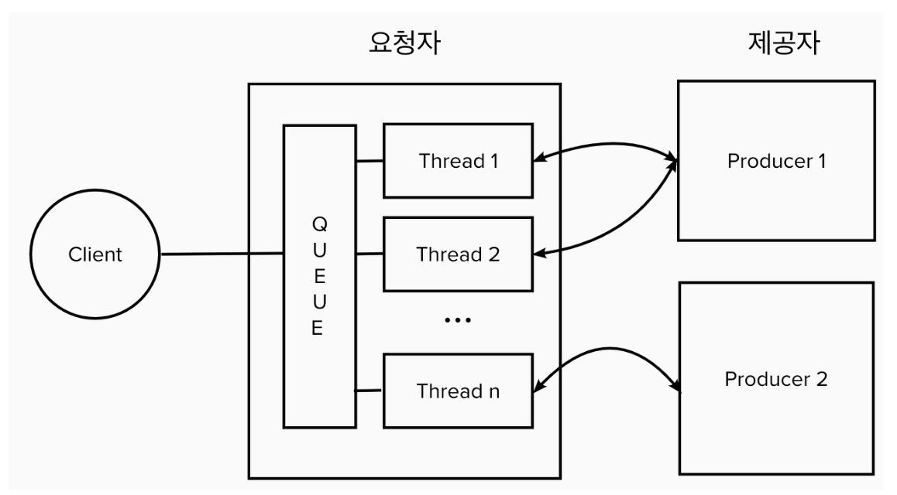

## 글 링크
- [동기와 비동기, Blocking과 Non-Blocking](https://musma.github.io/2019/04/17/blocking-and-synchronous.html)
- [1대의 서버 애플리케이션은 최대 몇 개의 동시 요청을 감당할 수 있을까?](https://happycloud-lee.tistory.com/220)
- [신규 전시 프로젝트에서 WebClient 사용하기](https://oliveyoung.tech/blog/2022-11-10/oliveyoung-discovery-premium-webclient/)
- [WebClient Docs](https://docs.spring.io/spring-framework/reference/web/webflux-webclient.html)

## 내용 정리
### Synchronous와 Asynchronous, Blocking과 Non-Blocking
- `Synchronous와 Asynchronous`: 호출한 함수가 호출된 함수의 수행 결과를 신경쓰는지 여부를 의미
  - Synchronous: 호출한 함수가 호출된 함수의 수행 결과와 종료를 신경씀.
  - Asynchronous: 호출한 함수가 호출된 함수의 수행 결과와 종료에 신경을 쓰지 않음. (호출된 함수가 혼자 처리)
- `Blocking과 Non-Blocking`: 함수를 호출하게 되면 제어권이 호출된 함수로 넘어간다. 이때 호출한 함수에게 언제 제어권을 돌려주는지의 차이
  - Blocking: 호출된 함수가 자신의 로직을 마칠 때까지 제어권을 가지고 있음. (호출한 함수는 다른 작업을 할 수 없음)
  - Non-Blocking: 호출된 함수가 자신의 로직을 마치지 않았더라도 제어권을 반환. (호출한 함수는 다른 작업 수행이 가능함)

### RestTemplate vs WebClient
#### RestTemplate

- RestTemplate은 기본적으로 Multi-Thread & Blocking 방식을 사용한다.
- Thread Pool을 미리 두어 HTTP 요청이 필요할 때 Thread를 할당받게 된다 (1 요청 - 1 Thread)
- 각 Thread는 Blocking방식으로 처리되어 응답이 올 때까지 해당 Thread는 다른 요청에 할당될 수 없다.

#### WebClient

- WebClient는 기본적으로 Single Thread & Non-Blocking 방식을 사용한다.
- 각 HTTP 요청은 Event Loop 내의 Job으로 등록된다.
- Event Loop는 Job을 처리한 후 결과를 기다리지 않고 다른 Job을 처리한다
- 제공자로부터 callback으로 응답이 오면 그 결과를 요청자에게 제공한다.