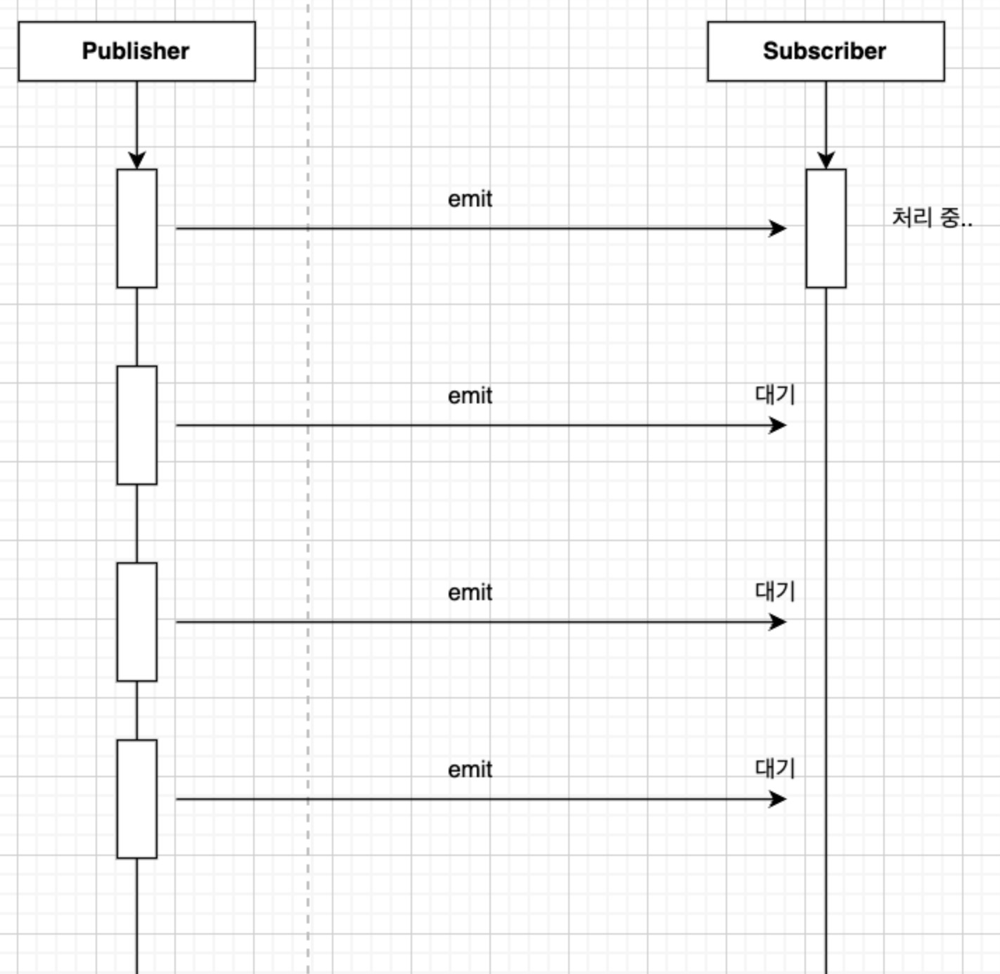
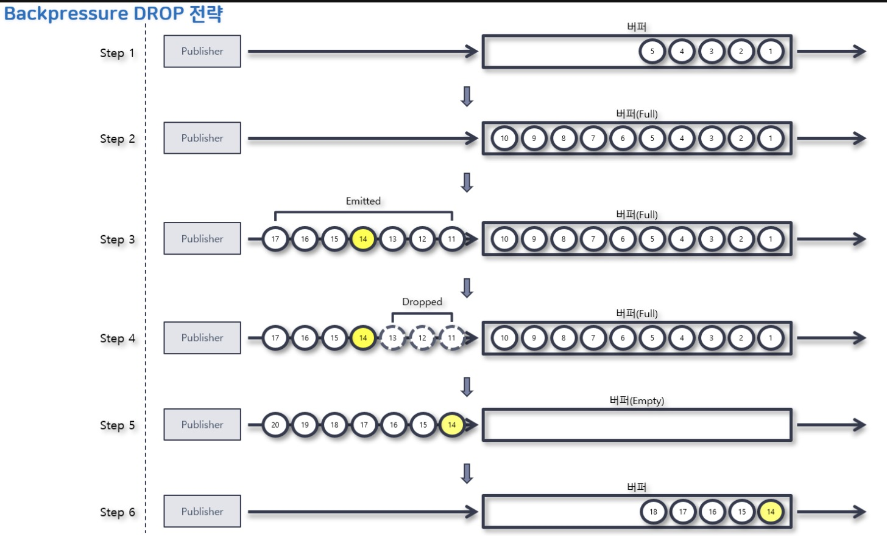
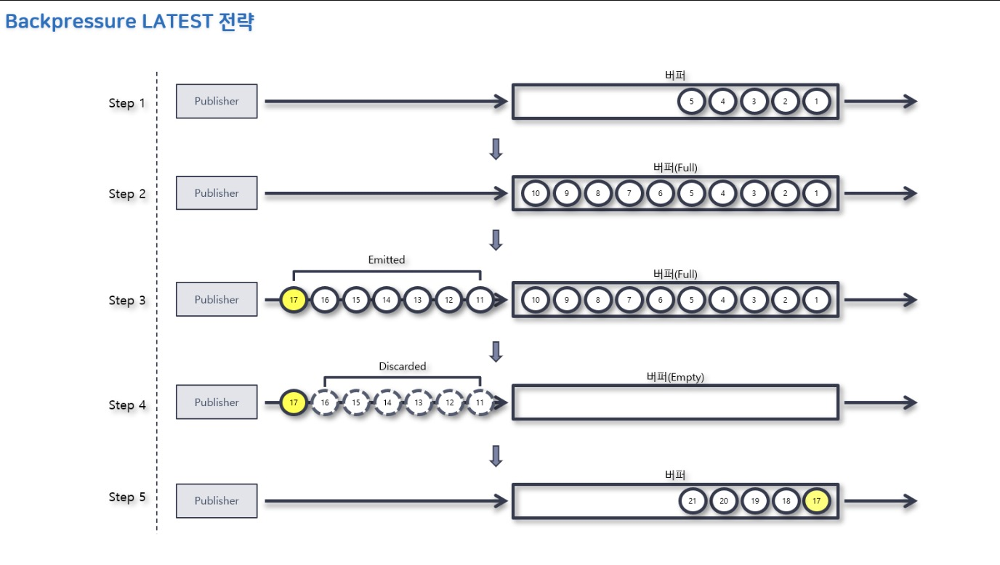
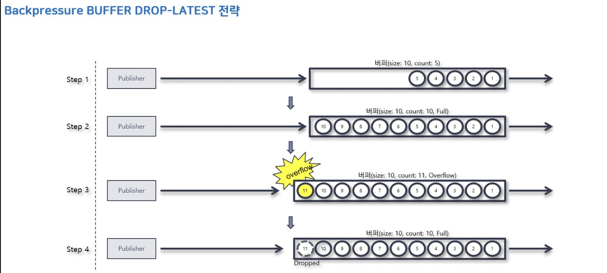
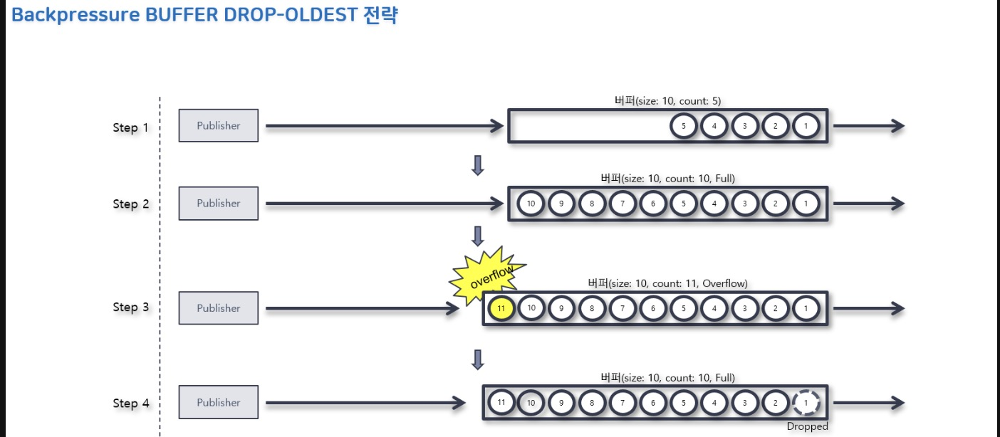

## 1. Reactor란?
- Reacctor란 리액티브 스트림즈의 구현체이다.
- 즉, 리액티브 프로그래밍을 위한 라이브러리이다.
- Spring Fraamework 5부터 포함되었고 Spring WebFlux에 라이브러리로 포함되어 있다.


### Reactor 특징
1. Reactive  Streams
   - 리액티브 스트림즈를 구현한 라이브러리이다.
2. Non-Blocking
   - Reactor는 JVM 위에서 실행되는 Non-Blocking 앱을 제작하기 위한 필수 기술이다.
3. Java's Functional API
   - Publisher와 Subscriber 간의 상호작용은 Java Functional API를 통해 이루어진다.
4. Flux [N]
    - Reactor에서 0 ~ N개 데이터를 emit할 수 있는 Publisher
5. Mono [0|1]
   - Reactor에서 0 또는 1개 데이터를 emit할 수 있는 Publisher
6. Well-suited for microservices
   - microservices 환경에서는 I/O가 빈번히 발생한다.
   - 빈번히 I/O 작업이 발생하는 환경에서는 Non-Blocking 방식이 적합하다.
7. Backpressure-ready network
   - Publisher로부터 받은 데이터를 처리할 때 과부하를 방지하는 Backpressure 기술을 지원한다.


### Reactor의 구성 요소
```java
public class Main {
    public static void main(String[] args) {
        Flux<String> sequence = Flux.just("Hello", "Reactor");
        sequence.map(data -> data.toLowerCase())
                .subscribe(data -> System.out.println(data));
    }
}
```
- 위 코드를 바탕으로 Reactor 구성 요소를 정리하자면 아래와 같다.
  - Flux: Publisher
  - "Hello", "Reactor": Data Source
  - just(), map(): Operator
  - subscribe(): Subscriber
- 동작 순서는 아래와 같다.
  1. 데이터를 생성해서 제공한다.
  2. 데이터를 가공한다.
  3. 데이터를 처리한다.

## 2. 마블 다이어그램 (Marble Diagram)
- 여러 구슬 모양의 도형으로 구성된 도표이다.
- 비동기적인 데이터 흐름을 시간의 흐름에 따라 시각적으로 표시한 것이다.
- 리액티브 프로그래밍의 Operator를 이해하는데 큰 도움이 된다.
- 크게 Mono 마블 다이어그램과 Flux 마블 다이어그램으로 구분할 수 있다.


### Mono 마블 다이어그램

- 상단에 1개의 수평 축
  - 상단의 경우 Publisher가 전달하는 데이터이다.
  - 왼쪽에서 오른쪽으로 시간의 흐름을 나타낸다.
  - Mono이기 때문에 데이터를 나타내는 구슬 도형이 1개이다. (Optional Item)
  - 수평 축의 끝부분의 수직 막대는 Mono가 정상적으로 데이터 발행을 마무리한 시점을 뜻한다. (onComplete Signal)
- 중간의 네모 박스는 operator를 뜻한다.
  - 상단 Publisher에서 emit된 Imem들이 입력으로 들어와 Operator가 수행되고 하단으로 결과를 전달한다.
- 하단 1개의 수평 축
  - 마찬가지로 왼쪽에서 오른쪽으로 시간의 흐름을 나타낸다.
  - Operator의 결과값을 나타낸다.
  - 위 사진처럼 X아이콘을 통해 error 상황을 정의할 수도 있다.
  
### Flux 마블 다이어그램

- Mono 마블 다이어그램과 전반적인 구성은 동일하다.
- 단, emit item의 개수가 0 ~ N이기 때문에 상단 수평 축에 구슬 모형이 여러개 존재한다.

## 3. Cold Sequence와 Hot Sequence
### 컴퓨터 공학에서 Cold / Hot의 의미
- Cold: 무언가를 새로 시작한다는 의미
    - 얘사: Cold Wallet 인터넷과 단절되어 있는 암호 화폐 지갑
- Hot: 무언가를 새로 시작하지 않는다는 의미
  - 예시: Hot Deploy - 서버 재시작 없이 응용 프로그램의 변경 사항을 반영하는 기능


### Cole Sequence 예시
```java
@Slf4j
public class Example7_1 {
    public static void main(String[] args) throws InterruptedException {

        Flux<String> coldFlux =
                Flux
                    .fromIterable(Arrays.asList("KOREA", "JAPAN", "CHINESE"))
                    .map(String::toLowerCase);

        coldFlux.subscribe(country -> log.info("# Subscriber1: {}", country));
        System.out.println("----------------------------------------------------------------------");

        Thread.sleep(2000L);

        coldFlux.subscribe(country -> log.info("# Subscriber2: {}", country));
    }
}

// 23:07:05.739 [main] INFO - # Subscriber1: korea
// 23:07:05.740 [main] INFO - # Subscriber1: japan
// 23:07:05.740 [main] INFO - # Subscriber1: chinese
// ----------------------------------------------------------------------
// 23:07:07.746 [main] INFO - # Subscriber2: korea
// 23:07:07.749 [main] INFO - # Subscriber2: japan
// 23:07:07.750 [main] INFO - # Subscriber2: chinese
```
- Subscriber가 구독하는 시점이 달라도 구독 때마다 Publisher는 데이터를 emit하는 과정을 처음부터 다시 시작한다.

```java
public class Example {
    public static void main(String[] args) throws InterruptedException {
        URI worldTimeUri = UriComponentsBuilder.newInstance().scheme("http")
                .host("worldtimeapi.org")
                .port(80)
                .path("/api/timezone/Asia/Seoul")
                .build()
                .encode()
                .toUri();

        Mono<String> mono = getWorldTime(worldTimeUri);
        mono.subscribe(dateTime -> log.info("# dateTime 1: {}", dateTime));
        Thread.sleep(2000);
        mono.subscribe(dateTime -> log.info("# dateTime 2: {}", dateTime));

        Thread.sleep(2000);
    }

    private static Mono<String> getWorldTime(URI worldTimeUri) {
        return WebClient.create()
                .get()
                .uri(worldTimeUri)
                .retrieve()
                .bodyToMono(String.class)
                .map(response -> {
                    DocumentContext jsonContext = JsonPath.parse(response);
                    String dateTime = jsonContext.read("$.datetime");
                    return dateTime;
                });
    }
}

// # dateTime 1: 2022-02-21T14:55:06.365269+09:00
// # dateTime 2: 2022-02-21T14:55:08.265269+09:00
```
- 결과를 보면 총 2번의 구독이 발생했다.
- 발생 시점마다 데이터 emit 과정이 처음부터 새로 시작되어 log에 2초 정도의 차이가 있는 것을 확인할 수 있다.

### Hot Sequence 예시
```java
public class Example {
    public static void main(String[] args) throws InterruptedException {
        String[] singers = {"Singer A", "Singer B", "Singer C", "Singer D", "Singer E"};

        log.info("# Begin concert:");
        Flux<String> concertFlux =
                Flux
                    .fromArray(singers)
                    .delayElements(Duration.ofSeconds(1))
                    .share();

        concertFlux.subscribe(
                singer -> log.info("# Subscriber1 is watching {}'s song", singer)
        );

        Thread.sleep(2500);

        concertFlux.subscribe(
                singer -> log.info("# Subscriber2 is watching {}'s song", singer)
        );

        Thread.sleep(3000);
    }
}

// 23:12:24.717 [parallel-1] INFO - # Subscriber1 is watching Singer A's song
// 23:12:25.722 [parallel-2] INFO - # Subscriber1 is watching Singer B's song
// 23:12:26.729 [parallel-3] INFO - # Subscriber1 is watching Singer C's song
// 23:12:26.729 [parallel-3] INFO - # Subscriber2 is watching Singer C's song
// 23:12:27.733 [parallel-4] INFO - # Subscriber1 is watching Singer D's song
// 23:12:27.733 [parallel-4] INFO - # Subscriber2 is watching Singer D's song
// 23:12:28.738 [parallel-5] INFO - # Subscriber1 is watching Singer E's song
// 23:12:28.739 [parallel-5] INFO - # Subscriber2 is watching Singer E's song
```
- share() Operator에 의해 원본 Flux를 멀티캐스트한다. 
  - `중요: 만약 Subscriber1이 구독을 종료한 이후 Subscriber2가 구독을 시작한다면 Subscriber2는 처음부터 데이터를 구독하게 됨`
- 즉, 여러 Subscriber가 하나의 원본 Flux를 공유하게 된다.
- 결과를 보면 Subscriber2는 Singer A, Singer B 데이터를 전달받지 못한 것을 확인할 수 있다.
- 로그를 보면 thread 명이 남은 걸 확인할 수 있는데 이는 delayElements() Operator의 default thread scheduler가 parallel이기 때문이다.
  - Scheduler는 10장에서...


```java
@Slf4j
public class Example {
    public static void main(String[] args) throws InterruptedException {
        URI worldTimeUri = UriComponentsBuilder.newInstance().scheme("http")
                .host("worldtimeapi.org")
                .port(80)
                .path("/api/timezone/Asia/Seoul")
                .build()
                .encode()
                .toUri();

        Mono<String> mono = getWorldTime(worldTimeUri).cache();
        mono.subscribe(dateTime -> log.info("# dateTime 1: {}", dateTime));
        Thread.sleep(2000);
        mono.subscribe(dateTime -> log.info("# dateTime 2: {}", dateTime));

        Thread.sleep(2000);
    }

    private static Mono<String> getWorldTime(URI worldTimeUri) {
        return WebClient.create()
                .get()
                .uri(worldTimeUri)
                .retrieve()
                .bodyToMono(String.class)
                .map(response -> {
                    DocumentContext jsonContext = JsonPath.parse(response);
                    String dateTime = jsonContext.read("$.datetime");
                    return dateTime;
                });
    }
}

// # dateTime 1: 2022-02-21T14:55:06.365269+09:00
// # dateTime 2: 2022-02-21T14:55:06.365269+09:00
```
- cache() Operator는 Cold Sequence로 동작하는 Mono를 Hot Sequence로  변경한다.
- emit된 데이터를 캐시해 구독이 발생할 때마다 캐시된 값을 전달한다.
- Hot Sequence의 첫 예시와 상황이 동일하지는 않은 것 같다.
  - 단, 구독이 발생했을 때 데이터 emit을 다시 하지 않는다(Cache값 활용)는 점에서 동일하게 Hot Sequence이다
#### HOT의 2가지 의미
1. 최초 구독이 발생하기 전까지는 데이터의 emit이 발생하지 않는 것 (Warm up)
2. 구독 여부와 상관 없이 데이터가 emit되는 것


## 4. Backpressure

- 위 그림의 Pub - Sub 데이터 흐름을 보면 Sub의 처리 속도가 Pub의 emit 속도를 못따라가고 있다.
- 이런 상황에서 emit된 data 2 ~ N은 data 1이 처리되기를 대기하고 있다.
- 하지만 무제한의 데이터가 보관될 수는 없기 때문에 데이터는 유실되거나 저장 공간을 넘어서 오버 플로가 발생할 수도 있다.
- 이러한 문제점을 해결하는 수단이 바로 Backpressure이다.

### Reactor에서 Backpressure 처리 방식
#### 1. 데이터 요청 개수 제어 (BaseSubscriber 구현)
```java
    public static void main(String[] args) {

        Flux.range(1, 5)
                .doOnRequest(data -> System.out.println("# doOnRequest: "+data))
                .subscribe(new BaseSubscriber<Integer>() {
                    @Override
                    protected void hookOnSubscribe(Subscription subscription) { // 최초 데이터 요청 개수를 제어하는 역할
                        request(1);
                    }

                    @Override
                    protected void hookOnNext(Integer value) { // Subscriber가 데이터를 처리한 후 다시 데이터를 요청할 때의 개수를 제어하는 역할

                        try {
                            Thread.sleep(2000L);
                        } catch (InterruptedException e) {
                            throw new RuntimeException(e);
                        }
                        System.out.println("# hookOnNext: "+value);;
                        request(1);
                    }
                });
    }

// 결과
// doOnRequest: 1
(2초 대기)
// hookOnNext: 1
// doOnRequest: 1
(2초 대기)
// hookOnNext: 2
// doOnRequest: 1
(2초 대기)
// hookOnNext: 3
// doOnRequest: 1
(2초 대기)
// hookOnNext: 4
// doOnRequest: 1
(2초 대기)
// hookOnNext: 5
// doOnRequest: 1
```
- 위 코드와 같이 BaseSubscriber를 구현하여 적절한 요청 데이터 개수를 결정하는 것도 하나의 Backpressure 전략이 될 수 있다.

#### 2. IGNORE 전략
```java
    public static void main(String[] args) throws InterruptedException {
        Flux.interval(Duration.ofMillis(1L))
                .doOnNext(data -> System.out.println("// doOnNext:  "+data)) // 한 sequence가 emit될 때마다 발생
                .publishOn(Schedulers.parallel())
                .subscribe(data -> {
                    try {
                        Thread.sleep(Duration.ofMillis(5).toMillis());
                    } catch (InterruptedException e) {
                    }
                }, error -> System.out.println("// "  +error));

        Thread.sleep(Duration.ofSeconds(5).toMillis());
    }
    
  
// doOnNext:  0
// doOnNext:  1
...
// doOnNext:  252
// doOnNext:  253
// doOnNext:  254
// doOnNext:  255
// reactor.core.Exceptions$OverflowException: Could not emit tick 256 due to lack of requests 


// IGNORE를 명시적으로 적용
    public static void main(String[] args) throws InterruptedException {

        Flux.create(fluxSink -> {
                    for(int i = 0; i < 10000; i++) {
                        fluxSink.next(i);
                    }
                    fluxSink.complete();
                }, FluxSink.OverflowStrategy.IGNORE)
                .doOnNext(data -> System.out.println("// doOnNext:  "+data))
                .publishOn(Schedulers.parallel())
                .subscribe(data -> {
                    try {
                        Thread.sleep(Duration.ofMillis(5).toMillis());
                    } catch (InterruptedException e) {
                    }
                }, error -> System.out.println("// "  +error));

        Thread.sleep(Duration.ofSeconds(5).toMillis());
    }

// doOnNext:  0
// doOnNext:  1
...
// doOnNext:  252
// doOnNext:  253
// doOnNext:  254
// doOnNext:  255
// doOnNext:  256
// doOnNext:  257
// reactor.core.Exceptions$OverflowException: Queue is full: Reactive Streams source doesn't respect backpressure
// emit에 성공한 데이터 수가 다르네..
```
- Backpressure 전략을 적용하지 않는 것을 뜻한다.
- Downstream 큐가 가득 차면 아무 전략이 적용되지 않았기 떄문에 IllegalStateException이 발생할 수 있다.
- 위 코드를 실행해보면 0 ~ 255까지는 emit되고 256번째 data가 emit되는 과정에서 오류가 발생한 걸 알 수 있다.
  - Downstream Queue 크기가 256
  - Subscriber가 읽었다고 지우는 공간을 비우는 방식이 아닌듯 싶다.
- 여기서 중요한 점은 마지막 라인의 오류는 Publisher가 data(256)를 emit하는 시점이 아닌 Subscriber가 256번을 subscribe 메서드에 의해 처리하는 시점에 발생했다는 점이다.
- 만약 Subscriber가 256번째 데이터를 읽지 않는다면 오류는 발생하지 않았을 것이다.


#### 3. Error 전략
```java
    public static void main(String[] args) throws InterruptedException {
        Flux.interval(Duration.ofMillis(1L))
                .onBackpressureError()
                .doOnNext(data -> System.out.println("// doOnNext:  "+data))
                .publishOn(Schedulers.parallel())
                .subscribe(data -> {
                    try {
                        Thread.sleep(Duration.ofMillis(5).toMillis());
                    } catch (InterruptedException e) {
                    }
                }, error -> System.out.println("// "  +error));

        Thread.sleep(Duration.ofSeconds(5).toMillis());
    }

// doOnNext:  0
// doOnNext:  1
// doOnNext:  2
// doOnNext:  3
...
// doOnNext:  252
// doOnNext:  253
// doOnNext:  254
// doOnNext:  255
// reactor.core.Exceptions$OverflowException: The receiver is overrun by more signals than expected (bounded queue...)
```
- Downstream으로 전달할 데이터가 버퍼에 가득 찰 경우 Exception을 발생시키는 전략
- 내부적으로 onBackpressureDrop()을 사용하지만 Drop이 발생하는 시점에 OverflowException을 throw한다.
- 오류의 메시지만 다르지 IGNORE와 ERROR 전략은 동일하게 동작하고 있다
  - [IGNORE vs ERROR](https://stackoverflow.com/questions/59307989/reactor-overflow-strategy-ignore-vs-error)
  - 위 글에 따르면 IGNORE 전략의 경우 복구의 기회가 주어지고 ERROR의 경우 복구의 기회가 주어지지 않는다는 점이 다르다고 한다.
  - 하지만 작동시켜보면 다른 점을 잘 모르겠음...

#### 3. Drop 전략

- 전달할 데이터가 버퍼에 가득 찰 경우 버퍼 밖에서 대기 중인 데이터 중에서 먼저 emit된 데이터부터 Drop시키는 전략

```java
    public static void main(String[] args) throws InterruptedException {

        Flux.interval(Duration.ofMillis(1L))
                .onBackpressureDrop(dropped -> System.out.println("// dropped: "+ dropped))
                .doOnNext(data -> System.out.println("// doOnNext:  " + data))
                .publishOn(Schedulers.parallel())
                .subscribe(data -> {
                    try {
                        Thread.sleep(Duration.ofMillis(5).toMillis());
                    } catch (InterruptedException e) {
                    }
                }, error -> System.out.println("// "  +error));

        Thread.sleep(Duration.ofSeconds(2).toMillis());
    }
// doOnNext:  0
// doOnNext:  1
// doOnNext:  2
// doOnNext:  3
// doOnNext:  4
...
// doOnNext:  252
// doOnNext:  253
// doOnNext:  254
// doOnNext:  255
// dropped: 256
// dropped: 257
// dropped: 258
...
// dropped: 1162
// dropped: 1163
// dropped: 1164
// dropped: 1165
// doOnNext:  1166
// doOnNext:  1167
// doOnNext:  1168
```
- log를 보면 256번째 data까지 buffer에 들어가며 가득찬 걸로 보인다.
- 때문에 이후 257번째 ~ 1166번째까지의 data는 drop되고 buffer가 빈 후에는 다시 정상적으로 데이터가 쌓이는 걸 확인할 수 있다.

### 4. Latest 전략

- 새로운 데이터가 들어오는 시점에 가장 최근의 데이터만 남겨두고 나머지 데이터를 폐기한다
- Drop 전략과의 차이점은 어떤 데이터들을 Drop할 것인지의 차이

```java
    public static void main(String[] args) throws InterruptedException {

        Flux.interval(Duration.ofMillis(1L))
                .onBackpressureLatest()
                .doOnNext(data -> System.out.println("// doOnNext:  " + data))
                .publishOn(Schedulers.parallel())
                .subscribe(data -> {
                    try {
                        Thread.sleep(Duration.ofMillis(5).toMillis());
                    } catch (InterruptedException e) {
                    }
                }, error -> System.out.println("// "  +error));

        Thread.sleep(Duration.ofSeconds(2).toMillis());
    }

// doOnNext:  0
// doOnNext:  1
...
// doOnNext:  253
// doOnNext:  254
// doOnNext:  255
// doOnNext:  1146
// doOnNext:  1147
// doOnNext:  1148
```
- log를 Drop과 마찬가지로 log를 보면 256번째 data까지 buffer에 들어가며 가득찬 걸로 보인다.
- 단 Drop 전략에서는 1166번째 data까지 버려졌다면 Latest전략에서는 1146번째 data까지만 버려진다.
- 새로운 데이터가 buffer에 들어가는 시점에 가장 최근 데이터가 1147번째 데이터였고 그 이전 data를 폐기한 걸로 보인다.


### 5. Buffer 전략
- 버퍼는 일반적으로 입출력을 수행하는 장치들간의 속도 차이를 조절하기 위해 사용하는 데이터 저장 공간이다.
- [Buffer와 Drop 전략의 차이](https://www.inflearn.com/questions/957813/backpressure-example-%EC%BD%94%EB%93%9C-%EC%A7%88%EB%AC%B8%EC%9E%88%EC%8A%B5%EB%8B%88%EB%8B%A4)
  - Drop 전략 예시를 보면 256번째 데이터까지 정상 emit이 가능했던 건 Buffer가 존재했기 때문이다.
  - Buffer 전략을 기본 Buffer 앞단에 Buffer 1개를 더 두어 추가된 Buffer에 Drop 전략을 적용하는 것이라 볼 수 있다.

#### (1) Buffer - Drop Latest 전략

- Buffer 내 가장 최근 데이터를 제거하고 emit 데이터를 Buffer에 추가하는 전략
#### (2) Buffer - Drop Oldest 전략

- Buffer 내 가장 오래된 데이터를 제거하고 emit 데이터를 Buffer에 추가하는 전략


## 5. Sinks란?
- 리액티브 스트림즈의 구성 요소 중 하나인 Processor의 개선된 버전.
- Signal을 프로그래밍 방식으로 푸시할 수 있는 구조이며 Flux, Mono의 의미 체계를 가진다.
- Processor와 다른 점은 스레드 안정성을 보장하기 때문에 멀티스레드 방식으로 Signal을 전송해도 문제가 없다
  - Processor는 싱글 스레드 기반

### Sink의 종류
#### 1. Sinks.One
- 1건의 데이터를 전송하는 방법을 정의해 둔 기능 명세
```java
    public static void main(String[] args) throws InterruptedException {

        Sinks.One<String> sinkOne = Sinks.one();
        Mono<String> mono = sinkOne.asMono(); // asMono() 메서드를 통해 Sinks.One -> Mono

        // param: emit value, emit 실패 시 핸들링 전략
        sinkOne.emitValue("Hello Reactor", Sinks.EmitFailureHandler.FAIL_FAST);
        // 

        mono.subscribe(data -> System.out.println(data));
        mono.subscribe(data -> System.out.println(data));
    }
    
// Hello Reactor
// Hello Reactor
```
- 여러 건의 데이터를 여러 가지 방식으로 전송하는 기능을 정의해 둔 기능 명세
- Sinks.one() 메서드 호출은 한 건의 데이터를 emit하는 기능을 사용하려는 것이라 이해할 수 있음

```java
    public static void main(String[] args) throws InterruptedException {

        Sinks.One<String> sinkOne = Sinks.one();
        Mono<String> mono = sinkOne.asMono();

        // param: emit value, emit 실패 시 핸들링 전략
        sinkOne.emitValue("Hello Reactor", Sinks.EmitFailureHandler.FAIL_FAST);
        sinkOne.emitValue("Hi Reactor", Sinks.EmitFailureHandler.FAIL_FAST);

        mono.subscribe(data -> System.out.println(data));
        mono.subscribe(data -> System.out.println(data));
    }
    
// Hello Reactor
// Hello Reactor
```
- 위와 같이 emitValue를 2번 사용해도 처음 emit한 데이터만 정상 동작하고 나머지는 Drop된다


##### FAIL_FAST란?
```java
    public interface EmitFailureHandler {
        EmitFailureHandler FAIL_FAST = (signalType, emission) -> {
            return false;
        };
    }
```
- lamda 표현식으로 구성된 EmitFailureHandler 인터페이스의 구현 객체
- emit 도중에 발생한 오류에 대해 빠르게 실패 처리를 하여 스레드 간의 경합, 교착 상태를 방지한다

#### 2. Sinks.Many
- 여러 건의 데이터를 여러 가지 방법으로 전송하는 기능을 정의해 둔 기능 명세
```java
public interface ManySpec {
    UnicastSpec unicast();
    MulticastSpec multicast();
    MulticastReplaySpec replay();
}
```
- Sinks.many() 메서드는 ManySpec을 반환하는데 ManySpec은 3가지의 3가지 별도의 Spec을 제공한다.

##### (1) UnicastSpec
```java
    public static void main(String[] args) throws InterruptedException {

        Sinks.Many<Integer> unicastSink = Sinks.many().unicast().onBackpressureBuffer();

        Flux<Integer> fluxView = unicastSink.asFlux();

        unicastSink.emitNext(1, Sinks.EmitFailureHandler.FAIL_FAST);
        unicastSink.emitNext(2, Sinks.EmitFailureHandler.FAIL_FAST);
        unicastSink.emitNext(3, Sinks.EmitFailureHandler.FAIL_FAST);

        fluxView.subscribe(data -> System.out.println(data));

        unicastSink.emitNext(4, Sinks.EmitFailureHandler.FAIL_FAST);
    }
    
// 1
// 2
// 3
// 4
```
- 하나의 특정 시스템만 데이터를 전달 받는 방식이다. (One to One)
- 만약 fluxView.subscribe()를 2번 실행하면 아래와 같은 오류를 반환한다.
  - java.lang.IllegalStateException: Sinks.many().unicast() sinks only allow a single Subscriber

##### (2) MulticastSpec
```java
    public static void main(String[] args) throws InterruptedException {

        Sinks.Many<Integer> multicastSink = Sinks.many().multicast().onBackpressureBuffer();

        Flux<Integer> fluxView = multicastSink.asFlux();

        multicastSink.emitNext(1, Sinks.EmitFailureHandler.FAIL_FAST);
        multicastSink.emitNext(2, Sinks.EmitFailureHandler.FAIL_FAST);
        multicastSink.emitNext(3, Sinks.EmitFailureHandler.FAIL_FAST);

        fluxView.subscribe(data -> System.out.println("Subscriber 1: "+data));
        fluxView.subscribe(data -> System.out.println("Subscriber 2: "+data));

        multicastSink.emitNext(4, Sinks.EmitFailureHandler.FAIL_FAST);

        fluxView.subscribe(data -> System.out.println(data));
    }
    
// Subscriber 1: 1
// Subscriber 1: 2
// Subscriber 1: 3
// Subscriber 1: 4
// Subscriber 2: 4
```
- 하나 이상의 일부 시스템들만 정보를 전달받는 방식
- 즉, 하나 이상의 Subscriber에게 데이터를 emit할 수 있다
- Sinks가 Publisher로 동작하면 기본적으로 Hot Publisher로 동작한다.
- onBackpressureBuffer() 메서드는 Warm up 특징을 가지는 Hot Sequence로 구독이 발생한 시점에 emit이 시작된다.
- 때문에 Subscriber 2는 데이터 4만 구독하게 된다.

##### (3) MulticastReplaySpec
```java
    public static void main(String[] args) throws InterruptedException {

        Sinks.Many<Integer> replaySink = Sinks.many().replay().limit(3);

        Flux<Integer> fluxView = replaySink.asFlux();

        replaySink.emitNext(1, Sinks.EmitFailureHandler.FAIL_FAST);
        replaySink.emitNext(2, Sinks.EmitFailureHandler.FAIL_FAST);
        replaySink.emitNext(3, Sinks.EmitFailureHandler.FAIL_FAST);

        fluxView.subscribe(data -> System.out.println("Subscriber 1: "+data));

        fluxView.subscribe(data -> System.out.println("Subscriber 2: "+data));

        replaySink.emitNext(4, Sinks.EmitFailureHandler.FAIL_FAST);
    }
    
// Subscriber 1: 1
// Subscriber 1: 2
// Subscriber 1: 3
// Subscriber 2: 1
// Subscriber 2: 2
// Subscriber 2: 3
// Subscriber 1: 4
// Subscriber 2: 4
```
- 이미 emit된 데이터들을 새로운 Subscriber들에게 다시 제공할 수 있는 기능을 제공한다.
- limit() 메서드를 이용하면 Subscriber들의 구독 시점에서 최근 emit된 n개 만큼의 데이터를 다시 제공한다.
## Reference
- [projectreactor docs](https://projectreactor.io/docs/core/release/reference/#howtoReadMarbles)