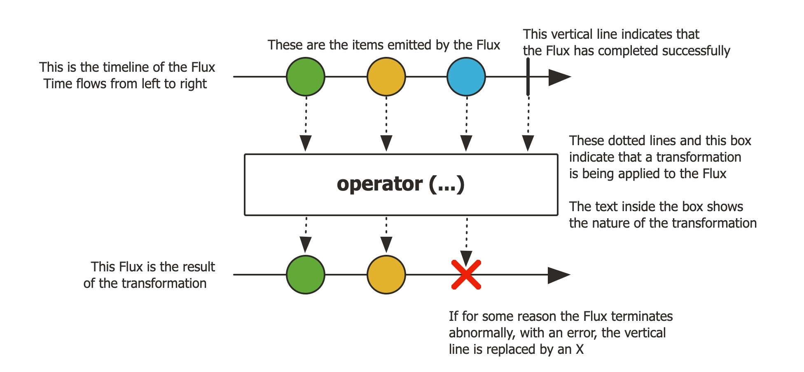

## 1. Reactor란?
- Reacctor란 리액티브 스트림즈의 구현체이다.
- 즉, 리액티브 프로그래밍을 위한 라이브러리이다.
- Spring Fraamework 5부터 포함되었고 Spring WebFlux에 라이브러리로 포함되어 있다.


### Reactor 특징
1. Reactive  Streams
   - 리액티브 스트림즈를 구현한 라이브러리이다.
2. Non-Blocking
   - Reactor는 JVM 위에서 실행되는 Non-Blocking 앱을 제작하기 위한 필수 기술이다.
3. Java's Functional API
   - Publisher와 Subscriber 간의 상호작용은 Java Functional API를 통해 이루어진다.
4. Flux [N]
    - Reactor에서 0 ~ N개 데이터를 emit할 수 있는 Publisher
5. Mono [0|1]
   - Reactor에서 0 또는 1개 데이터를 emit할 수 있는 Publisher
6. Well-suited for microservices
   - microservices 환경에서는 I/O가 빈번히 발생한다.
   - 빈번히 I/O 작업이 발생하는 환경에서는 Non-Blocking 방식이 적합하다.
7. Backpressure-ready network
   - Publisher로부터 받은 데이터를 처리할 때 과부하를 방지하는 Backpressure 기술을 지원한다.


### Reactor의 구성 요소
```java
public class Main {
    public static void main(String[] args) {
        Flux<String> sequence = Flux.just("Hello", "Reactor");
        sequence.map(data -> data.toLowerCase())
                .subscribe(data -> System.out.println(data));
    }
}
```
- 위 코드를 바탕으로 Reactor 구성 요소를 정리하자면 아래와 같다.
  - Flux: Publisher
  - "Hello", "Reactor": Data Source
  - just(), map(): Operator
  - subscribe(): Subscriber
- 동작 순서는 아래와 같다.
  1. 데이터를 생성해서 제공한다.
  2. 데이터를 가공한다.
  3. 데이터를 처리한다.

## 2. 마블 다이어그램 (Marble Diagram)
- 여러 구슬 모양의 도형으로 구성된 도표이다.
- 비동기적인 데이터 흐름을 시간의 흐름에 따라 시각적으로 표시한 것이다.
- 리액티브 프로그래밍의 Operator를 이해하는데 큰 도움이 된다.
- 크게 Mono 마블 다이어그램과 Flux 마블 다이어그램으로 구분할 수 있다.


### Mono 마블 다이어그램

- 상단에 1개의 수평 축
  - 상단의 경우 Publisher가 전달하는 데이터이다.
  - 왼쪽에서 오른쪽으로 시간의 흐름을 나타낸다.
  - Mono이기 때문에 데이터를 나타내는 구슬 도형이 1개이다. (Optional Item)
  - 수평 축의 끝부분의 수직 막대는 Mono가 정상적으로 데이터 발행을 마무리한 시점을 뜻한다. (onComplete Signal)
- 중간의 네모 박스는 operator를 뜻한다.
  - 상단 Publisher에서 emit된 Imem들이 입력으로 들어와 Operator가 수행되고 하단으로 결과를 전달한다.
- 하단 1개의 수평 축
  - 마찬가지로 왼쪽에서 오른쪽으로 시간의 흐름을 나타낸다.
  - Operator의 결과값을 나타낸다.
  - 위 사진처럼 X아이콘을 통해 error 상황을 정의할 수도 있다.
  
### Flux 마블 다이어그램

- Mono 마블 다이어그램과 전반적인 구성은 동일하다.
- 단, emit item의 개수가 0 ~ N이기 때문에 상단 수평 축에 구슬 모형이 여러개 존재한다.

## 3. Cold Sequence와 Hot Sequence
### 컴퓨터 공학에서 Cold / Hot의 의미
- Cold: 무언가를 새로 시작한다는 의미
    - 얘사: Cold Wallet 인터넷과 단절되어 있는 암호 화폐 지갑
- Hot: 무언가를 새로 시작하지 않는다는 의미
  - 예시: Hot Deploy - 서버 재시작 없이 응용 프로그램의 변경 사항을 반영하는 기능


### Cole Sequence 예시
```java
@Slf4j
public class Example7_1 {
    public static void main(String[] args) throws InterruptedException {

        Flux<String> coldFlux =
                Flux
                    .fromIterable(Arrays.asList("KOREA", "JAPAN", "CHINESE"))
                    .map(String::toLowerCase);

        coldFlux.subscribe(country -> log.info("# Subscriber1: {}", country));
        System.out.println("----------------------------------------------------------------------");

        Thread.sleep(2000L);

        coldFlux.subscribe(country -> log.info("# Subscriber2: {}", country));
    }
}

// 23:07:05.739 [main] INFO - # Subscriber1: korea
// 23:07:05.740 [main] INFO - # Subscriber1: japan
// 23:07:05.740 [main] INFO - # Subscriber1: chinese
// ----------------------------------------------------------------------
// 23:07:07.746 [main] INFO - # Subscriber2: korea
// 23:07:07.749 [main] INFO - # Subscriber2: japan
// 23:07:07.750 [main] INFO - # Subscriber2: chinese
```
- Subscriber가 구독하는 시점이 달라도 구독 때마다 Publisher는 데이터를 emit하는 과정을 처음부터 다시 시작한다.

```java
public class Example {
    public static void main(String[] args) throws InterruptedException {
        URI worldTimeUri = UriComponentsBuilder.newInstance().scheme("http")
                .host("worldtimeapi.org")
                .port(80)
                .path("/api/timezone/Asia/Seoul")
                .build()
                .encode()
                .toUri();

        Mono<String> mono = getWorldTime(worldTimeUri);
        mono.subscribe(dateTime -> log.info("# dateTime 1: {}", dateTime));
        Thread.sleep(2000);
        mono.subscribe(dateTime -> log.info("# dateTime 2: {}", dateTime));

        Thread.sleep(2000);
    }

    private static Mono<String> getWorldTime(URI worldTimeUri) {
        return WebClient.create()
                .get()
                .uri(worldTimeUri)
                .retrieve()
                .bodyToMono(String.class)
                .map(response -> {
                    DocumentContext jsonContext = JsonPath.parse(response);
                    String dateTime = jsonContext.read("$.datetime");
                    return dateTime;
                });
    }
}

// # dateTime 1: 2022-02-21T14:55:06.365269+09:00
// # dateTime 2: 2022-02-21T14:55:08.265269+09:00
```
- 결과를 보면 총 2번의 구독이 발생했다.
- 발생 시점마다 데이터 emit 과정이 처음부터 새로 시작되어 log에 2초 정도의 차이가 있는 것을 확인할 수 있다.

### Hot Sequence 예시
```java
public class Example {
    public static void main(String[] args) throws InterruptedException {
        String[] singers = {"Singer A", "Singer B", "Singer C", "Singer D", "Singer E"};

        log.info("# Begin concert:");
        Flux<String> concertFlux =
                Flux
                    .fromArray(singers)
                    .delayElements(Duration.ofSeconds(1))
                    .share();

        concertFlux.subscribe(
                singer -> log.info("# Subscriber1 is watching {}'s song", singer)
        );

        Thread.sleep(2500);

        concertFlux.subscribe(
                singer -> log.info("# Subscriber2 is watching {}'s song", singer)
        );

        Thread.sleep(3000);
    }
}

// 23:12:24.717 [parallel-1] INFO - # Subscriber1 is watching Singer A's song
// 23:12:25.722 [parallel-2] INFO - # Subscriber1 is watching Singer B's song
// 23:12:26.729 [parallel-3] INFO - # Subscriber1 is watching Singer C's song
// 23:12:26.729 [parallel-3] INFO - # Subscriber2 is watching Singer C's song
// 23:12:27.733 [parallel-4] INFO - # Subscriber1 is watching Singer D's song
// 23:12:27.733 [parallel-4] INFO - # Subscriber2 is watching Singer D's song
// 23:12:28.738 [parallel-5] INFO - # Subscriber1 is watching Singer E's song
// 23:12:28.739 [parallel-5] INFO - # Subscriber2 is watching Singer E's song
```
- share() Operator에 의해 원본 Flux를 멀티캐스트한다. 
- 즉, 여러 Subscriber가 하나의 원본 Flux를 공유하게 된다. (Cold Sequence -> Hot Sequence)
- 결과를 보면 Subscriber2는 Singer A, Singer B 데이터를 전달받지 못한 것을 확인할 수 있다.
- 로그를 보면 thread 명이 남은 걸 확인할 수 있는데 이는 delayElements() Operator의 default thread scheduler가 parallel이기 때문이다.
  - Scheduler는 10장에서...


```java
@Slf4j
public class Example {
    public static void main(String[] args) throws InterruptedException {
        URI worldTimeUri = UriComponentsBuilder.newInstance().scheme("http")
                .host("worldtimeapi.org")
                .port(80)
                .path("/api/timezone/Asia/Seoul")
                .build()
                .encode()
                .toUri();

        Mono<String> mono = getWorldTime(worldTimeUri).cache();
        mono.subscribe(dateTime -> log.info("# dateTime 1: {}", dateTime));
        Thread.sleep(2000);
        mono.subscribe(dateTime -> log.info("# dateTime 2: {}", dateTime));

        Thread.sleep(2000);
    }

    private static Mono<String> getWorldTime(URI worldTimeUri) {
        return WebClient.create()
                .get()
                .uri(worldTimeUri)
                .retrieve()
                .bodyToMono(String.class)
                .map(response -> {
                    DocumentContext jsonContext = JsonPath.parse(response);
                    String dateTime = jsonContext.read("$.datetime");
                    return dateTime;
                });
    }
}

// # dateTime 1: 2022-02-21T14:55:06.365269+09:00
// # dateTime 2: 2022-02-21T14:55:06.365269+09:00
```
- cache() Operator는 Cold Sequence로 동작하는 Mono를 Hot Sequence로  변경한다.
- emit된 데이터를 캐시해 구독이 발생할 때마다 캐시된 값을 전달한다.
- Hot Sequence의 첫 예시와 상황이 동일하지는 않은 것 같다.
  - 단, 구독이 발생했을 때 데이터 emit을 다시 하지 않는다(Cache값 활용)는 점에서 동일하게 Hot Sequence이다
#### HOT의 2가지 의미
1. 최초 구독이 발생하기 전까지는 데이터의 emit이 발생하지 않는 것 (Warm up)
2. 구독 여부와 상관 없이 데이터가 emit되는 것

## Reference
- [projectreactor docs](https://projectreactor.io/docs/core/release/reference/#howtoReadMarbles)