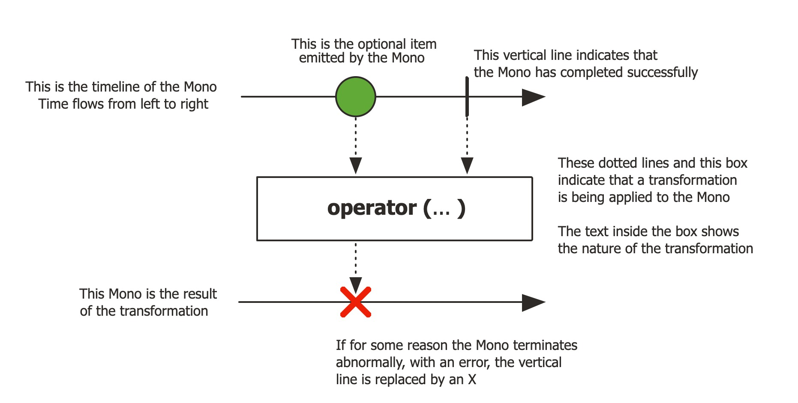

## 1. Reactor란?
- Reacctor란 리액티브 스트림즈의 구현체이다.
- 즉, 리액티브 프로그래밍을 위한 라이브러리이다.
- Spring Fraamework 5부터 포함되었고 Spring WebFlux에 라이브러리로 포함되어 있다.


### Reactor 특징
1. Reactive  Streams
   - 리액티브 스트림즈를 구현한 라이브러리이다.
2. Non-Blocking
   - Reactor는 JVM 위에서 실행되는 Non-Blocking 앱을 제작하기 위한 필수 기술이다.
3. Java's Functional API
   - Publisher와 Subscriber 간의 상호작용은 Java Functional API를 통해 이루어진다.
4. Flux [N]
    - Reactor에서 0 ~ N개 데이터를 emit할 수 있는 Publisher
5. Mono [0|1]
   - Reactor에서 0 또는 1개 데이터를 emit할 수 있는 Publisher
6. Well-suited for microservices
   - microservices 환경에서는 I/O가 빈번히 발생한다.
   - 빈번히 I/O 작업이 발생하는 환경에서는 Non-Blocking 방식이 적합하다.
7. Backpressure-ready network
   - Publisher로부터 받은 데이터를 처리할 때 과부하를 방지하는 Backpressure 기술을 지원한다.


### Reactor의 구성 요소
```java
public class Main {
    public static void main(String[] args) {
        Flux<String> sequence = Flux.just("Hello", "Reactor");
        sequence.map(data -> data.toLowerCase())
                .subscribe(data -> System.out.println(data));
    }
}
```
- 위 코드를 바탕으로 Reactor 구성 요소를 정리하자면 아래와 같다.
  - Flux: Publisher
  - "Hello", "Reactor": Data Source
  - just(), map(): Operator
  - subscribe(): Subscriber
- 동작 순서는 아래와 같다.
  1. 데이터를 생성해서 제공한다.
  2. 데이터를 가공한다.
  3. 데이터를 처리한다.

## 2. 마블 다이어그램 (Marble Diagram)
- 여러 구슬 모양의 도형으로 구성된 도표이다.
- 비동기적인 데이터 흐름을 시간의 흐름에 따라 시각적으로 표시한 것이다.
- 리액티브 프로그래밍의 Operator를 이해하는데 큰 도움이 된다.
- 크게 Mono 마블 다이어그램과 Flux 마블 다이어그램으로 구분할 수 있다.


### Mono 마블 다이어그램

- 상단에 1개의 수평 축
  - 상단의 경우 Publisher가 전달하는 데이터이다.
  - 왼쪽에서 오른쪽으로 시간의 흐름을 나타낸다.
  - Mono이기 때문에 데이터를 나타내는 구슬 도형이 1개이다. (Optional Item)
  - 수평 축의 끝부분의 수직 막대는 Mono가 정상적으로 데이터 발행을 마무리한 시점을 뜻한다. (onComplete Signal)
- 중간의 네모 박스는 operator를 뜻한다.
  - 상단 Publisher에서 emit된 Imem들이 입력으로 들어와 Operator가 수행되고 하단으로 결과를 전달한다.
- 하단 1개의 수평 축
  - 마찬가지로 왼쪽에서 오른쪽으로 시간의 흐름을 나타낸다.
  - Operator의 결과값을 나타낸다.
  - 위 사진처럼 X아이콘을 통해 error 상황을 정의할 수도 있다.
  
### Flux 마블 다이어그램

- Mono 마블 다이어그램과 전반적인 구성은 동일하다.
- 단, emit item의 개수가 0 ~ N이기 때문에 상단 수평 축에 구슬 모형이 여러개 존재한다.

## Reference
- [projectreactor docs](https://projectreactor.io/docs/core/release/reference/#howtoReadMarbles)