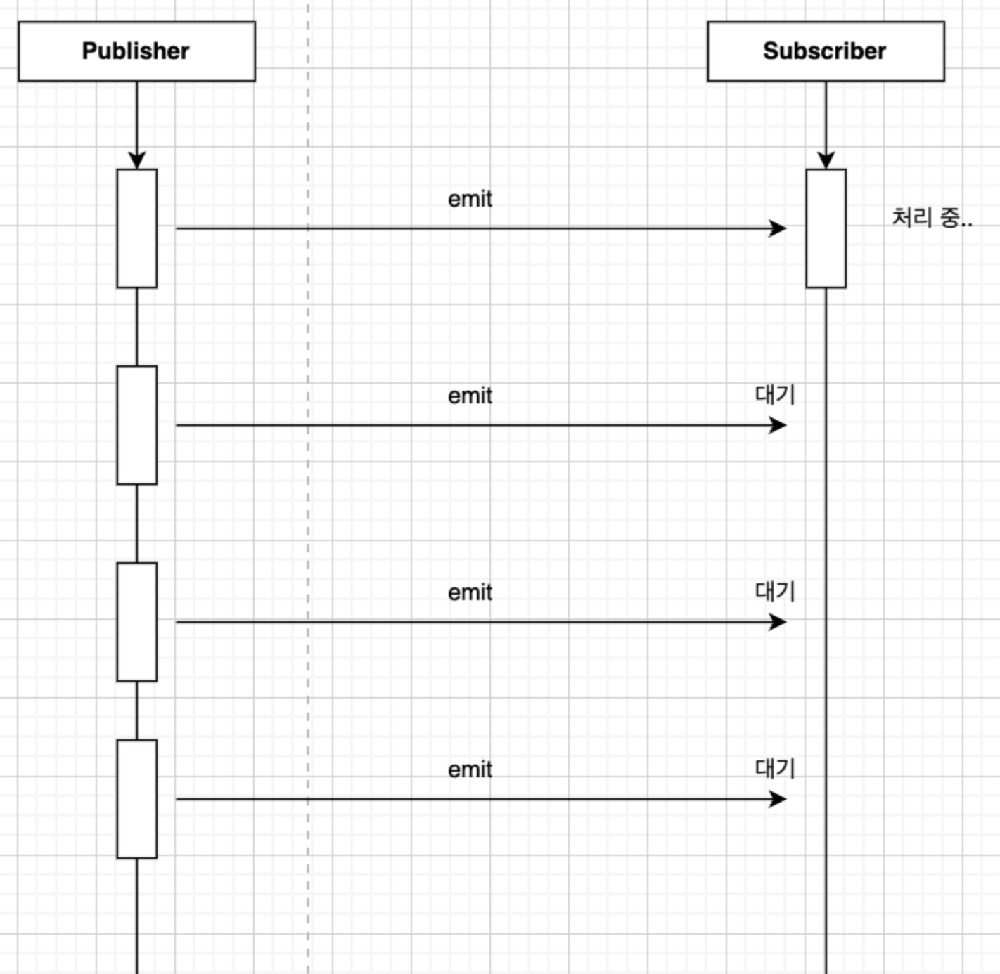
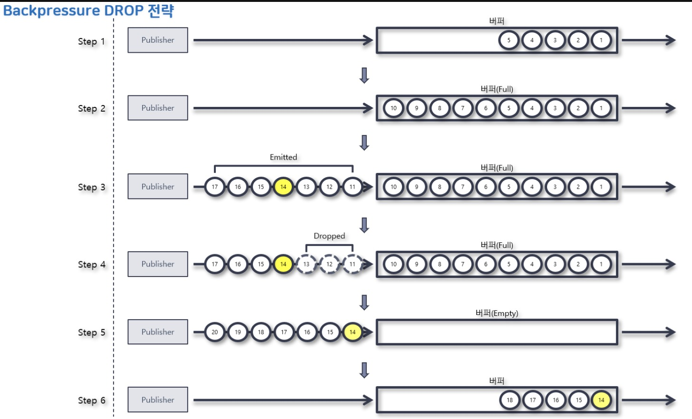
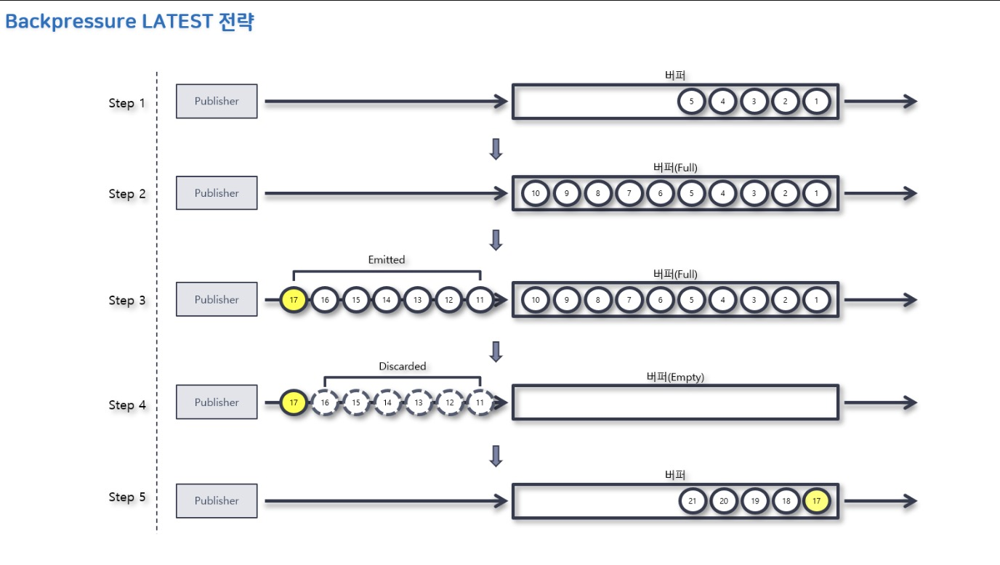
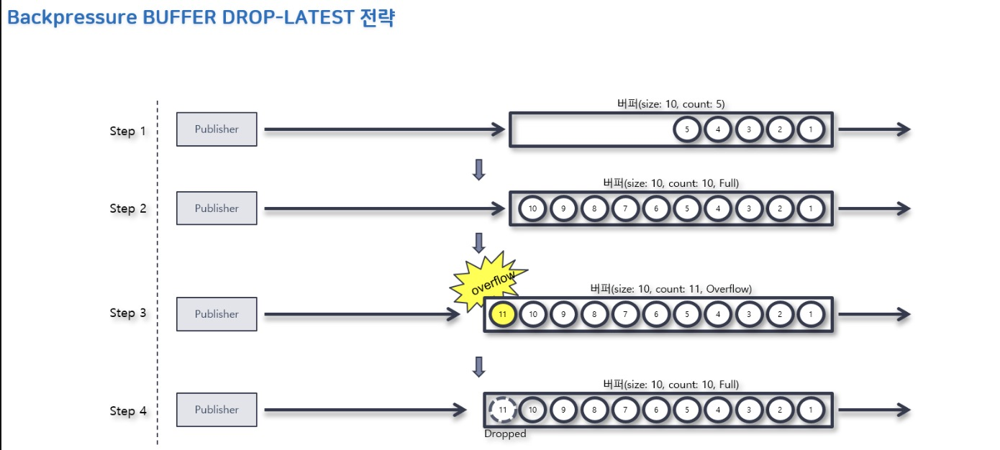
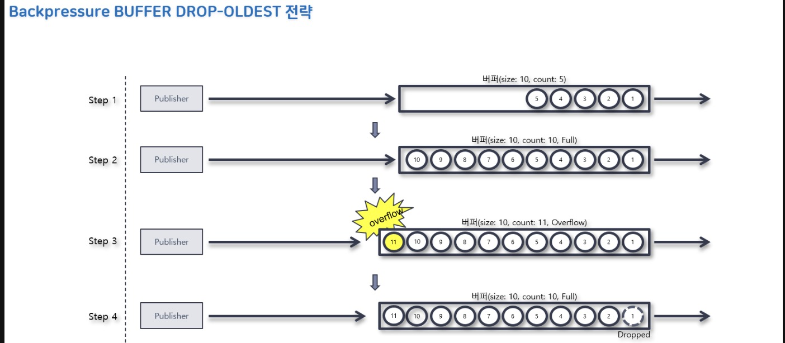

## 1. Backpressure

- 위 그림의 Pub - Sub 데이터 흐름을 보면 Sub의 처리 속도가 Pub의 emit 속도를 못따라가고 있다.
- 이런 상황에서 emit된 data 2 ~ N은 data 1이 처리되기를 대기하고 있다.
- 하지만 무제한의 데이터가 보관될 수는 없기 때문에 데이터는 유실되거나 저장 공간을 넘어서 오버 플로가 발생할 수도 있다.
- 이러한 문제점을 해결하는 수단이 바로 Backpressure이다.

### Reactor에서 Backpressure 처리 방식
#### 1. 데이터 요청 개수 제어 (BaseSubscriber 구현)
```java
    public static void main(String[] args) {

        Flux.range(1, 5)
                .doOnRequest(data -> System.out.println("# doOnRequest: "+data))
                .subscribe(new BaseSubscriber<Integer>() {
                    @Override
                    protected void hookOnSubscribe(Subscription subscription) { // 최초 데이터 요청 개수를 제어하는 역할
                        request(1);
                    }

                    @Override
                    protected void hookOnNext(Integer value) { // Subscriber가 데이터를 처리한 후 다시 데이터를 요청할 때의 개수를 제어하는 역할

                        try {
                            Thread.sleep(2000L);
                        } catch (InterruptedException e) {
                            throw new RuntimeException(e);
                        }
                        System.out.println("# hookOnNext: "+value);;
                        request(1);
                    }
                });
    }

// 결과
// doOnRequest: 1
(2초 대기)
// hookOnNext: 1
// doOnRequest: 1
(2초 대기)
// hookOnNext: 2
// doOnRequest: 1
(2초 대기)
// hookOnNext: 3
// doOnRequest: 1
(2초 대기)
// hookOnNext: 4
// doOnRequest: 1
(2초 대기)
// hookOnNext: 5
// doOnRequest: 1
```
- 위 코드와 같이 BaseSubscriber를 구현하여 적절한 요청 데이터 개수를 결정하는 것도 하나의 Backpressure 전략이 될 수 있다.

#### 2. IGNORE 전략
```java
    public static void main(String[] args) throws InterruptedException {
        Flux.interval(Duration.ofMillis(1L))
                .doOnNext(data -> System.out.println("// doOnNext:  "+data)) // 한 sequence가 emit될 때마다 발생
                .publishOn(Schedulers.parallel())
                .subscribe(data -> {
                    try {
                        Thread.sleep(Duration.ofMillis(5).toMillis());
                    } catch (InterruptedException e) {
                    }
                }, error -> System.out.println("// "  +error));

        Thread.sleep(Duration.ofSeconds(5).toMillis());
    }
    
  
// doOnNext:  0
// doOnNext:  1
...
// doOnNext:  252
// doOnNext:  253
// doOnNext:  254
// doOnNext:  255
// reactor.core.Exceptions$OverflowException: Could not emit tick 256 due to lack of requests 


// IGNORE를 명시적으로 적용
    public static void main(String[] args) throws InterruptedException {

        Flux.create(fluxSink -> {
                    for(int i = 0; i < 10000; i++) {
                        fluxSink.next(i);
                    }
                    fluxSink.complete();
                }, FluxSink.OverflowStrategy.IGNORE)
                .doOnNext(data -> System.out.println("// doOnNext:  "+data))
                .publishOn(Schedulers.parallel())
                .subscribe(data -> {
                    try {
                        Thread.sleep(Duration.ofMillis(5).toMillis());
                    } catch (InterruptedException e) {
                    }
                }, error -> System.out.println("// "  +error));

        Thread.sleep(Duration.ofSeconds(5).toMillis());
    }

// doOnNext:  0
// doOnNext:  1
...
// doOnNext:  252
// doOnNext:  253
// doOnNext:  254
// doOnNext:  255
// doOnNext:  256
// doOnNext:  257
// reactor.core.Exceptions$OverflowException: Queue is full: Reactive Streams source doesn't respect backpressure
// emit에 성공한 데이터 수가 다르네..
```
- Backpressure 전략을 적용하지 않는 것을 뜻한다.
- Downstream 큐가 가득 차면 아무 전략이 적용되지 않았기 떄문에 IllegalStateException이 발생할 수 있다.
- 위 코드를 실행해보면 0 ~ 255까지는 emit되고 256번째 data가 emit되는 과정에서 오류가 발생한 걸 알 수 있다.
  - Downstream Queue 크기가 256
  - Subscriber가 읽었다고 지우는 공간을 비우는 방식이 아닌듯 싶다.
- 여기서 중요한 점은 마지막 라인의 오류는 Publisher가 data(256)를 emit하는 시점이 아닌 Subscriber가 256번을 subscribe 메서드에 의해 처리하는 시점에 발생했다는 점이다.
- 만약 Subscriber가 256번째 데이터를 읽지 않는다면 오류는 발생하지 않았을 것이다.


#### 3. Error 전략
```java
    public static void main(String[] args) throws InterruptedException {
        Flux.interval(Duration.ofMillis(1L))
                .onBackpressureError()
                .doOnNext(data -> System.out.println("// doOnNext:  "+data))
                .publishOn(Schedulers.parallel())
                .subscribe(data -> {
                    try {
                        Thread.sleep(Duration.ofMillis(5).toMillis());
                    } catch (InterruptedException e) {
                    }
                }, error -> System.out.println("// "  +error));

        Thread.sleep(Duration.ofSeconds(5).toMillis());
    }

// doOnNext:  0
// doOnNext:  1
// doOnNext:  2
// doOnNext:  3
...
// doOnNext:  252
// doOnNext:  253
// doOnNext:  254
// doOnNext:  255
// reactor.core.Exceptions$OverflowException: The receiver is overrun by more signals than expected (bounded queue...)
```
- Downstream으로 전달할 데이터가 버퍼에 가득 찰 경우 Exception을 발생시키는 전략
- 내부적으로 onBackpressureDrop()을 사용하지만 Drop이 발생하는 시점에 OverflowException을 throw한다.
- 오류의 메시지만 다르지 IGNORE와 ERROR 전략은 동일하게 동작하고 있다
  - [IGNORE vs ERROR](https://stackoverflow.com/questions/59307989/reactor-overflow-strategy-ignore-vs-error)
  - 위 글에 따르면 IGNORE 전략의 경우 복구의 기회가 주어지고 ERROR의 경우 복구의 기회가 주어지지 않는다는 점이 다르다고 한다.
  - 하지만 작동시켜보면 다른 점을 잘 모르겠음...

#### 3. Drop 전략

- 전달할 데이터가 버퍼에 가득 찰 경우 버퍼 밖에서 대기 중인 데이터 중에서 먼저 emit된 데이터부터 Drop시키는 전략

```java
    public static void main(String[] args) throws InterruptedException {

        Flux.interval(Duration.ofMillis(1L))
                .onBackpressureDrop(dropped -> System.out.println("// dropped: "+ dropped))
                .doOnNext(data -> System.out.println("// doOnNext:  " + data))
                .publishOn(Schedulers.parallel())
                .subscribe(data -> {
                    try {
                        Thread.sleep(Duration.ofMillis(5).toMillis());
                    } catch (InterruptedException e) {
                    }
                }, error -> System.out.println("// "  +error));

        Thread.sleep(Duration.ofSeconds(2).toMillis());
    }
// doOnNext:  0
// doOnNext:  1
// doOnNext:  2
// doOnNext:  3
// doOnNext:  4
...
// doOnNext:  252
// doOnNext:  253
// doOnNext:  254
// doOnNext:  255
// dropped: 256
// dropped: 257
// dropped: 258
...
// dropped: 1162
// dropped: 1163
// dropped: 1164
// dropped: 1165
// doOnNext:  1166
// doOnNext:  1167
// doOnNext:  1168
```
- log를 보면 256번째 data까지 buffer에 들어가며 가득찬 걸로 보인다.
- 때문에 이후 257번째 ~ 1166번째까지의 data는 drop되고 buffer가 빈 후에는 다시 정상적으로 데이터가 쌓이는 걸 확인할 수 있다.

### 4. Latest 전략

- 새로운 데이터가 들어오는 시점에 가장 최근의 데이터만 남겨두고 나머지 데이터를 폐기한다
- Drop 전략과의 차이점은 어떤 데이터들을 Drop할 것인지의 차이

```java
    public static void main(String[] args) throws InterruptedException {

        Flux.interval(Duration.ofMillis(1L))
                .onBackpressureLatest()
                .doOnNext(data -> System.out.println("// doOnNext:  " + data))
                .publishOn(Schedulers.parallel())
                .subscribe(data -> {
                    try {
                        Thread.sleep(Duration.ofMillis(5).toMillis());
                    } catch (InterruptedException e) {
                    }
                }, error -> System.out.println("// "  +error));

        Thread.sleep(Duration.ofSeconds(2).toMillis());
    }

// doOnNext:  0
// doOnNext:  1
...
// doOnNext:  253
// doOnNext:  254
// doOnNext:  255
// doOnNext:  1146
// doOnNext:  1147
// doOnNext:  1148
```
- log를 Drop과 마찬가지로 log를 보면 256번째 data까지 buffer에 들어가며 가득찬 걸로 보인다.
- 단 Drop 전략에서는 1166번째 data까지 버려졌다면 Latest전략에서는 1146번째 data까지만 버려진다.
- 새로운 데이터가 buffer에 들어가는 시점에 가장 최근 데이터가 1147번째 데이터였고 그 이전 data를 폐기한 걸로 보인다.


### 5. Buffer 전략
- 버퍼는 일반적으로 입출력을 수행하는 장치들간의 속도 차이를 조절하기 위해 사용하는 데이터 저장 공간이다.
- [Buffer와 Drop 전략의 차이](https://www.inflearn.com/questions/957813/backpressure-example-%EC%BD%94%EB%93%9C-%EC%A7%88%EB%AC%B8%EC%9E%88%EC%8A%B5%EB%8B%88%EB%8B%A4)
  - Drop 전략 예시를 보면 256번째 데이터까지 정상 emit이 가능했던 건 Buffer가 존재했기 때문이다.
  - Buffer 전략을 기본 Buffer 앞단에 Buffer 1개를 더 두어 추가된 Buffer에 Drop 전략을 적용하는 것이라 볼 수 있다.

#### (1) Buffer - Drop Latest 전략

- Buffer 내 가장 최근 데이터를 제거하고 emit 데이터를 Buffer에 추가하는 전략
#### (2) Buffer - Drop Oldest 전략

- Buffer 내 가장 오래된 데이터를 제거하고 emit 데이터를 Buffer에 추가하는 전략