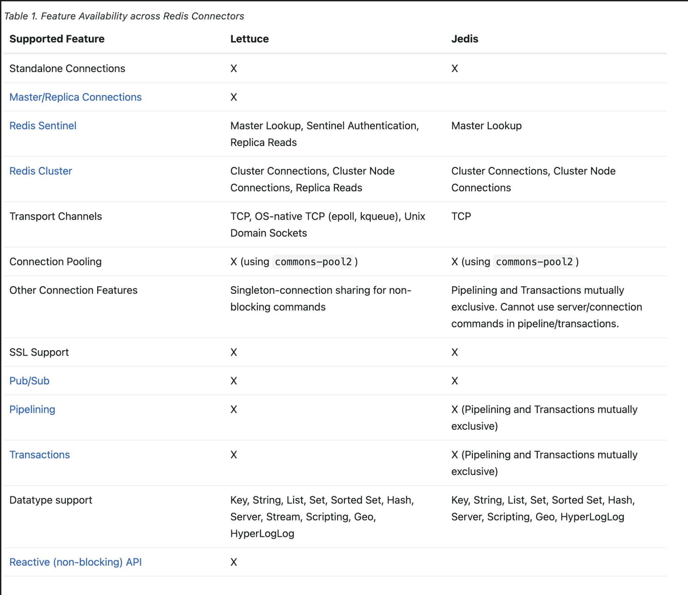

## 01. 시작하기
``` gradle
dependencies {
	implementation 'org.springframework.data:spring-data-redis'
}
```
- 회사 지원 spring boot version이 3.0.11이여서 해당 버전 docs이다.
- 요구 조건
  - JDK 17 이상
  - Spring Framework 6.0.13 이상
  - Redis 2.6 이상
  - Lettuce 또는 Jedis open-source 이용하여

## 02. Redis Connection
- Redis를 사용하기 위해서 가장 먼저 할 일은 IoC container를 통해 Redis 저장소와 Connection을 맺는 것이다.
- 이를 위해 `RedisConnection`과 `RedisConnectionFactory` 객체가 필요한데 후자는 전자를 생성하는 역할을 한다.
- `RedisConnectionFactory`는 `PersistenceExceptionTranslator` 객체 역할도 한다.
  - Redis 에러를 Spring 일반 에러로 변환하는 역할
- 동시성 관련
  - RedisConnection은 기본적으로 스레드 안전하지 않다. 때문에 여러 Thread에서 RedisConnection 인스턴스를 공유하면 안 된다. 또한 트랜잭션 내에서 RedisConnection을 사용하더라도 이 객체는 변경 가능한 상태이다. (의도된 디자인임)
  - Redis 리소스를 공유해야 하는 경우 native connection을 얻고 Redis client library API를 직접 사용해야 한다.
  - 아니면 `RedisTemplate`를 사용하는 것도 방법이다.

### 사용 가능한 Redis Connector library

- Redis 구조에 따라 Config 설정 방법이 달라진다
  - 단일 Store
  - Sentinel
  - Master - Replica
  - Cluster


## 03. RedisTemplate
``` java
@Configuration  
class MyConfig {  
  
	@Bean  
	LettuceConnectionFactory redisConnectionFactory() {  
		return new LettuceConnectionFactory();  
	}  
	  
	@Bean  
	RedisTemplate<String, String> redisTemplate(RedisConnectionFactory redisConnectionFactory) {  
	  
	RedisTemplate<String, String> template = new RedisTemplate<>();  
		template.setConnectionFactory(redisConnectionFactory);  
		return template;  
	}  
}  
  
public class Example {  
  
	// inject the actual template  
	@Autowired  
	private RedisTemplate<String, String> template;  
	  
	// inject the template as ListOperations  
	@Resource(name="redisTemplate")  
	private ListOperations<String, String> listOps;  
	  
	public void addLink(String userId, URL url) {  
		listOps.leftPush(userId, url.toExternalForm());  
	}  
}  
```
- RedisConnection은 바이너리 값을 받아들이고 반환하는 저수준 메서드만을 제공한다.
- 하지만 RedisTemplate를 활용하면 객체 수준에서 Redis를 편리하게 이용할 수 있다.
- RedisTemplate을 구성하면 thread-safe하며 여러 인스턴스에서 재사용할 수 있다.
- RedisTemplate에서 읽고 쓰는 객체는 Java를 통해 역/직열화 된다.
  - 설정을 통해 RedisTemplate와 원시 바이트 배열을 함께 사용할 수 있다.


## 04. 문자열 중심의 편의 클래스들
``` java
@Configuration  
class MyConfig {  
  
	@Bean  
	LettuceConnectionFactory redisConnectionFactory() {  
		return new LettuceConnectionFactory();  
	}  
  
	@Bean  
	StringRedisTemplate stringRedisTemplate(RedisConnectionFactory redisConnectionFactory) {  
  
	StringRedisTemplate template = new StringRedisTemplate();  
	template.setConnectionFactory(redisConnectionFactory);  
	return template;  
	}  
}  
  
public class Example {  
  
	@Autowired  
	private StringRedisTemplate redisTemplate;  
	  
	public void addLink(String userId, URL url) {  
		redisTemplate.opsForList().leftPush(userId, url.toExternalForm());  
	}  
}  
```
- Redis에 저장된 key/value는 String인 경우가 일반적이라 String 편의 클래스를 제공한다.
- `StringRedisConnection`
- `StringRedisTemplate`

### RedisCallback
``` java
public void useCallback() {  
  
	redisTemplate.execute(new RedisCallback<Object>() {  
		public Object doInRedis(RedisConnection connection) throws DataAccessException {  
			Long size = connection.dbSize();  
			// Can cast to StringRedisConnection if using a StringRedisTemplate  
			((StringRedisConnection)connection).set("key", "value");  
		}  
	});  
}  

```
- RedisCallback을 이용하면 Redis와 직접적으로 통신이 가능하다. (완전한 제어권을 가지게 됨)
- 단, `StringRedisTemplate`을 사용할 경우 `StringRedisConnection`을 거치게 됨


## 05.  Hash 매핑
- Redis Hash 구조를 이용할 경우 매핑을 위한 동작이 필요해진다.
- Spring Data Redis는 Hash 매핑 위한 다양한 전략을 제공함.
  - HashOperation, serializer을 통한 직접 매핑
  - Redis Repositories 이용하기
  - HashMapper, HashOperation 이용하기


### Hash Mappers
- `BeanUtilsHashMapper` using Spring’s [BeanUtils](https://docs.spring.io/spring-framework/docs/6.0.13/javadoc-api/org/springframework/beans/BeanUtils.html).
- `ObjectHashMapper` using [Object-to-Hash Mapping](https://docs.spring.io/spring-data/redis/docs/3.0.11/reference/html/#redis.repositories.mapping).
- [`Jackson2HashMapper`](https://docs.spring.io/spring-data/redis/docs/3.0.11/reference/html/#redis.hashmappers.jackson2) using [FasterXML Jackson](https://github.com/FasterXML/jackson).


## 06. Redis Messaging
- JMS Integration과 유사한 Messaging 기능을 제공한다 (Pub/Sub)
- 나중에 필요할 때 알아보자.


## 07. Redis Streams
- 로그 데이터를 추가하고 소비하는 기능 또한 제공한다.
- 6번 Redis Messaging과 유사하지만 Message의 영속성과 Consume 방식에서 차이점이 있다.
- 이 또한 필요할 때로 공부를 미루자.

## 08. Redis Transactions
- RedisTemplate의 `multi`, `exec`, `discard` command를 통해 Transaction 기능을 제공한다.
- 하지만 RedisTemplate이 동일한 Connection으로 모든 연산에 Transaction을 수행하는 걸 보장하지는 않는다.

``` java
//execute a transaction  
List<Object> txResults = redisTemplate.execute(new SessionCallback<List<Object>>() {  
	public List<Object> execute(RedisOperations operations) throws DataAccessException {  
		operations.multi();  
		operations.opsForSet().add("key", "value1");  
		  
		// This will contain the results of all operations in the transaction  
		return operations.exec();  
	}  
});  

System.out.println("Number of items added to set: " + txResults.get(0));  
```
- `SessionCallback`을 이용하면 여러 operation을 동인한 connection으로 수행함을 보장할 수 있다.


### @Transactional
``` java 
@Configuration  
@EnableTransactionManagement  
public class RedisTxContextConfiguration {  
	  
	@Bean  
	public StringRedisTemplate redisTemplate() {  
		StringRedisTemplate template = new StringRedisTemplate(redisConnectionFactory());  
		// explicitly enable transaction support  
		template.setEnableTransactionSupport(true);  
		return template;  
	}  
	  
	@Bean  
	public RedisConnectionFactory redisConnectionFactory() {  
	// jedis || Lettuce  
	}  
	  
	@Bean  
	public PlatformTransactionManager transactionManager() throws SQLException {  
		return new DataSourceTransactionManager(dataSource());  
	}  
	  
	@Bean  
	public DataSource dataSource() throws SQLException {  
	// ...  
	}  
}  
  
// 1. Configures a Spring Context to enable declarative transaction management.  
// 2. Configures RedisTemplate to participate in transactions by binding connections to the current thread.  
// 3. Transaction management requires a PlatformTransactionManager. Spring Data Redis does not ship with a PlatformTransactionManager implementation. Assuming your application uses JDBC, Spring Data Redis can participate in transactions by using existing transaction managers.  
  
// Usage Constraints  
// must be performed on thread-bound connection  
template.opsForValue().set("thing1", "thing2");  
  
// read operation must be run on a free (not transaction-aware) connection  
template.keys("*");  
  
// returns null as values set within a transaction are not visible  
template.opsForValue().get("thing1");
```
- 기본적으로 RedisTemplate는 Spring Transaction에 연동하여 동작하지 않는다.
- `@Transaction`, `TransactionTemplate`을 사용하려면 RedisTemplate에 setEnableTransactionSupport(true) 설정을 해줘야 한다.
  - 설정을 하면 RedisConnection과 현재 사용 중인 ThreadLocal을 연동한다.
  - 오류 없이 완료되었을 때 Redis transaction은 EXEC와 함께 commit되고 그렇지 않다면 DISCARD로 롤백된다.
  - Transaction 중에 실행된 명령은 큐에 대기하고 트랜잭션을 커밋할 때만 적용된다.
- Spring Data Redis는 Transaction 중에 읽기 명령과 쓰기 명령을 분리한다.
  - 읽기 전용 명령의 경우 새로운 RedisConnection과 pipe되고 쓰기 명령의 경우 RedisTemplate에 의해 Queue에 대기하고 commit을 기다린다.


## 09. Pipelining
- multiple commands를 응답 대기 없이 한번에 server에 전달할 수 있는 방법을 제공한다.

## 10. Redis Scripting
- Lua script를 실행할 수 있는 Redis Version(2.6 이상)의 경우 Script를 활용한 요청도 가능하다.

## 11. Redis Cache
- Spring Redis는 Spring Cache Abstraction 구현체를 제공한다.

## 12. 지원 Class들
- `org.springframework.data.redis.support`는 redis 백업 저장소로 사용할 수 있는 다양한 클래스를 제공한다.
  - `atomic counter`: Redis 키 증분을 쉽게 래핑하여 쉽게 관리할 수 있다.
  - `RedisSet`, `RedisZSet`: 교집합, 유니온과 같은 Redis 지원 연산을 쉽게 사용할 수 있도록 돕는다.
  - `RedisList`: List, Queue, Deque 상호작용을 구현하여 최소한의 설정으로 저장소를 FIFO, LIFO, 제한 컬렉션으로 대체한다
  - Redis 구현을 인메모리 구현으로 대체할 때 사용 가능할듯

## 13. Observability
- Lettuce 드라이버를 통해 Redis 상호작용을 관찰하고 Micrometer통해 지표를 제공한다.


## 정리
- 결국 Spring Boot + Redis를 활용할 때 아래 3가지 방법 중 1가지를 선택할 수 있을듯
  - RedisTemplate
  - RedisRepository
  - RedisCacheManager

## Reference
- [Spring Data Redis](https://docs.spring.io/spring-data/redis/docs/3.0.11/reference/html/#redis)