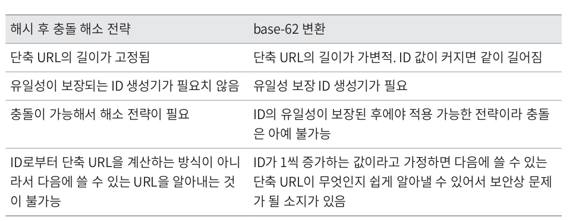

## 1. 단축 URL이란?
- 단축 URL이란 원본 URL을 짧게 줄인 것으로 단축 URL에 접근하면 원본 URL로 리디렉션(redirection)되는 구조이다.
- 설계 시 고려사항
  - 트래픽 규모는 얼마나 되는가?
  - URL 길이는 어느 정도여야 하는가?
  - 사용될 문자에 제한이 있는가?
  - 단축 URL을 시스템에서 삭제/갱신할 수 있는가?

## 2. 개략적 설계
### (1) API 엔드 포인트
- 단축 URL 서비스를 위해서 2가지 API 엔드 포인트가 필요하다.
  1. URL 단축용 엔드 포인트 (인자: 원본 URL, 반환: 단축 URL)
  2. URL 리디렉션용 엔드 포인트 (반환: 원본 URL)

### (2) URL 리디렉션
- 단축 URL을 브라우저에 입력하면 아래와 같은 일들이 일어난다.
  1. Status Code 301, 302 반환.
  2. location header값으로 원본 url이 적용됨.
- API를 구현할 때 가장 직관적인 방법으로 해시 테이블을 떠올릴 수 있다. (key: 단축 URL, value: 원본 URL)

#### 301 Permanently Moved
- HTTP 요청 처리 책임을 location 헤더값인 url로 영구적으로 이전되었다는 의미.
- `브라우저는 이 응답을 cache하게 됨.`
- 브라우저 cache가 적용되기 때문에 서버 부하를 줄일 수 있다.

#### 302 Found
- HTTP 요청이 처리 책임이 일시적으로 location 헤더값인 url로 이전되었다는 의미.
- 301과 달리 브라우저는 이 응답을 cache하지 않는다.
- 매번 서버로 요청이 오기 때문에 301에 비해 정교한 트래픽 분석이 가능하다.

### 3. URL 단축 방식
- https://tinyurl.com/{hashvalue}와 같은 형태라고 가정했을 때
- URL 단축에서 결국 가장 중요한 것은 f(원본 url) = hashvalue를 만족하는 함수 f(x)를 찾는 것이다.
  - 당연하지만 입력으로 주어진 url이 변경되면 hashvalue도 변경되어야 한다.
  - hashvalue는 원본 url로 복원될 수 있어야 한다.

## 상세 설계
### 1. 데이터 모델
- 소규모 서비스에서는 메모리 해시 테이블을 쓸 수도 있지만, 규모가 커진다면 서비스를 지탱하기 어렵다.
- 때문에 단축 URL - 원본 URL 순서쌍을 RDB에 저장할 수도 있다. (규모에 따라 Redis를 고려해볼 수도 있을듯)
- 주요 컬럼으로는 id, shortURL, longURL이 있다.

### 2. 해시 함수
- 해시 함수는 원본 URL -> hashvalue 변환에 사용된다.
- hashvalue의 문자 구성과 데이터 보관 기간, 예상 트래픽에 따라 hashvalue의 길이를 정할 수 있다.
  - 예를 들어, 문자 구성은 숫자, 영문 대소문자 / 보관 기간은 10년 / 예상 트래픽은 1일 1억 건이라고 가정해보자.
  - 사용 가능한 문자는 62^n >= 1억 * 365일 * 10년을 만족하는 최소의 n을 구하면 이 값이 hashvalue의 길이가 된다.

#### 해시 함수 전략

#### 해시 후 충돌 해소
- 해시 함수는 대개 기존에 존재하는 함수를 사용할 것이다.(예를 들어 CRC32, MD5, SHA-1)
- 3개의 함수 모두 결과값의 길이가 긴 편이기 때문에 위에서 구한 hashvalue 길이에 맞게 잘라서 사용할 수 있다.
- 하지만 이렇게 될 경우 동일한 hashvalue를 사용할 확률이 커진다.
- 이런 상황은 아래 로직을 통해 해소할 수 있다.
  1. 해시 함수를 활용해 longURL로 shortURL을 만든다.
  2. shortURL이 DB에 존재하는 값인지 확인해본다.
  3. 없다면 DB에 저장, 있다면 충돌이 해소될 때까지 사전에 정한 문자열을 hashvalue에 더한다.
- 위 로직을 사용하면 DB 조회가 1회 추가되는데, 지연을 최소화하기 위해서 `블룸 필터` 사용도 고려해볼 수 있다.

#### base-62 변환
- URL 순서쌍 데이터의 ID를 62진수로 변환하여 hashvalue로 사용하는 전략. (이전에 가정한 hashvalue사용 가능 문자가 62개였기 때문에 62진법 사용)
- 충돌의 가능성이 없지만, 유일성 보장 ID 생성기가 전제되어야 한다.
- base-62 변환을 사용할 경우 아래 로직을 통해 동작한다.
  1. longURL DB에서 조회.
  2. 있다면 DB에서 조회된 shortURL 반환
  3. 없다면 새로운 ID 생성
  4. 생성된 ID를 base-62 활용하여 shortURL로 변경
  5. DB 저장 후 반환

### 3. URL 리디렉션

- 위 설계의 특징은 캐시를 적용한 점이다.
- 대부분 읽기 동작이 수행되고, 데이터 수정/갱신이 일어나지 않도록 설계했다면 캐시를 두지 않을 이유가 없다.

### 4. 추가 논의 사항
- 처리율 제한 장치
- 웹 서버의 규모 확장
- DB의 규모 확장
- 데이터 분석 솔루션
- 가용성, 데이터 일관성, 안정성