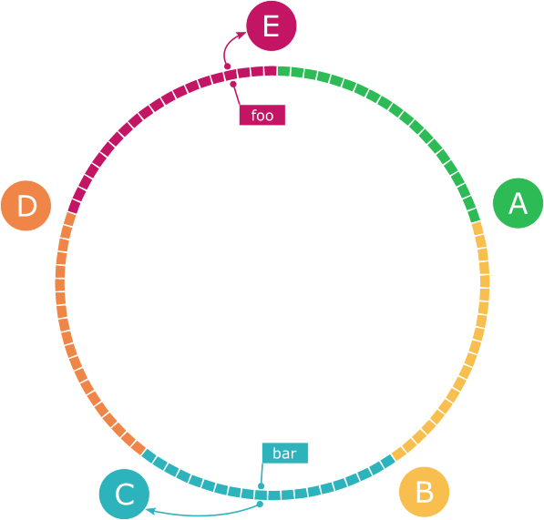
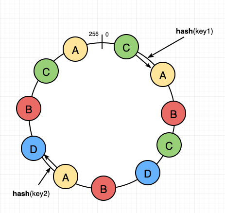

## 1. 해시 키 재배치 문제
- 분산 DB 노드가 추가되거나 삭제가 된다면? 서버 인덱스 값(해시 % 서버 수)이 달라진다.
- 이는 대규모 캐시 미스를 초래할 수 있다.

## 2. 안정 해시
- 안정 해시는 해시 테이블 수가 변경될 때 평균적으로 k/n(key 개수 / 서버 개수)개의 키만 재배치한다.

- 위 사진은 hash ring과 DB 노드를 나타낸 것이다.
- hash ring은 key가 가질 수 있는 해시값의 범위이고 이를 균등하게 나눠 서버를 할당한다.
- 이때 각 해시는 시계 방향으로 가장 가까이 있는 노드에 할당된다.
- 이때 새로운 노드가 추가되거나 삭제되면 모든 key가 아닌 일부만 재배치 되어 대규모 캐시 미스를 막을 수 있다.

## 3. 2가지 문제점
- 파티션 크기를 균등하게 유지하는 게 불가능하다.
- 키의 균등 분포를 달성하기가 어렵다
- 이 문제를 해결하기 위해 가상 노드 기법을 사용한다.
시
## 4. 가상 노드 기법

- 그림을 보면 실제로는 4개의 노드만 존재하지만 1개의 노드는 2개의 추가적인 가상 노드를 둬 해시 링 위 곳곳에 분포한다.
- 이처럼 가상의 노드 개수를 늘리면 파티션 크기를 균등하게 유지할 수 있다.
- 키의 분포 또한 균등해진다. (100 ~ 200개의 가상 노드를 사용했을 경우 표준 편차 값은 평균의 5% ~ 10%)