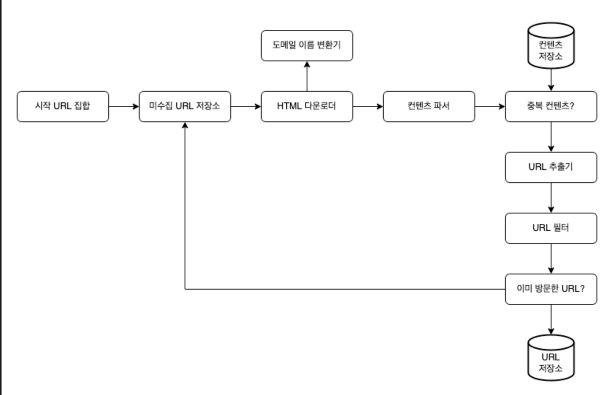
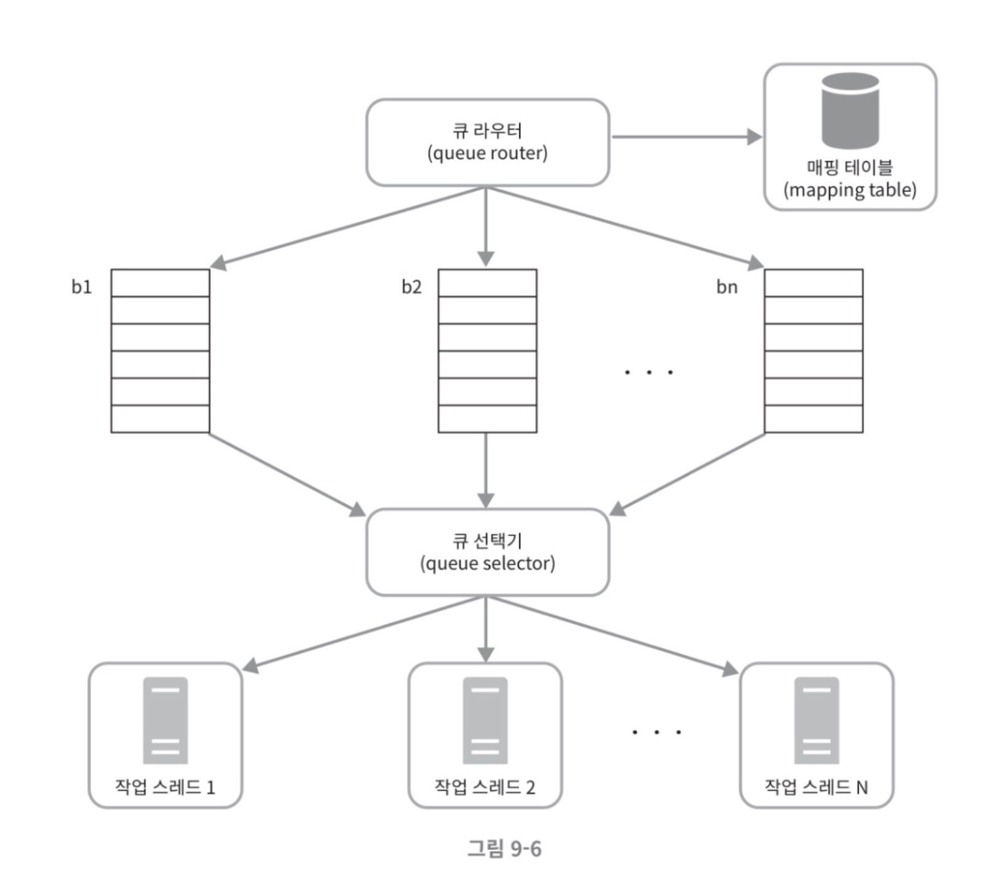
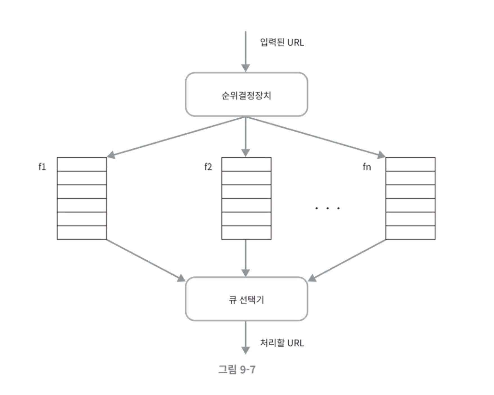
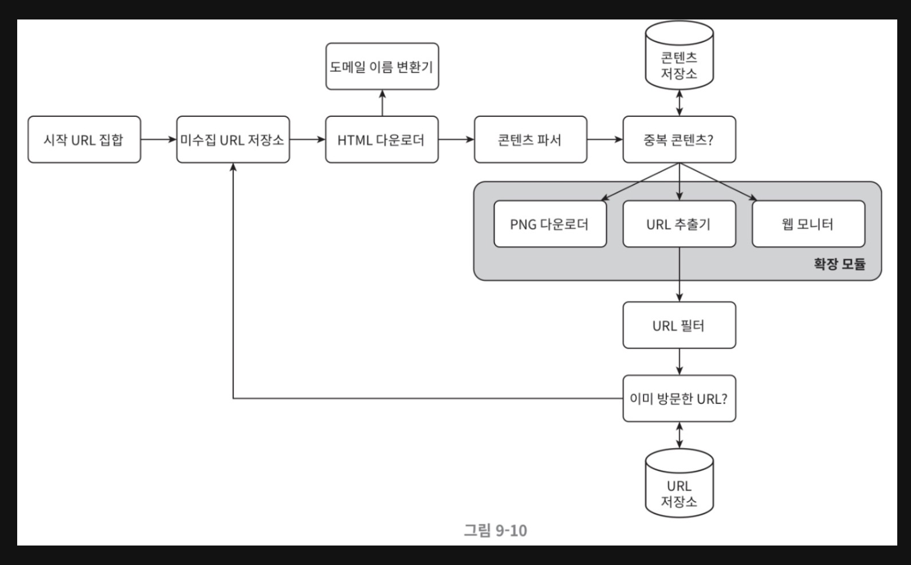

## 1. 웹 크롤러란?
- 웹에 올라오거나 갱신된 콘텐츠를 찾아내는 목적을 가진 프로그램
- 여기서 콘텐츠는 다양한 형식일 수 있음(web page, pdf, image ...)
- 사용 예시: 검색 엔진 인덱싱, 웹 아카이빙, 웹 마이닝, 웹 모니터링

## 2. 설계 시 고민할 것들
- 웹 크롤러의 목적
- 수집이 필요한 웹 페이지의 규모
- 웹 페이지 형식 변화에 대한 대응 여부
- 웹 페이지 저장 여부 및 보관 기간
- 중복된 컨텐츠 처리 여부 등...
- 규모 확장성, 안정성, 수집 대상 웹 페이지 요청 수, 수집 콘텐츠의 확장성 등등...

## 3. 웹 크롤러 개략적인 설계도

### (1) 시작 URL 집합
- 웹 크롤러가 크롤링을 시작하는 출발점들의 집합
- 대개 수집할 전체 URL 공간을 작은 부분집합으로 나누는 전략을 사용한다. (지역, 주제 등등..)

### (2) 미수집 URL 저장소
- 크롤링 상태를 관리하기 위해 URL을 다운로드 할 URL / 다운로드된 URL로 나눈다.
- 이 중에서 다운로드 할 URL을 저장 관리하는 컴포넌트가 미수집 URL 저장소이다.

### (3) HTML 다운로더
- 말 그대로 URL을 인자로 받아 콘텐츠를 다운로드하는 컴포넌트이다.

### (4) 도메인 이름 변환기
- URL을 대응되는 IP로 변환하는 컴포넌트이다.


### (5) 콘텐츠 파서
- 다운받은 콘텐츠를 parsing하고 validation하는 역할을 담당한다.
- 원하는 형식의 데이터를 걸러내는 작업을 진행한다.
- 크롤링 서버 내에 콘텐츠 파서를 구현하면 크롤링 과정이 느려짐으로 별도의 컴포넌트로 두는 것도 고려할 수 있다.

### (6) 중복 콘텐츠 여부
- 책에 의하면 29%가량의 웹 콘텐츠는 중복이라고 한다.
- 때문에 적합한 자료 구조를 도입하여 중복과 데이터 처리 소요 시간을 줄이는 컴포넌트이다.
- HTML 비교에 가장 직관적인 방법은 문자열 비교이겠지만, 큰 규모에서 성능을 고려한다면 책에서는 Hash값 비교를 추천한다.

### (7) 콘텐츠 저장소
- 수집한 콘텐츠를 저장하는 시스템
- 콘텐츠 유형, 크기, 접근 빈도, 보관 기간 등을 고려하여 선택할 수 있다.
- 책에서는 디스크와 메모리를 동시에 사용하는 저장소를 택했다.

### (8) URL 추출기
- HTML 페이지를 파싱하여 링크들을 골라내는 역할을 한다.
- 예를 들면 상대 경로에 도메인을 추가하여 절대 경로로 변환하는 역할이다.

### (9) URL 필터
- 특정한 콘텐츠 타입나 파일 확장자, 오류가 발생하는 URL, 접근 제외 목록에 포함된 URL을 크롤링 대상에서 제외하는 역할을 담당한다.

### (10) 이미 방문한 URL 여부
- 다운로드 할 URL / 다운로드된 URL을 바탕으로 이미 방문한 URL을 거르는 컴포넌트이다.
- 책에서는 자료 구조를 통해 다운로드 할 URL / 다운로드된 URL를 관리한다.
- 해당 컴포넌트를 통해 서버 주하를 줄이고 무한 루프를 방지할 수 있다.
- 자료 구조로는 블룸 필터 혹은 해시 테이블이 널리 쓰인다.

### (11) URL 저장소
- 이미 방문한 URL을 보관하는 저장소이다.

## 4. 상세 설계
### (1) DFS or BFS
- 웹은 페이지(Node)와 하이퍼링크(Edge)를 가지는 방향성 그래프와 같다.
- 때문에 웹 크롤링 프로세스는 방향성 그래프를 탐색하는 과정이다.
- 그래프 깊이를 가늠하고 조절하기 위해 대개 DFS보다는 BFS를 사용한다.
- 하지만 BFS에는 2가지 문제점이 있다.
  - 한 페이지에서 나오는 링크는 대개 같은 서버 위에 동작하기 때문에 서버에 부하를 주게 된다.
  - URL 간에 우선순위가 없어 처리 순서에 우선순위를 둘 수 없다.

### (2) 미수집 URL 저장소
- 미수집 저장소는 다운로드할 URL을 보관하는 장소이다.
- 즉, 미수집 URL 저장소를 잘 구현하면 서버에 부하를 줄 수 있고, 우선 순위가 없는 BFS 문제점을 해결할 수 있다.
- 안정성, 속도 측면을 고려할 때 미수집 URL 저장소는 디스크와 메모리 혹은 둘을 혼합하는 하이브리드 선택지가 있다.

#### 예의 바른 웹 크롤러
- 짧은 시간 안에 너무 많은 요청을 보내면 대상 서버에 부하를 줄 수 있고 Dos 공격으로 간주될 수도 있음.
- 예의 바른 웹 크롤러를 만들기 위해서는 동일 웹 사이트에 대해서는 한 번에 한 페이지만 요청해야 한다.
  - 대상 hostname과 작업 스레드 사이의 관계를 유지하면 된다. (작업 스레드는 별도의 FIFO 큐를 가진다.)

- 큐 라우터는 host별로 분리하여 Queue에 대상 url을 담는다.
- 큐 선택기는 큐를 순회하며 url을 가져와 url별로 지정된 작업 스레드에 할당한다.
- 작업 스레드는 전달된 url을 다운로드하며 작업들 사이에는 일정한 지연시간을 유지한다.

#### 우선순위

- 크롤러 목적과의 적합성, 트래픽 양, 갱신 빈도 등의 척도에 기반하여 우선순위를 정하고 순차적인 크롤링이 필요할 수 있다.
- 이때 위와 같은 순위 결정 장치를 추가하면 된다.
- 순위결정장치는 url을 받아 주어진 조건에 따라 순위 별 큐에 URL을 분리하여 담는다.
- 큐 선택기는 처리할 url을 반환한다. 이때 순위가 높은 큐에서 더 자주 값을 가져오도록 프로그래밍 되어야 한다.


#### 신선도
- 웹 콘텐츠 변경에 따른 데이터 재수집이 필요할 수 있다.
- 이때 웹 페이지 변경 이력을 활용하여 재수집을 시도할 수도 있고 우선순위를 활용하여 중요한 페이지는 자주 재수집하는 것을 고려할 수 있다.

### (3) HTML 다운로더
#### Robot.txt
```
// https://finance.naver.com/robots.txt
User-agent: *
Disallow: /
User-agent: yeti
Disallow: /
Allow: /sise/
Allow: /research/
Allow: /marketindex/
Allow: /fund/
Allow: /template/head_js.naver
Disallow : /fund/news/
Disallow : /marketindex/news/
```
- 웹사이트가 크롤러와 소통하는 표준적인 방법이다.
- 이 파일에는 수집이 허용된 페이지 목록이 들어있다.
- 때문에 크롤러는 웹 사이트 수집 이전에 해당 파일에 정의된 규칙을 확인해야 한다.
- 매번 다운받기보다는 캐시하는 것이 성능 상 더 좋다.

#### 성능 최적화 포인트
##### - 분산 크롤링
- 미수집 URL 저장소에서 2개 이상의 서버로 URL을 배분하여 제공하고 여러 서버가 처리를 동시에 진행하는 구조
##### - 도메인 이름 변환 결과 캐시
- DNS 요청 - 응답 과정은 동기적인 특성이 있어 크롤러의 병목 중 하나이다.
- DNS 처리는 보통 10ms에서 200가 소요됨
- 크롤러의 스레드 하나가 이 작업을 수행하면 나머지는 전부 block됨
- 때문에 도메인명 - IP 관계를 캐시해두고 주기적으로 갱신한다면 성능을 높일 수 있다.
##### - 지역성
- 수집 대상 서버와 가까운 위치일수록 수집이 빠르다는 점을 고려하여 서버를 지역별로 분산하는 방법.
##### - 짧은 타임아웃
- 응답이 느리거나 없는 경우 이를 무한정 기다리면 크롤러가 동작을 멈추는 경우가 자주 생길 수 있다.
- 때문에 짧은 타임 아웃으로 이러한 케이스를 넘길 수 있어야 한다.

#### 안정성
- 안정 해시: 이는 서버 추가가 가능하게 만들어 부하를 분산시킬 수 있다.
- 크롤링 상태 및 수집 데이터 저장: 장애 발생의 경우 해당 지점부터 재시작이 가능하도록 크롤링 상태 및 수집 데이터를 수시로 저장하는 것이 좋다.
- 예외 처리: 예외 발생 시에도 시스템이 동작하도록 고려해야 한다. 항상 그렇듯이 크롤러를 동작시켜가며 발생하는 예외에 대해 고려가 필요할듯
- 데이터 검증: validation은 시스템 오류를 방지하기 위한 중요 수단이다

#### 확장성

- 크롤러가 확장되면서 새로운 타입의 데이터를 수집해야 하는 경우가 발생할 수 있다.
- 책에서는 새로운 타입을 다운로드할 수 있는 모듈을 추가하는 방식을 제안한다.
- 이렇게 되면 콘텐츠를 구분하는 모듈이 필요할 수도 있을 것 같다.

#### 문제가 있는 콘텐츠 감지 및 회피
- 중복 콘텐츠: 해시나 체크섬을 사용하여 중복 콘텐츠를 회피할 수 있다.
- 거미 덫: url 최대 길이에 제한을 두어 www.spider.com/foo/foo/foo/foo...와 같은 덫 사이트를 피할 수 있다.
  - 만능 방법은 없고 알고리즘을 고민해봐야 한다. 이런 사이트를 찾을 때마다 제외 대상에 추가하는 것도 방법
- 데이터 노이즈: 가치가 없는 콘텐츠를 검증하는 방식도 고민해볼 필요가 있다,.

## 5. 추가로 고민하면 좋은 주제
- 서버 측 렌더링: 웹사이트에서 링크를 즉석에서 만들어 내는 경우 페이지 파싱 전에 서버 측 렌더링을 적용하여 해결 가능
- 원치 않는 페이지 필터링: 자원을 아끼기 위해 스팸 방지 컴포넌트를 두어 불필요한 페이지를 걸러내면 좋다.
- DB 다중화 및 샤딩: 데이터 계층의 가용성, 규모 확장성, 안정성을 위한 기법
- 수평적 규모 확장성: 대규모 크롤링을 위한 서버 추가를 고려하여 무상태 서버 개발을 고려할 수 있다.
- 가용성, 일관성, 안정성
- 데이터 분석 솔루션