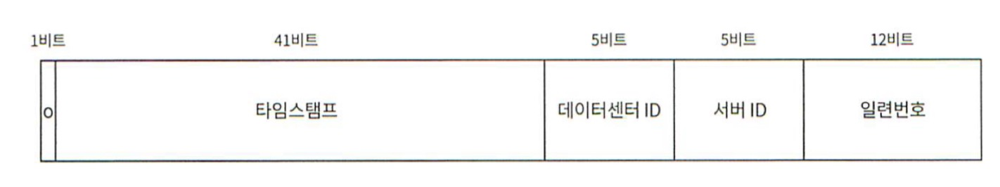

## 분산 시스템에서 사용할 ID 생성기 설계 시 고민해볼 조건들
- ID의 특성: 유일성, 정렬 가능 등
- 레코드 생성 방식: 이전 데이터 + 1 등
- ID 구성: 숫자로 구성 등
- 시스템 규모: 초당 10,000개의 ID 생성 등

## ID 생성기 종류
### 다중 마스터 복제
- auto_increment기능을 활용하되, ID를 사용중인 DB 서버 수만큼 증가시킨다.
  - 서버 1은 ID를 1, 3, 5, 7, 9 ...로 생성
  - 서버 2는 ID를 2, 4, 6, 8, 10 ...로 생성
- 규모의 확장성 문제를 어느 정도 해결할 수 있다.
- 단점
  - 여러 데이터 센터에 걸쳐 규모를 늘릴 수 없음.
  - 시간에 맞춰 ID값이 커지는 것을 보장할 수 없다.
  - 서버의 추가/삭제 시에 잘 동작하도록 만들기 어렵다. (추가한다고 가정하면 기존 서버의 ID 생성 방식에도 영향을 줌)

### UUID
- UUID란: 정보를 유일하게 식별하기 위해 만든 128비트짜리 수.
- 장점
  - 생성이 단순하고 서버간 조율이 필요 없다.
  - 당연히 규모 확장도 용의하다.
- 단점
  - ID가 길다.
  - 시간순으로 정렬할 수 없다.
  - 숫자가 아닌 값이 포함될 수 있다.

### 티켓 서버
- auto_increment 기능을 수행할 DB서버(Ticket 서버)를 하나 두고 유일한 ID 생성기로 사용하는 방식
- 장점
  - 유일성이 보장되고 숫자로만 구성된 ID를 쉽게 만들 수 있따.
  - 구현이 쉽고, 중소 규모에 적합하다.
- 단점
  - 티켓 서버가 SPOF가 된다.

### 트위터 스노플레이크 접근법

- ID를 5개의 섹션으로 나눔
- 사인: 현재는 의미가 없지만 음수/양수 구분값 등으로 추후 활용 가능
- 타임스탬프: 기원 시각 이후로 몇 ms가 경과했는지 나타내는 값
- 데이터센터 ID: 데이터 센터 식별자
- 서버 ID: 서버 식별자
- 일련번호: ID생성마다 1씩 증가하며 1ms경과시마다 0으로 reset된다.

## 추가로 고민해볼 것들
- 어떻게 모든 서버가 같은 시계를 사용하도록 보장할 것인가?
- 스노플레이크를 사용했다면 각 파트의 길이 최적화를 어떻게 할 것인가?
- 고가용성 제공 방법

