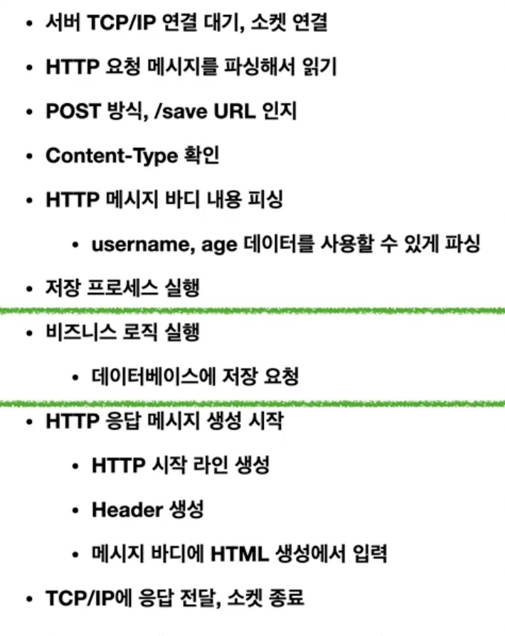
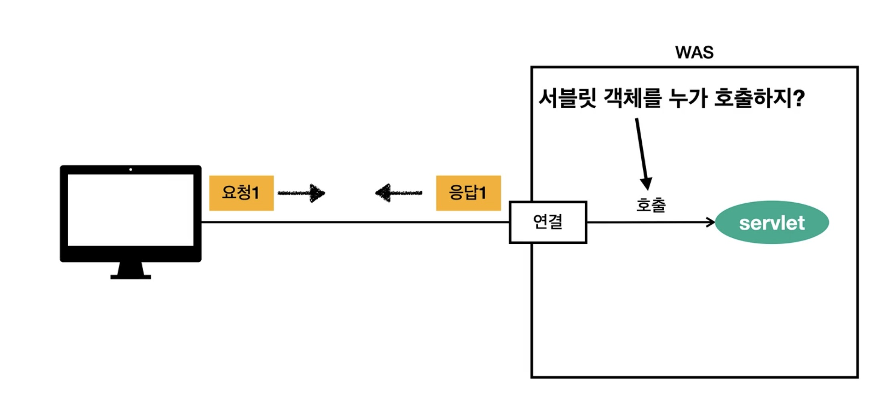

## 1. 서블릿

- HTTP 요청을 받아 응답하기 위해서 서버는 위와 같은 작업들을 수행해야 한다.
- 개발자가 초록색 부분에만 집중할 수 있도록 `서블릿` 지원하는 WAS가 나머지 부분을 처리해줌 (서블릿이 처리를 해준다고 생각해도 무방할듯)
- 개발자는 `서블릿`을 통해 HTTP 스펙을 매우 편리하게 사용할 수 있게 된다.
- 동작 순서
  1. WAS는 Request, Response 객체를 만들어서 서블릿 객체 호출
  2. 개발자는 Request 객체에서 정보 조회
  3. Response 객체에 HTTP 응답 정보 입력
  4. WAS는 Response 객체에 담긴 내용으로 HTTP 응답 정보 생성

## 2. 서블릿 컨테이너
- 서블릿을 지원하는 WAS를 서블릿 컨테이너라고 부른다.
- 서블릿 컨테이너는 서블릿 객체를 생성, 초기화, 호출, 관리한다. (생명주기 관리)
- 서블릿 객체는 싱글톤으로 관리됨
  - 공유 변수 사용 시 주의가 필요함
  - 서블릿 컨테이너 종료시 함께 종료
  - 당연하지만.. HTTP Request/Response는 요청마다 생성됨
- JSP도 서블릿으로 변환 되어서 사용
- 동시 요청을 위한 멀티 쓰레드 처리 지원

## 3. 동시 요청 - Multi Thread

- 바로 Thread가 서블릿 객체를 호출하게 된다.
- `Thread`
  - 애플리케이션 코드를 하나하나 순차적으로 실행하는 것은 Thread
  - Thread는 한번에 하나의 코드 라인만 수행
  - 동시 처리가 필요하면 Thread 추가 생성 필요

- 요청이 오면 Thread를 할당 받아서 서블릿을 호출하게 된다.
- 때문에 WAS는 대부분 Thread를 미리 생성해 Pool을 만들어둠.
- Pool 내에 Thread 수보다 더 많은 요청이 올 경우 대기 또는 거절된다.
  - 모두 설정으로 수를 조절할 수 있다.

### 실무 팁
- WAS의 주요 튜닝 포인트는 MAX THREAD 수이다.
- 너무 낮으면 서버 리소스는 여유롭지만, 응답 지연이 금방 생긴다.
- 너무 높으면 서버 리소스 임계점 초과 -> 서버 다운... (무섭군)
- 적정 숫자는 어떻게 찾지?
  - 로직의 복잡도, CPU, 메모리, IO 리소스 상황에 따라 다르다.
  - 성능 테스트로 체크해볼 것

## Reference
- [1대의 서버 애플리케이션은 최대 몇 개의 동시 요청을 감당할 수 있을까?](https://songkg7.github.io/posts/Spring-MVC-Traffic-Testing/)
- [스프링 MVC 1편 - 백엔드 웹 개발 핵심 기술](https://www.inflearn.com/course/%EC%8A%A4%ED%94%84%EB%A7%81-mvc-1/)