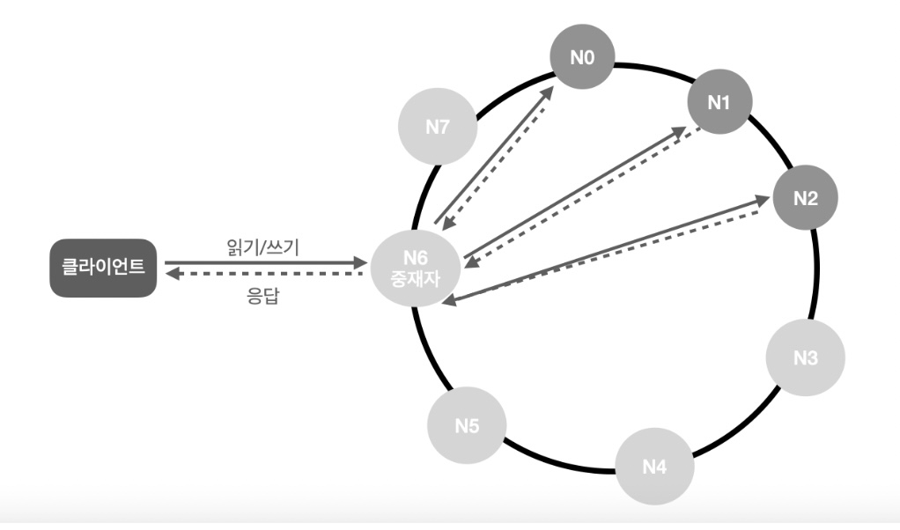

## 1. key-value 저장소란?
- 고유의 식별자 key와 key에 매핑되는 value를 가지는 비 관계형 DB
- 성능상의 이유로 key는 짧을수록 좋다

## 2. 문제 이해 및 설계 범위 확정
- 읽기, 쓰기, 메모리 사용량 사이에서 적절한 균형을 찾아야 한다.

## 3. 단일 서버 key-value 저장소
- 기본적으로 메모리에 해시 테이블을 두는 것을 생각할 수 있다.
- 속도는 빠르지만 용량에 문제가 있을 수 있다.
- 이때 데이터 압축, 자주 쓰이는 데이터만 담는 방향을 생각해볼 수 있다.

## 4. 분산 key-value 저장소

### CAP 정리
- 일관성(Consistency): 모든 클라이언트는 같은 데이터를 봐야 한다.
- 가용성(Availability): 일부 DB 노드에 장애가 생기더라도 항상 응답을 받을 수 있어야 한다.
- 파티션 감내(Partition tolerance): 두 DB 노드 사이에 네트워크 파티션(통신 장애)이 생기더라도 시스템은 계속 동작해야 한다.
- 대개 2가지를 충족시키고 1가지를 희생해야 한다. 파티션 감내는 필수로 생각하기에 대개 CP, AP 시스템을 선택한다.
- 예를 들어 3노드 중 1개의 노드에 통신이 불가능하다. 데이터 일관성을 위해서는 나머지 노드에 대해서도 읽기, 쓰기 연산을 중단행양 하지만 이 경우 가용성이 깨짐

### 데이터 파티션
- 데이터를 분할하여 여러 서버에 나누어 저장하는 방식
- 고민할 주제
  - 어떻게 데이터를 고르게 분산할 것인가?
  - 노드의 추가, 삭제시 데이터 이동을 최소화할 수 있는가?
- 5장에서 다뤘던 안정 해시를 생각할 수 있다.
- 안정 해시를 이용한 파티션을 해둔다면 서버를 자동으로 추가/삭제하기 용이해지고 (각 서버의 용량에 맞게 가상 노드 수를 설정할 수 있다 - 성능 다른 서버를 두는 경우도 있나?)

### 데이터 다중화
- 안정적인 다중화를 위해서는 N개의 서버에 비동기적으로 작업하는 것이 좋다.
- 이때 가상 노드를 사용한다면 같은 같은 노드를 선택하지 않도록 주의

### 데이터 일관성
- 다중화된 데이터는 동기화를 통해 일관성을 유지해야 한다.
- Quorum Consensus 프로토콜을 사용하면 읽기/쓰기 연산에 일관성을 보장할 수 있다.
  - N: 저장할 사본의 개수, W: 쓰기 연산이 성공으로 보기 위해 받아야 하는 성공 응답, R: 읽기 연산이 성공으로 보기 위해 받아야 하는 성공 응답
  - 위 3가지 값을 조절하며 상황에 맞게 사용하면 된다. (속도 \<-> 일관성)

#### 일관성 모델
- 종류
  - 강한 일관성: 모든 읽기 연산은 최근 갱신된 결과를 반환함
  - 약한 일관성:가장 최근 갱신된 결과를 반환하지 못할 수도 있음
  - 최종 일관성: 약한 일관성의 한 종류. 갱신 결과가 `결국` 사본에 반영됨
- 약한 일관성 모델의 경우 클라이언트 측에서 일관성이 깨진 데이터를 읽지 않도록 조치가 필요하다.
  - 데이터 버저닝: 데이터에 버전을 두어 일관성이 깨진 데이터인지를 확인하는 방법, 벡터 시계(서버, 버전)를 사용하여 버전 식별
    - 단, 클라이언트에서 충돌 감지 및 해소 로직을 구현해야 한다.
    - 순서쌍 개수가 굉장히 빨리 늘어나게 된다 (임계치를 설정해 길이가 기준을 넘으면 과거 순서쌍 삭제하는 방식도 가능)

### 장애 감지 및 대응
- 대개 2개 이상의 서버가 똑같이 A서버에 대해 장애를 보고해야 장애로 인식한다.
- 종류
  - 멀티 캐스팅: 사용하는 서버를 모두 연결하여 health check하는 것
  - 가십 프로토콜
    1. 각 노드는 멤버십 목록(노드 식별자, 박동수 카운터, 최근 갱신 시간)을 가진다.
    2. 각 노드는 주기적으로 자신의 박동 카운터를 증가시킨다.
    3. 각 노드는 무작위로 선정된 노드에게 자신의 멤버십 목록을 보냄
    4. 목록을 받은 노드는 자신의 멤버십 목록을 최신화
    5. 어떤 멤버의 박동 카운터 값이 지정된 시간 동안 그대로라면.. 장애로 간주
- 대응 방식
  - 일시적 장애 처리
    - 상황에 따라 다르지만 일관성이 중요하다면 읽기/쓰기 연산을 중단하는 것을 고려해봐야 한다.
    - 그렇지 않다면 쓰기 연산 / 읽기 연산을 할 때 가용한 노드만을 골라 수행하도록 조치한다.
    - 임시 위탁 기법: 장애 노드가 담당하던 역할은 다른 노드가 대신하고 복구와 동시에 변경 사항을 일관 반영한다. (임시로 대행한 노드는 대행 작업에 대한 hint를 남겨둬야 한다)
  - 영구 장애 처리
    - 사본들을 최신 데이터로 갱신하여 시스템을 최대한 정상화하는 작업을 제안한다.
    - 이때 사본 간의 일관성 탐지에 머클 트리를 사용한다.

### 시스템 아키텍처 (지금까지 학습한 것을 통해 구현한)

- 클라이언트는 중재자 노드를 통해 단순 API로 작업할 수 있어야 한다.
- 노드는 안정 해시의 해시 링 위에 존재한다.
- 노드 추가/삭제가 가능하도록 시스템은 분산 환경이다.
- 데이터는 여러 노드에 다중화 된다.
- 모든 노드가 같은 책임을 가지기에 SPOF는 존재하지 않는다
- 모든 노드가 책임져야 하는 역할들(클라이언트 API, 장애 감지, 복구 매커니즘, 다중화, 데이터 충돌 해서, 저장소 엔진 등등..)

