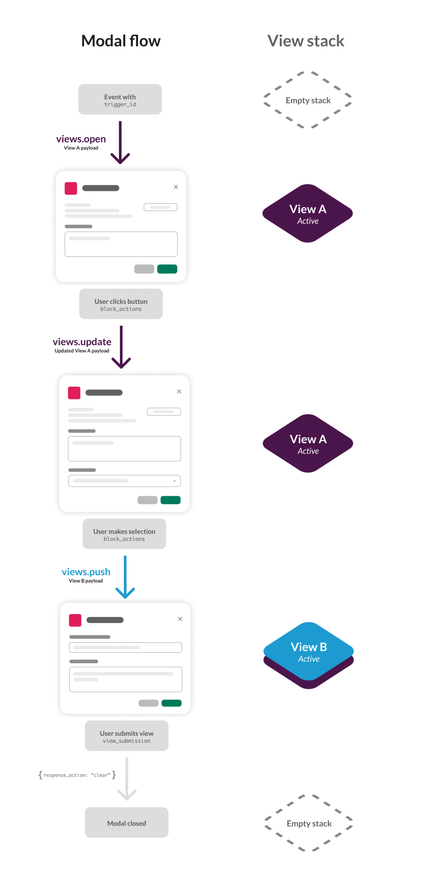
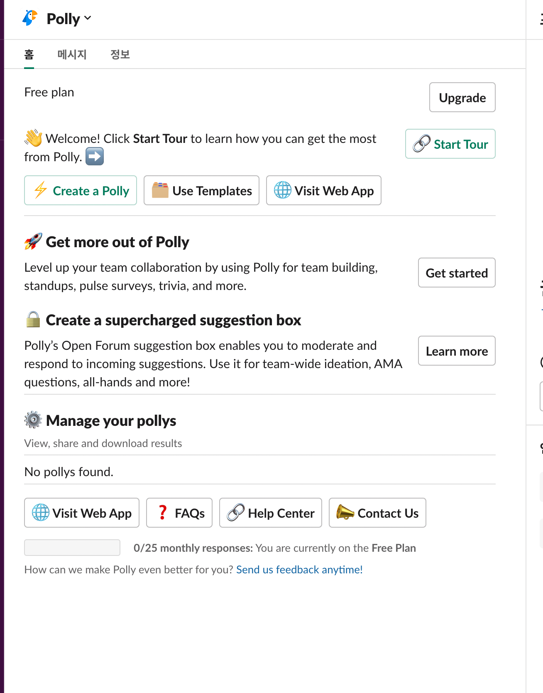

## 글 링크
- [Slack View Object 기본 페이지](https://api.slack.com/reference/surfaces/views)
- [Modal](https://api.slack.com/surfaces/modals)
- [Home Tabs](https://api.slack.com/surfaces/tabs)
- [View Block Kit Builder](https://app.slack.com/block-kit-builder/)
- [Block kotlin DSL ](https://slack.dev/java-slack-sdk/guides/composing-messages#block-kit-kotlin-dsl)
- [Block 종류](https://api.slack.com/reference/block-kit/blocks)

## Slack의 View
### Modal
- 요청 혹은 데이터 수집을 위한 View
- alert boxes, pop-ups, or dialog boxes 등의 형태
- 관련 메서드
  - view.open
  - view.update
  - view.push
- Modal은 1번에 3개의 view까지 소유할 수 있다. (view stack에 쌓는다)

#### Lifecycle

1. 유저가 특정한 행동을 하면 slack -> server로 특정 `trigger_id` + `paylod`를 보낸다
  - 특정한 행동은 Entry points를 뜻함 [Entry points for app interactions](https://api.slack.com/interactivity/entry-points)
  - [Handling payload](https://api.slack.com/interactivity/handling#payloads)
2. views.open api로 modal 전달
3. 유저는 전달 받은 modal view와 상호작용 함. 이 과정에서 새로운 요청을 보낼 수 있음
4. server는 view를 update함 (views.update)
   - [view update 방법](https://api.slack.com/surfaces/modals/using#updating_views)
5. 완전히 새로운 view가 필요할 때는 view.push. 이전 것 사용 못함
6. submit 버튼을 누르면 data가 전송됨
7. view stack이 비워짐

### Home Tabs

- Slack 앱 메인 페이지라 생각하면 됨
- 관련 메서드
  - view.publish
    - 유저 id별로 제공, insert + update
