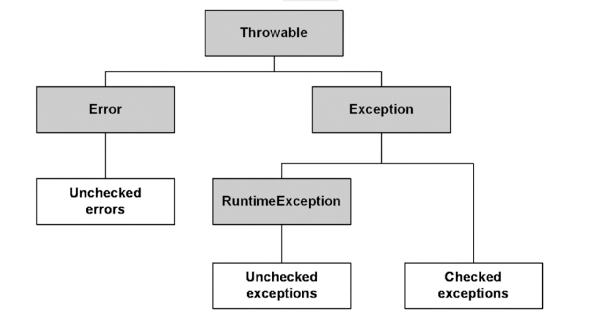

# 코틀린의 예외 처리

- 코틀린의 모든 예외 클래스는 Throwable을 상속한다.
  - Error는 복구가 불가능한 예외
  - Exception은 복구가 가능한 예외

## Checked Exception vs Unchecked Exception(RuntimException)
- Exception은 기본적으로 시스템에서 포착이 가능하여 복구가 가능하다.

- Checked의 경우 
  - 예시 IOException, FileNotFoundException 등
  - Java에서는 예외 처리를 강제하지만 Kotlin에서는 강제하지 않는다. try/catch
    - Java 혹은 타 언어와의 호환을 위해 @Throws 어노테이션을 제공
    - ```kotlin
      @Throws(NumberFormatException::class)
      fun convertStringToInt(str: String) {
          ....
      }
        
      // 자바로 변환하면 아래와 같음
      public static final void convertStringToInt(@NotNull String str) throws NumberFormatException {
          ....
      }  
      ```
  - @Transactional에서 롤백되지 않음

- Unchecked의 경우
  - Java / Kotlin 모두 예외 처리를 강제하지 않는다.


## 코틀린에서 Checked Exception을 다룰 때
```kotlin
@Throws(NumberFormatException::class)
fun convertStringToInt(str: String) {
    throw NumberFormatException("무조건 Checked Exception 발생")
}

fun main(){

    // try  - catch로 감싸지 않아도 된다.
    var int = convertStringToInt("3");

    // 감싸도 되고
    try {
        int = convertStringToInt("3");
    } catch (e : Exception){
        println("예외 발생!")
    } finally {
        println("finally 실행!")
    }
}
```

## Kotlin에서 try - catch와 throw문은 표현식
```kotlin
fun main(){
    val int = try {
        convertStringToInt("3");
    } catch (e : Exception){
        println("예외 발생")
    }
}
```
- kotlin에서 try - catch문은 표현식이기에 자체로 값이 될 수 있다.

```kotlin
fun illegalArgumentException() : Nothing {
    throw IllegalArgumentException("예외 반환")
}
```
- 예외는 Nothing을 반환한다.
- 이를 활용해 예외를 반환하는 메서드를 만들어 활용할 수 있음
  - ```kotlin
    fun main() {
        val time = if (getCurrentTime() < 24) getCurrentTime() 
                   else illegalArgumentException()
    }
    ```
  - ```kotlin
    fun main() {
        val b: String? = null
        val c = b ?: illegalArgumentException()
    
        c.length
    }
    ```
    - 엘비스 연산자와 사용하면 nullable타입을 대입해도 nonnull 타입으로 인식된다.

# 코틀린을 활용한 에러 핸들링
## runCatching과 Result타입
- runCatching은 코틀린에서 사용할 수 있는 에러 핸들링 방식이다.
```kotlin
// runCatching

@InlineOnly
@SinceKotlin("1.3")
public inline fun <R> runCatching(block: () -> R): Result<R> {
    return try {
        Result.success(block())
    } catch (e: Throwable) {
        Result.failure(e)
    }
}
```
- 내부적으로 try - catch문을 사용하지만
- Result 객체에 결과를 감싸서 반환한다.


```kotlin
// Result
public value class Result<out T> @PublishedApi internal constructor(
    @PublishedApi
    internal val value: Any?
) : Serializable {

    public val isSuccess: Boolean get() = value !is Failure

    public val isFailure: Boolean get() = value is Failure

    public companion object {

        @Suppress("INAPPLICABLE_JVM_NAME")
        @InlineOnly
        @JvmName("success")
        public inline fun <T> success(value: T): Result<T> =
            Result(value)


        @Suppress("INAPPLICABLE_JVM_NAME")
        @InlineOnly
        @JvmName("failure")
        public inline fun <T> failure(exception: Throwable): Result<T> =
            Result(createFailure(exception))
    }
    
    internal class Failure(
        @JvmField
        val exception: Throwable
    ) : Serializable {
        override fun equals(other: Any?): Boolean = other is Failure && exception == other.exception
        override fun hashCode(): Int = exception.hashCode()
        override fun toString(): String = "Failure($exception)"
    }
    
    // 등등...
}
```
- 기본적인 구성은
  - 성공 시 데이터를 담을 value
  - 실패 시 Exception을 담을 Failure 객체
  - 성공/실패 여부를 확인할 수 있는 변수
  - 성공 / 실패 시 객체를 생성할 수 있는 메서드 등이 존재한다.


### runCatching 사용 예시
```kotlin
// 에러 발생 시 null 반환
val result = runCatching {
  // 에러 가능성 있는 로직 실행
}.getOrNull()


// 에러 발생 시 다른 동적 수행
val response = runCatching {
  // 에러 가능성 있는 로직 실행
}.getOrElse { ex ->
  logger.warn(ex) { "에러 발생" }

  // 에러를 던지고 싶다면
  throw ex
}

등등...
```


### 핵심은 예외 처리를 다른 클래스에 위임하는 것
```kotlin
// API client
@FeignClient
internal interface LoginApi {
  @PostMapping
  fun login(
    @RequestBody request: LoginRequestDto
  ): OtherServiceResponse<LoginResponseDto>
}

@Component
class LoginApiClient internal constructor(
  private val loginApi: LoginApi
) {
  fun login(request: LoginRequestDto): Result<LoginResult> {
    return runCatching { 
      loginApi.login(request).result.toResult()
    }
  }
}

@Service
class LoginService(
  private val loginApiClient: LoginApiClient
) {
  fun login(id: String, pw: String): LoginResult {
    return loginApiClient.login(LoginRequestDto(id, pw))
      .onFailure {
        // 에러 핸들링
      }
  }
}
```
- 위 코드와 같이 LoginApiClient에서 로그인 요청에 대한 결과를 Result로 반환하면
- LoginApiClient를 사용하는 각 Service단에서 각기 다르게 에러를 핸들링할 수 있다.


# Reference
- (코틀린의 예외 처리)[https://fastcampus.co.kr/dev_online_kopring]
- (코틀린을 활용한 에러 핸들링)[https://toss.tech/article/kotlin-result]
- 왜 CheckedException을 없앴을까?
  - [참고1](https://www.artima.com/articles/the-trouble-with-checked-exceptions)
  - [참고2](https://www.artima.com/articles/the-trouble-with-checked-exceptions)