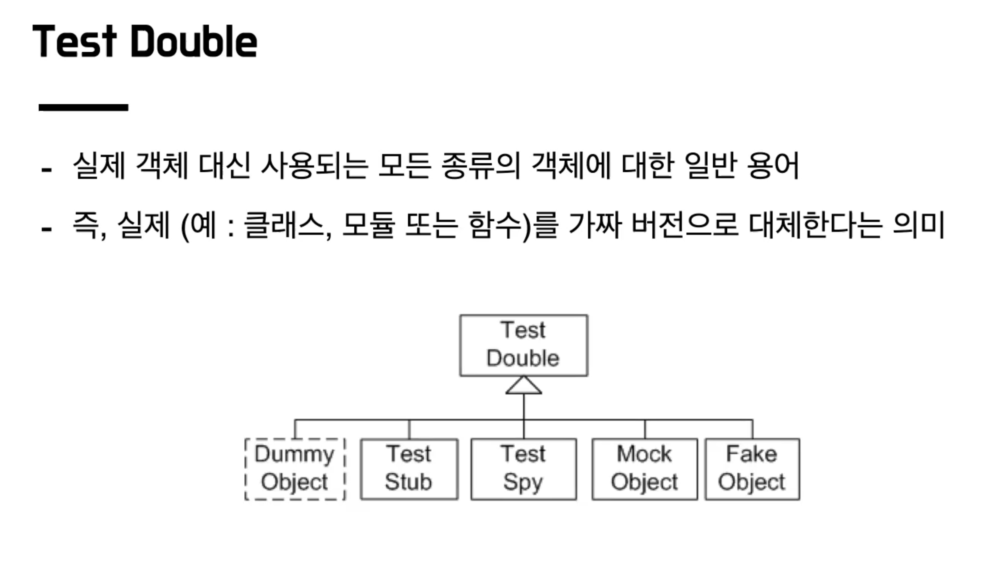

## 강의 중 생각 정리

### Test 의도 명확히 드러내기
#### 1. 중복 제거
- 메서드 분리
- CRUD 추상화
- Cucumber, JBehave같은 BDD도구 사용

#### 2. 의도 드러내기
- 테스트의 각 스텝 의도가 드러날 수 있도록
  - 주석이나
  - 메서드명으로 표시할 수 있을듯

  
### 협력 객체를 필요로 하는 테스트는 어떻게 작성해야 할까?
- ex) 노선 테스트를 위해서는 역이 필요함
- 실제 객체를 이용 VS 가짜 객체 이

#### 가짜 객체

- Stub 방식
  - 실제 객체가 아니기에 Response부분을 설정해두어야 함
- Fake 방식
  - 테스트용 객체를 만드는 것
  - 예를 들면 Map으로 된 가짜 DB를 가진 Repository 객체
- Mock 방식
  - 어떤 객체가 호출 됐는지, 몇 번 호출이 됐는지를 확인하는 방식
- 테스트 하고자 하는 부분에 더 집중할 수 있음 (외부와 더 철저히 격리가 가능)
- 단, 가짜 객체의 상세 동작을 구현해야 함..

#### 실제 객체
- 상세 구현을 알 필요가 없음
- 단, 협력 객체가 정상 동작해야 원하는 테스트 가능(격리 부족)

#### 강의 내 추천 방식
- 가급적 실제 객체 이용
- 단, 테스트 작성이 어렵거나 흐름이 이어지지 않는다면 가짜 객체 사용

### Classist vs Mokist
- 테스트 격리에 대한 견해 차이
- Classist의 경우 테스트 간의 격리로 이해
  - 즉, 테스트 간의 의존성이 아니라면 실제 객체를 사용
- Mokist 협력 객체의 격리로 이해

### TDD 적근법
- 가짜 객체 vs 실제 객체
- 둘 중 어떤 방법을 사용하느냐에 따라 구현 방식이 달라진다
  - `Classist` - Inside Out
  - `Mokist` - Outside In

#### Inside Out
- Domain Model부터 개발 시작 필요
- 도메인 설계가 충분히 이루어진 다음에 진행이 가능
- PROD에 덜 의존적인 테스트가 작성됨

#### Outside In
- 상위 레벨 테스트부터 시작
- 도메인 이해가 높지 않은 상태에서 진행이 가능
- TDD 사이클 이어나가기 수월
  - Controller 테스트 (Service 가짜 객체 생성)
  - Service 테스트
  - 즉, 테스트할 다음 대상이 명확함
- PROD 의존적인 테스트가 작성됨

#### 그럼 어떻게 해야하나?
- 아는 것에서 모르는 것으로 구현하는 방향
- 강의 추천 방향
  - Top-Down으로 방향을 잡고, Bottom-Up 구현하기
  - 인수 테스트 작성을 통해 요구사항과 기능 전반에 대한 이해 선행
  - 내부 구현에 대한 설계 흐름을 구상
  - 설계가 끝나면 도메인부터 차근차근 TDD로 기능 구현
  - 만약 도메인이 복잡하거나 설계가 어려울 경우 이해하고 있는 부분부터 기능 구현