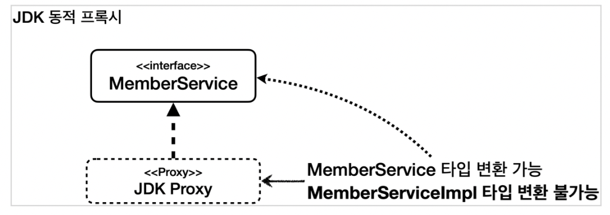
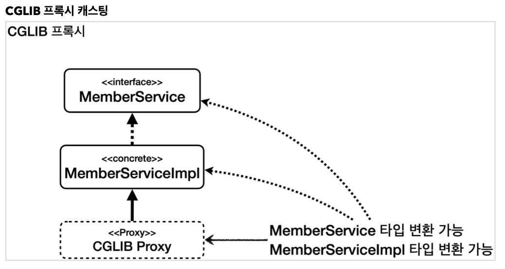
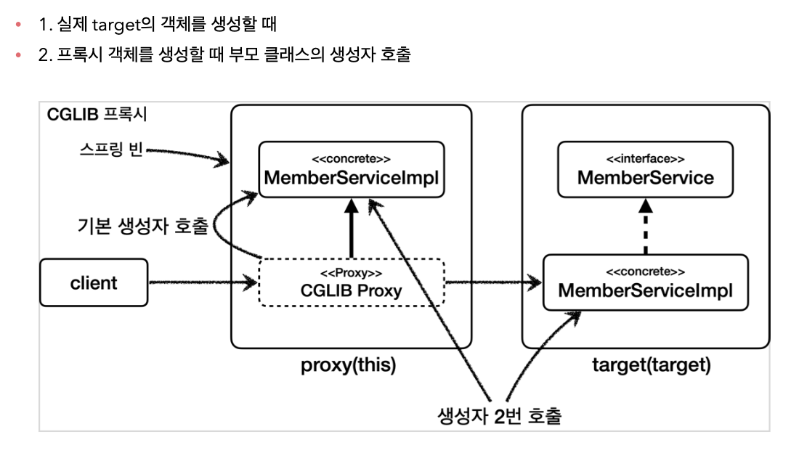

## (1) 프록시 내부 호출 문제
- Spring은 프록시 방식의 AOP를 사용한다.
- @Bean 자체를 프록시로 등록한다.
- 하지만 대상 객체의 내부에서 메서드 호출이 발생하면 대상 객체를 직접 호출하여 문제가 발생할 수 있다.

### 예시
```java
@Slf4j
@Component
public class CallServiceV0 {

    public void external() {
        log.info("call external");
        internal(); //내부 메서드 호출(this.internal())
    }

    public void internal() {
        log.info("call internal");
    }
}

@Slf4j
@Aspect
public class CallLogAspect {

    // CallService의 모든 메서드에 로직 적용
    @Before("execution(* hello.aop.internalcall..*.*(..))")
    public void doLog(JoinPoint joinPoint) {
        log.info("aop={}", joinPoint.getSignature());
    }
}
```
- CallServiceV0의 external()를 사용하면 external()과 내부 로직 internal()에 모두 advice가 적용될 거라 생각할 수 있다.
- 하지만 advice는 external()에만 적용된다.
- 이는 프록시 방식 AOP의 한계라 볼 수 있다.

### 해결책 1. 자기 자신 주입
```java
@Slf4j
@Component
public class CallServiceV1 {

    private CallServiceV1 callServiceV1;

    public void external() {
        log.info("call external");
        callServiceV1.internal(); //외부 메서드 호출
    }

    public void internal() {
        log.info("call internal");
    }
    
    @Autowired
    public void setCallServiceV1(CallServiceV1 callServiceV1) {
        this.callServiceV1 = callServiceV1;
    }
}
```
- 자기 자신을 주입받도록 클래스를 설정하면 프록시 객체가 주입된다.
- 이후 내부에서 호출할 떄는 주입 받은 프록시 객체로 메서드를 호출하면 문제를 해결할 수 있다.
- `주의`
  - 이때 생성자 주입을 사용하면 순환 사이클이 만들어저 오류가 발생한다. (본인 생성 \<-> 주입)
  - 때문에 수정자 주입을 사용해야 한다.


### 해결책 2. 지연 조회 (ObjectProvider)
```java
@Slf4j
@Component
@RequiredArgsConstructor
public class CallServiceV2 {
    private final ObjectProvider<CallServiceV2> callServiceProvider;

    public void external() {
        log.info("call external");
        CallServiceV2 callServiceV2 = callServiceProvider.getObject();
        callServiceV2.internal(); //외부 메서드 호출
    }

    public void internal() {
        log.info("call internal");
    }
}
```
- `ObjectProvider`: 스프링 컨테이너에서 객체를 조회하는 시점을 변경 (스프링 빈 생성 시점 -> 객체를 사용하는 시점)
- callServiceProvider.getObject()를 호출하는 시점에 빈을 조회하게 된다.
- 이 경우 자기 자신을 주입받는 것이 아니기 때문에 순환 사이클이 발생하지 않음
  - 자기 자신을 사용하는 건 맞다.


### 해결책 3. 구조 변경
```java
@Slf4j
@Component
@RequiredArgsConstructor
public class CallServiceV3 {

    private final InternalService internalService;

    public void external() {
        log.info("call external");
        internalService.internal(); //외부 메서드 호출
    }
}

@Slf4j
@Component
public class InternalService {

    public void internal() {
        log.info("call internal");
    }
}
```
- InternalService라는 별도 클래스로 분리했다.


### 팁
- 대개 AOP적용 지점은 인터페이스에 메서드가 나올 규모 즉, public 메서드 규모에 지정하는 것이 적합하다.
- 하지만 public 메서드에서 public 메서드를 호출하는 경우에는 문제가 발생할 수 있으니 이런 지점을 유심히 살펴보면 좋을 것이다.

## 프록시 기술과 한계 - 타입 캐스팅

```java
@Slf4j
public class ProxyCastingTest {

    @Test
    void jdkProxy() {
        MemberServiceImpl target = new MemberServiceImpl();
        ProxyFactory proxyFactory = new ProxyFactory(target);
        proxyFactory.setProxyTargetClass(false); //JDK 동적 프록시

        //프록시를 인터페이스로 캐스팅 성공
        MemberService memberServiceProxy = (MemberService) proxyFactory.getProxy();

        //JDK 동적 프록시를 구현 클래스로 캐스팅 시도 실패, ClassCastException 예외 발생
        assertThrows(ClassCastException.class, () -> {
            MemberServiceImpl castingMemberService = (MemberServiceImpl) memberServiceProxy;
        });
    }

    @Test
    void cglibProxy() {
        MemberServiceImpl target = new MemberServiceImpl();
        ProxyFactory proxyFactory = new ProxyFactory(target);
        proxyFactory.setProxyTargetClass(true); //CGLIB 프록시

        //프록시를 인터페이스로 캐스팅 성공
        MemberService memberServiceProxy = (MemberService) proxyFactory.getProxy();

        log.info("proxy class={}", memberServiceProxy.getClass());

        //CGLIB 프록시를 구현 클래스로 캐스팅 시도 성공
        MemberServiceImpl castingMemberService = (MemberServiceImpl) memberServiceProxy;
    }
}
```

- `JDK 동적 프록시`: 인터페이스가 필수이며, 인터페이스 기반으로 프록시 생성
  - 프록시 객체를 구체 클래스로 타입 캐스팅이 불가능하다.

- `CGLIB`: 구체 클래스 기반으로 프록시 생성
  - 프록시 객체를 구체 클래스로 타입 캐스팅이 가능하다.

## 프록시 기술과 한계 - 의존 관계 주입
```java
@Slf4j
@SpringBootTest(properties = {"spring.aop.proxy-target-class=false"}) //JDK 동적 프록시
@SpringBootTest(properties = {"spring.aop.proxy-target-class=true"}) //CGLIB -> 오류 발생하지 않음
@SpringBootTest
@Import(ProxyDIAspect.class)
public class ProxyDITest {

    @Autowired
    MemberService memberService;

    @Autowired
    // 오류 발생 (BeanNotOfRequiredTypeException)
    MemberServiceImpl memberServiceImpl;

    @Test
    void go() {
        log.info("memberService class={}", memberService.getClass());
        log.info("memberServiceImpl class={}", memberServiceImpl.getClass());
        memberServiceImpl.hello("hello");
    }
}
```
- JDK 동적 프록시를 사용하면 구체 클래스로 의존성을 주입하는 과정에서 오류가 발생한다. (타입 캐스팅이 가능하기 때문에)
- CGLIB을 사용하면 구체 클래스로 의존성 주입이 가능해진다. (타입 캐스팅이 가능하기 때문에)
- `정리`
  - 구체 클래스로 의존성 주입하는 경우가 없다면 고민할 필요가 없는 내용이다.
  - 또한 CGLIB만 사용해도 고민할 이유가 없다.
  - 하지만 구체 클래스에 의존성을 주입해야 하는 겨우도 있고, 또 CGLIB의 단점도 있다... (다음 내용)


## 프록시 기술과 한계 - CGLIB
- `CGLIB의 문제점`
  - (1) 대상 클래스에 기본 생성자가 필수이다.
    - 클래스를 상속하면 자식 클래스의 생성자 첫줄에 부모 클래스의 기본 생성자를 호출하는 super()가 자동으로 들어감
    - 때문에 대상 클래스에 기본 생성자가 꼭 있어야 한다.
  - (2) 생성자 2번 호출 문제
    - 
    - 실제 target 객체를 생성할 때 / 프록시 객체를 생성할 때 총 2번의 대상 객체의 기본 생성자를 호출
  - (3) final 키워드 클래스, 메서드 사용 불가
    - final 키워드가 붙으면 상속이 불가하기 때문


## 프록시 기술의 한계 - 스프링의 해결책
- objenesis 라이브러리를 사용해 기본 생성자 문제와 생성자 2번 호출 문제를 해결하고
- Default로 CGLIB를 사용한다.