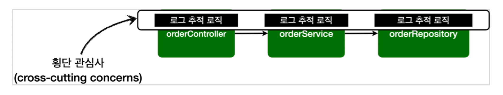
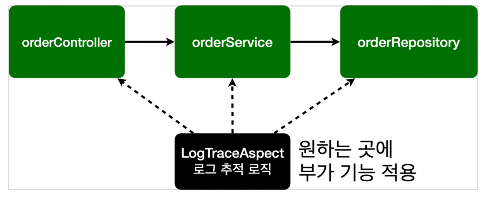
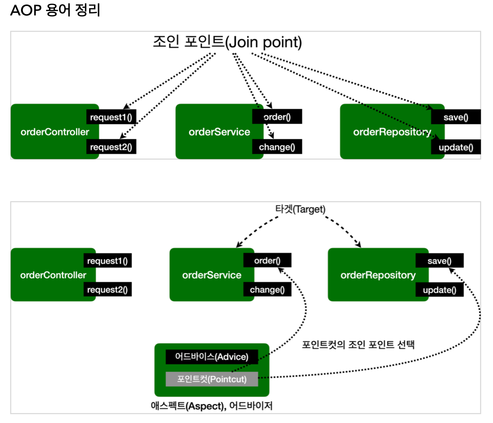

## AOP 개념

- Application 로직은 `핵심 기능`과 `부가 기능`으로 나눌 수 있다.
- 부가 기능 중 여러 곳에서 사용되는 부가 기능들이 있다.
- 공통 로직이 여러 곳에 적용되어 있으면 구현 / 유지 / 관리가 어려워진다.
- 이러한 어려움을 해결하기 위해 공통 로직을 핵심 기능에서 분리에 한 곳에서 관리할 수 있도록 돕는 기술

### Aspect

- 부가 기능과 부가 기능을 적용할 위치를 정이한 하나의 모듈

### AOP 구현체
- 스프링 AOP
- AspectJ 프레임 워크
  - 자바 프로그래밍 언어에 대한 완벽한 관점 지향 확장 횡단 관심사의 깔끔한 모듈화 
  - 오류 검사 및 처리 
  - 동기화 
  - 성능 최적화(캐싱) 
  - 모니터링 및 로깅

### AOP 적용 방식
- 컴파일 시점
  - AspectJ 컴파일러를 이용해야 한다.
  - .java -> .class 볂환 시점에 AspectJ 모듈을 바탕으로 원본 로직에 부가 기능 로직을 추가한다.
  - 단, 특별한 컴파일러가 필요하고 복잡하다.
- 클래스 로딩 시점
  - 자바 실행 시점에 .class를 조작하여 JVM 클래스 로더에 보관한다.
  - java instrumentation 참고
  - 단, 실행 옵션으로 클래스 로더 조작기를 지정해야 한다.
- 런타임 시점
  - main 메서드 실행 이후
  - 지금까지 학습한 방식
  - Spring AOP가 이용하는 방식이기도 하다

### AOP 적용 위치
- 적용 가능 지점(Join point): 생성자, 필드 값 접근, static 메서드 접근, 메서드 실행
- 컴파일 시점 / 클래스 로딩 시점에 AOP를 적용하면 모든 Join point에 적용 가능
- 프록시 방식은 메서드 실행 지점에 제한됨.

### AOP 용어 정리

- 조인 포인트(Join point)
  - AOP 적용 가능 지점
- 포인트컷(Pointcut)
  - 실제 적용 위치를 선별하는 기능
- 타켓(Target)
  - 어드바이스를 받는 객체, 포인트컷으로 결정 
- 어드바이스(Advice) 
  - 부가 기능 
  - Around(주변), Before(전), After(후)와 같은 다양한 종류의 어드바이스가 있음 
- 애스펙트(Aspect)
  - 어드바이스 + 포인트컷을 모듈화 한 것 @Aspect 를 생각하면 됨
- 어드바이저(Advisor)
  - 하나의 어드바이스와 하나의 포인트 컷으로 구성 스프링 AOP에서만 사용되는 특별한 용어 
- 위빙(Weaving)
  - 포인트컷으로 결정한 타켓의 조인 포인트에 어드바이스를 적용하는 것 위빙을 통해 핵심 기능 코드에 영향을 주지 않고 부가 기능을 추가 할 수 있음 
  - AOP 적용을 위해 애스펙트를 객체에 연결한 상태 
    - 컴파일 타임(AspectJ compiler)
    - 로드 타임 
    - 런타임, 스프링 AOP는 런타임, 프록시 방식 
- AOP 프록시
  AOP 기능을 구현하기 위해 만든 프록시 객체, 스프링에서 AOP 프록시는 JDK 동적 프록시 또는 CGLIB 프록시이다.


## AOP 구현

### 일반 예제
```java
@Slf4j
@Aspect
public class AspectV1 {

    //hello.aop.order 패키지와 하위 패키지
    @Around("execution(* hello.aop.order..*(..))")
    public Object doLog(ProceedingJoinPoint joinPoint) throws Throwable {
        log.info("[log] {}", joinPoint.getSignature()); //join point 시그니처
        return joinPoint.proceed();
    }
}
```
- 이전에 설명했듯이
- @Around 값이 Pointcut, 메서드가 Advice이다.

### Pointcut 분리 예제
```java
@Slf4j
@Aspect
public class AspectV2 {

    //hello.aop.order 패키지와 하위 패키지
    @Pointcut("execution(* hello.aop.order..*(..))")
    private void allOrder(){} //pointcut signature

    @Around("allOrder()")
    public Object doLog(ProceedingJoinPoint joinPoint) throws Throwable {
        log.info("[log] {}", joinPoint.getSignature()); //join point 시그니처
        return joinPoint.proceed();
    }
}
```
- 메서드 명, 파라미터를 합쳐서 포인트컷 시그니처라 한다.
  - 메서드 반환 값은 void
  - 코드 내용은 x
  - public, private 기존 개념과 같게 생각하면 됨
- @Around를 사용할 때 포인트컷 시그니처를 사용해도 됨


### Pointcut 연산  && / || / !
```java
@Slf4j
@Aspect
public class AspectV3 {

    //hello.aop.order 패키지와 하위 패키지
    @Pointcut("execution(* hello.aop.order..*(..))")
    private void allOrder(){} //pointcut signature

    //클래스 이름 패턴이 *Service
    @Pointcut("execution(* *..*Service.*(..))")
    private void allService(){}

    @Around("allOrder()")
    public Object doLog(ProceedingJoinPoint joinPoint) throws Throwable {
        log.info("[log] {}", joinPoint.getSignature()); //join point 시그니처
        return joinPoint.proceed();
    }

    //hello.aop.order 패키지와 하위 패키지 이면서 클래스 이름 패턴이 *Service
    @Around("allOrder() && allService()")
    public Object doTransaction(ProceedingJoinPoint joinPoint) throws Throwable {

        try {
            log.info("[트랜잭션 시작] {}", joinPoint.getSignature());
            Object result = joinPoint.proceed();
            log.info("[트랜잭션 커밋] {}", joinPoint.getSignature());
            return result;
        } catch (Exception e) {
            log.info("[트랜잭션 롤백] {}", joinPoint.getSignature());
            throw e;
        } finally {
            log.info("[리소스 릴리즈] {}", joinPoint.getSignature());
        }
    }
}
```


### Pointcut 참조
```java
public class Pointcuts {

    //hello.aop.order 패키지와 하위 패키지
    @Pointcut("execution(* hello.aop.order..*(..))")
    public void allOrder(){} //pointcut signature

    //클래스 이름 패턴이 *Service
    @Pointcut("execution(* *..*Service.*(..))")
    public void allService(){}

    //allOrder && allService
    @Pointcut("allOrder() && allService()")
    public void orderAndService() {}
}
```
- Pointcut만 따로 떼어 관리하고 사용할 수 있다

```java
@Slf4j
@Aspect
public class AspectV4Pointcut {

    @Around("hello.aop.order.aop.Pointcuts.allOrder()")
    public Object doLog(ProceedingJoinPoint joinPoint) throws Throwable {
        log.info("[log] {}", joinPoint.getSignature()); //join point 시그니처
        return joinPoint.proceed();
    }

    @Around("hello.aop.order.aop.Pointcuts.orderAndService()")
    public Object doTransaction(ProceedingJoinPoint joinPoint) throws Throwable {

        try {
            log.info("[트랜잭션 시작] {}", joinPoint.getSignature());
            Object result = joinPoint.proceed();
            log.info("[트랜잭션 커밋] {}", joinPoint.getSignature());
            return result;
        } catch (Exception e) {
            log.info("[트랜잭션 롤백] {}", joinPoint.getSignature());
            throw e;
        } finally {
            log.info("[리소스 릴리즈] {}", joinPoint.getSignature());
        }
    }
}
```
- Pointcut 객체의 시그니처 이용 가능

### Advice 순서 적용
```java
@Slf4j
public class AspectV5Order {

    @Aspect
    @Order(2)
    public static class LogAspect {
        @Around("hello.aop.order.aop.Pointcuts.allOrder()")
        public Object doLog(ProceedingJoinPoint joinPoint) throws Throwable {
            log.info("[log] {}", joinPoint.getSignature()); //join point 시그니처
            return joinPoint.proceed();
        }
    }

    @Aspect
    @Order(1)
    public static class TxAspect {
        @Around("hello.aop.order.aop.Pointcuts.orderAndService()")
        public Object doTransaction(ProceedingJoinPoint joinPoint) throws Throwable {

            try {
                log.info("[트랜잭션 시작] {}", joinPoint.getSignature());
                Object result = joinPoint.proceed();
                log.info("[트랜잭션 커밋] {}", joinPoint.getSignature());
                return result;
            } catch (Exception e) {
                log.info("[트랜잭션 롤백] {}", joinPoint.getSignature());
                throw e;
            } finally {
                log.info("[리소스 릴리즈] {}", joinPoint.getSignature());
            }
        }
    }
}
```
- @Order를 통해서 Advice 순서를 지정할 수 있다.


### Advice 종류
```java
@Slf4j
@Aspect
public class AspectV6Advice {

    @Around("hello.aop.order.aop.Pointcuts.orderAndService()")
    public Object doTransaction(ProceedingJoinPoint joinPoint) throws Throwable {

        try {
            //@Before
            log.info("[트랜잭션 시작] {}", joinPoint.getSignature());
            Object result = joinPoint.proceed();
            //@AfterReturning
            log.info("[트랜잭션 커밋] {}", joinPoint.getSignature());
            return result;
        } catch (Exception e) {
            //@AfterThrowing
            log.info("[트랜잭션 롤백] {}", joinPoint.getSignature());
            throw e;
        } finally {
            //@After
            log.info("[리소스 릴리즈] {}", joinPoint.getSignature());
        }
    }

    @Before("hello.aop.order.aop.Pointcuts.orderAndService()")
    public void doBefore(JoinPoint joinPoint) {
        log.info("[before] {}", joinPoint.getSignature());
    }

    @AfterReturning(value = "hello.aop.order.aop.Pointcuts.orderAndService()", returning = "result")
    public void doReturn(JoinPoint joinPoint, Object result) {
        log.info("[return] {} return={}", joinPoint.getSignature(), result);
    }

    @AfterThrowing(value = "hello.aop.order.aop.Pointcuts.orderAndService()", throwing = "ex")
    public void doThrowing(JoinPoint joinPoint, Exception ex) {
        log.info("[ex] {} message={}", ex);
    }

    @After(value = "hello.aop.order.aop.Pointcuts.orderAndService()")
    public void doAfter(JoinPoint joinPoint) {
        log.info("[after] {}", joinPoint.getSignature());
    }

}
```
- 모든 Advice는 JointPoint를 첫번째 파라미터로 사용할 수 있다.
  - JointPoint 주요 메서드 
    - getArgs() : 메서드 인수를 반환합니다. 
    - getThis() : 프록시 객체를 반환합니다. 
    - getTarget() : 대상 객체를 반환합니다. 
    - getSignature() : 조언되는 메서드에 대한 설명을 반환합니다. 
    - toString() : 조언되는 방법에 대한 유용한 설명을 인쇄합니다.
- 단, @Around 는 ProceedingJoinPoint 을 사용해야 한다.
  - ProceedingJoinPoint 주요 메서드
    - proceed() : 다음 어드바이스나 타켓을 호출한다.

- Advice 종류
  - `@Before`
    - Joinpoint 실행 전
    - ProceedingJoinPoint.proceed() 자체를 사용하지 않음. (실행 시점이 정해져있기 때문이다)
  - `@AfterReturning`
    - 메서드 실행이 정상적으로 반환될 때 실행
    - returning 속성에 사용된 이름은 어드바이스 메서드의 매개변수 이름과 일치해야 한다.
    - returning 절에 지정된 타입의 값을 반환하는 메서드만 대상으로 실행한다. (부모 타입을 지정하면 모든 자식 타입은 인정된다.)
    - 반환 객체를 변경할 수는 없고 조작할 수는 있다.
  - `@AfterThrowing`
    - 메서드 실행이 예외를 던져서 종료될 때 실행
    - throwing 속성에 사용된 이름은 어드바이스 메서드의 매개변수 이름과 일치해야 한다.
    - throwing 절에 지정된 타입과 맞는 예외를 대상으로 실행한다. (부모 타입을 지정하면 모든 자식 타입은 인정된다.)
  - `@After`
    - 메서드 실행이 종료되면 실행된다. (finally를 생각하면 된다.) 
    - 정상 및 예외 반환 조건을 모두 처리한다. 
    - 일반적으로 리소스를 해제하는 데 사용한다.
  - `@Around`
    - 메서드의 실행의 주변에서 실행된다. 메서드 실행 전후에 작업을 수행한다.
      - 조인 포인트 실행 여부 선택 joinPoint.proceed() 
      - 호출 여부 선택 전달 값 변환: joinPoint.proceed(args[])
      - 반환 값 변환 
      - 예외 변환 
      - 트랜잭션 처럼 try ~ catch~ finally 모두 들어가는 구문 처리 가능
    - 어드바이스의 첫 번째 파라미터는 ProceedingJoinPoint 를 사용해야 한다. 
    - proceed() 를 통해 대상을 실행한다. 
    - proceed() 를 여러번 실행할 수도 있음(재시도)
