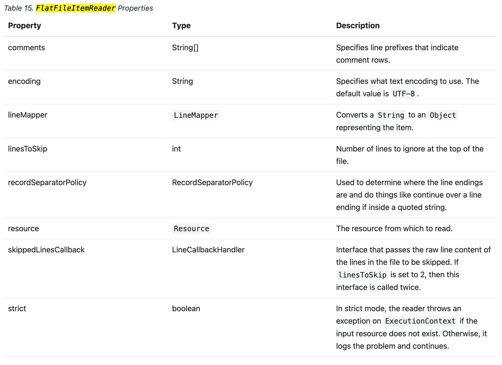

## JobParameterValidator
- CLI Arguments를 통해 JobParameter를 넘길 수 있다.
  - 예시 -변수명=값
  - 매개변수 정의에서 @Value("#\{jobParameters['targetDate']}")
  - ```java
    @StepScope
    @Bean
    public Tasklet advancedTasklet(@Value("#{jobParameters['targetDate']}") String targetDate) {
        return (contribution, chunkContext) -> {
            log.info("[AdvancedJobConfig] JobParameter - targetDate = " + targetDate);
            log.info("[AdvancedJobConfig] executed advancedTasklet");
            return RepeatStatus.FINISHED;
        };
    }
    ```
- JobParametersValidator Interface를 구현하여 JobParameter를 검증할 수 있다.
  - ```java
    @AllArgsConstructor
    public class LocalDateParameterValidator implements JobParametersValidator {
    
        private String parameterName;
    
        @Override
        public void validate(JobParameters parameters) throws JobParametersInvalidException {
            String localDate = parameters.getString(parameterName);
    
            if (!StringUtils.hasText(localDate)) {
                throw new JobParametersInvalidException(parameterName + "가 빈 문자열이거나 존재하지 않습니다.");
            }
    
            try {
                LocalDate.parse(localDate);
            } catch (DateTimeParseException e) {
                throw new JobParametersInvalidException(parameterName + "가 날짜 형식의 문자열이 아닙니다.");
            }
        }
    }
    
    
    // Validator 사용부
    @Bean
    public Job advancedJob(JobExecutionListener jobExecutionListener,
                           Step advancedStep) {
        return jobBuilderFactory.get("advancedJob")
                .incrementer(new RunIdIncrementer())
                .validator(new LocalDateParameterValidator("targetDate")) // validator 추가
                .listener(jobExecutionListener)
                .start(advancedStep)
                .build();
    }
    ```
    

## JobExecutionListner
- JobExecutionListner을 구현하여 실행 전, 실행 후 상태를 점검할 수 있다.
- 시작 전, 시작 후 이상 상태에 대해 알림을 보낼 수 있음.
```java
    @JobScope
    @Bean
    public JobExecutionListener jobExecutionListener() {
        return new JobExecutionListener() {
            @Override
            public void beforeJob(JobExecution jobExecution) {
                log.info("[JobExecutionListener#beforeJob] jobExecution is " + jobExecution.getStatus());
            }

            @Override
            public void afterJob(JobExecution jobExecution) {
                if (jobExecution.getStatus() == BatchStatus.FAILED) {
                    log.error("[JobExecutionListener#afterJob] JobExecution is FAILED!!! RECOVER ASAP");
                }
                
                // 실패하거나 원하는 결과가 나오지 못했을 떄 알림을 보내는 로직을 추가할 수 있음
            }
        };
    }
    
    @Bean
    public Job advancedJob(JobExecutionListener jobExecutionListener,
                           Step advancedStep) {
        return jobBuilderFactory.get("advancedJob")
                .incrementer(new RunIdIncrementer())
                .validator(new LocalDateParameterValidator("targetDate"))
                .listener(jobExecutionListener) // listener
                .start(advancedStep)
                .build();
    }
```


## FlatFileItemReader
- Chunk 기반으로 파일을 읽어올 수 있음

- 주요 특성
  - lineMapper: String to Object 
  - lineToSkip: 설정한 line만큼 무시
  - recordSeparatorPolicy: 데이터 구분 값
  - resource: 읽을 File 정보

### 예시 (공식 문서 예시에 대한 FlatFileItemReader)
```java
// @Bean 생성부
@StepScope
@Bean
public FlatFileItemReader<PlayerDto> playerFileItemReader() {
    return new FlatFileItemReaderBuilder<PlayerDto>()
            .name("playerFileItemReader")
            .lineTokenizer(new DelimitedLineTokenizer()) // recordSeparatorPolicy 설정, DelimitedLineTokenizer의 Default는 ','
            .linesToSkip(1) // 첫 줄 생략
            .fieldSetMapper(new PlayerFieldSetMapper()) // PlayerFieldSetMapper.mapFieldSet 반환값으로 변환
            .resource(new FileSystemResource("player-list.txt")) // resource 정보
            .build();
}

// Mapper
public class PlayerFieldSetMapper implements FieldSetMapper<PlayerDto> {
    @Override
    public PlayerDto mapFieldSet(FieldSet fieldSet) throws BindException {
        PlayerDto dto = new PlayerDto();
        dto.setID(fieldSet.readString(0));
        dto.setLastName(fieldSet.readString(1));
        dto.setFirstName(fieldSet.readString(2));
        dto.setPosition(fieldSet.readString(3));
        dto.setBirthYear(fieldSet.readInt(4));
        dto.setDebutYear(fieldSet.readInt(5));
        return dto;
    }
}   
```


### Reference
- [Spring FlatFileItemReader 공식 가이드](https://docs.spring.io/spring-batch/docs/current/reference/html/index-single.html#flatFileItemReader)


## StepListener
- JobExecutionListner처럼 Step 실행 이전/이후 상태도 알 수 있다.
```java
    @StepScope
    @Bean
    public StepExecutionListener stepExecutionListener() {
        return new StepExecutionListener() {
            @Override
            public void beforeStep(StepExecution stepExecution) {
                log.info("[StepExecutionListener#beforeStep] stepExecution is " + stepExecution.getStatus());
            }

            @Override
            public ExitStatus afterStep(StepExecution stepExecution) {
                log.info("[StepExecutionListener#afterStep] stepExecution is " + stepExecution.getStatus());
                return stepExecution.getExitStatus();
            }
        };
    }
    
    // Listener 사용부
    @JobScope
    @Bean
    public Step advancedStep(StepExecutionListener stepExecutionListener,
                             Tasklet advancedTasklet) {
        return stepBuilderFactory.get("advancedStep")
                .listener(stepExecutionListener)
                .tasklet(advancedTasklet)
                .build();
    }
```


### Reference
- [Spring StepExecutionListener 공식 가이드](https://docs.spring.io/spring-batch/docs/current/reference/html/index-single.html#stepExecutionListener)


## ItemProcessorAdapter
- processor 로직을 구현하는 3가지 방식

### 1. Step에서 구현
```java
    @JobScope
    @Bean
    public Step flatFileStep(FlatFileItemReader<PlayerDto> playerFileItemReader,
                             PlayerSalaryService playerSalaryService,
                             FlatFileItemWriter<PlayerSalaryDto> playerFileItemWriter
                             ) {
        return stepBuilderFactory.get("flatFileStep")
                .<PlayerDto, PlayerSalaryDto>chunk(5)
                .reader(playerFileItemReader)
                .processor(new ItemProcessor<PlayerDto, PlayerSalaryDto>() {
                    @Override
                    public PlayerSalaryDto process(PlayerDto item) throws Exception {
                        return playerSalaryService.calcSalary(item);
                    }
                })
                .writer(playerFileItemWriter)
                .build();
    }
```


### 2. ItemProcessor로 분리
```java
    @JobScope
    @Bean
    public Step flatFileStep(FlatFileItemReader<PlayerDto> playerFileItemReader,
                             ItemProcessor<PlayerDto, PlayerSalaryDto> itemProcessor,
                             FlatFileItemWriter<PlayerSalaryDto> playerFileItemWriter
                             ) {
        return stepBuilderFactory.get("flatFileStep")
                .<PlayerDto, PlayerSalaryDto>chunk(5)
                .reader(playerFileItemReader)
                .processor(itemProcessor)
                .writer(playerFileItemWriter)
                .build();
    }

    @StepScope
    @Bean
    public ItemProcessor<PlayerDto, PlayerSalaryDto> playerSalaryItemProcessor(PlayerSalaryService playerSalaryService){
        return new ItemProcessor<PlayerDto, PlayerSalaryDto>() {
            @Override
            public PlayerSalaryDto process(PlayerDto item) throws Exception {
                return playerSalaryService.calcSalary(item);
            }
        };
    }
```


### 3. ItemProcessorAdapter
```
    @JobScope
    @Bean
    public Step flatFileStep(FlatFileItemReader<PlayerDto> playerFileItemReader,
                             ItemProcessorAdapter<PlayerDto, PlayerSalaryDto> playerSalaryItemProcessorAdapter,
                             FlatFileItemWriter<PlayerSalaryDto> playerFileItemWriter
                             ) {
        return stepBuilderFactory.get("flatFileStep")
                .<PlayerDto, PlayerSalaryDto>chunk(5)
                .reader(playerFileItemReader)
                .processor(playerSalaryItemProcessorAdapter)
                .writer(playerFileItemWriter)
                .build();
    }
    
    @StepScope
    @Bean
    public ItemProcessorAdapter<PlayerDto, PlayerSalaryDto> playerSalaryItemProcessorAdapter(PlayerSalaryService playerSalaryService) {
        ItemProcessorAdapter<PlayerDto, PlayerSalaryDto> adapter = new ItemProcessorAdapter<>();
        adapter.setTargetObject(playerSalaryService); // 사용하는 클래스 명
        adapter.setTargetMethod("calcSalary"); // 사용하는 메서드 명
        return adapter;
    }
```
- 조금 더 간단하게 구현이 가능해진다.

## FlatFileItemWriter
- FlatFileItemWriter를 이용하면 결과를 파일로 반환할 수 있다
```java
    @StepScope
    @Bean
    public FlatFileItemWriter<PlayerSalaryDto> playerFileItemWriter() throws IOException {
        BeanWrapperFieldExtractor<PlayerSalaryDto> fieldExtractor = new BeanWrapperFieldExtractor<>();
        fieldExtractor.setNames(new String[]{"ID", "firstName", "lastName", "salary"}); // PlayerSalaryDto에서 사용할 값 정의
        fieldExtractor.afterPropertiesSet();

        DelimitedLineAggregator<PlayerSalaryDto> lineAggregator = new DelimitedLineAggregator<>();
        lineAggregator.setDelimiter("\t"); // 구분자 tab
        lineAggregator.setFieldExtractor(fieldExtractor);

        // 기존의 파일을 덮어쓴다.
        new File("player-salary-list.txt").createNewFile();
        FileSystemResource resource = new FileSystemResource("player-salary-list.txt");

        return new FlatFileItemWriterBuilder<PlayerSalaryDto>()
                .name("playerFileItemWriter")
                .resource(resource) // 파일을 쓸 resource 지정
                .lineAggregator(lineAggregator) // 값들을 어떻게 조합할 것인가
                .build();
    }
```