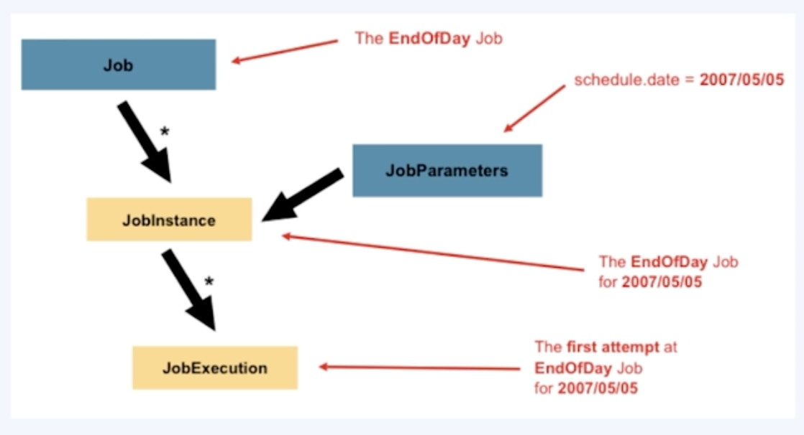
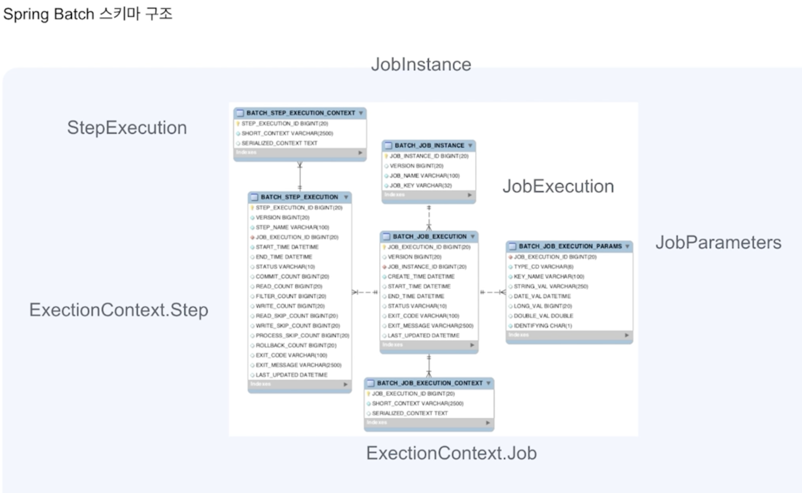

## Spring Batch란?
### Batch Program이란?
- batch processing이란 일괄 처리를 뜻함
- 즉, batch program은 개별적인 요청을 실시간으로 통신하는 것이 아닌 한번에 일괄적인 대량 건을 처리하는 프로그램을 뜻한다.
  - 대량 건을
  - 주기적 OR 반복적으로
  - 일괄 처리하는 프로그램

### Spring Batch
- batch 프로그램을 개발할 수 있는 프레임 워크
- 프레임워크가 그렇듯이 Spring Batch 또한 batch 프로그램을 만드는데 필요한 다양한 기능들을 제공한다.

### Scheduler
- Spring Batch를 모르는 상태에서 @Scheduled를 사용해 스케줄러를 만들지 Batch 프로그램을 만들지 고민했지만 이는 잘못된 생각이다.
- Spring Batch는 말 그대로 대용량 건을 일괄 처리하는 프로그램이고, 여러 스케줄링 방식(@Scheduled, Jenkins ..)을 활용해 Batch 프로그램을 스케줄링 해야한다.

### 사용하는 상황
- 데이터 처리 배치 프로그램
  - 서비스 데이터 저장할 때
  - 연관 상품 추천 데이터 모델을 만들 때
  - 지표를 집계할 때 등등...

- 서비스 배치 프로그램
  - 메시지, 이메일 발송 (현재 개발하려는 배치 프로그램)
  - 데이터 마이그레이션
  - 실패한 트랜잭션을 재처리
  - 만료 쿠폰, 포인트 소진 처리
  - 월말, 월초에 특정 데이터를 생성할 때

### 왜 Spring Batch를 써야할까?
- Batch Program을 만든는 방식은 다양하다. 그 중 Spring Batch를 써는 이유는?
  - Spring 기반이라는 점이 가장 큰 메리트인 것 같다. Spring으로 작성된 코드를 재활용할 수 있으니
  - 프레임워크에서 제공하는 다양한 기능들 (공부해봐야 알 것 같다..)

## Spring Batch 아키텍처
### JobLauncher
- Job을 실행시키는 Component

### Job

- 배치 작업을 뜻함
- Step의 순서를 정의하고
- JobParameters를 받는 역할을 한다.
- Job -> JobInstance(+ JobParameters) -> JobExecution

### Step
- 배치 작업의 단계를 뜻한다
- Job과 1:N 관계
- Chunk Step / Tasklet Step으로 나뉨
  - Chunk Step
    - Chunk기반(Read-Processor-Writer 포함)으로 하나의 트랜잭션에서 처리된다.
    - commitInterval: 읽을 데이터 크기, chunkSize: 쓸 데이터 크기
    - `chunkSize > commitInterval인 경우는?`
      - chunkSize가 찰 정도의 데이터를 계속 읽어오게 된다. chunkSize만큼 데이터를 읽어오면 Write+Commit
      - 현업에서는 대부분 chunkSize = commitInterval이다.
  - Tasklet Step
    - 하나의 트랜잭션에서 모든 데이터를 처리한다.
    - 단순한 처리를 할 때 사용한다.
    - 읽기 / 가공 / 쓰기 로직을 모두 한 곳에
- 각 Step은 1개씩의 ItemReader, ItemProccessor, ItemWriter를 가질 수 있다.
 
#### 1. ItemReader
- 데이터를 읽는 역할

#### 2. ItemProcessor
- 데이터를 가공하는 역할
- 가공이 간단할 경우 Writer에 로직을 구현하고 Processor는 생략할 수도 있다.

#### 3. ItemWriter
- 데이터를 쓰는 역할

### JobRepository
- Job의 실행과 Step을(?) 저장해주는 역할

### Spring Batch 아키텍처
- Application / Core / Infrastructure로 나뉜다.
- Application
  - Core와 Infrastructure를 어떻게 이용할지에 대한 서비스 로직
- Core
  - 배치 작업을 시작하고 제어하는데 필요한 클래스 (Job, Step, JobLauncher)
- Infrastructure
  - 외부와 상호작용
  - ItemReader, ItemWriter, RetryTemplate

## Sring Batch 스키마 구조

- 초기 설정이 필요하다.
- 보통 수정하지 않고 조회만 한다.
- Job의 이력, 파라미터 등 실행 결과를 조회할 수 있다.
- 대부분 별도의 로그 / 실행 이력을 남기기에 조회할 일이 많지 않다.