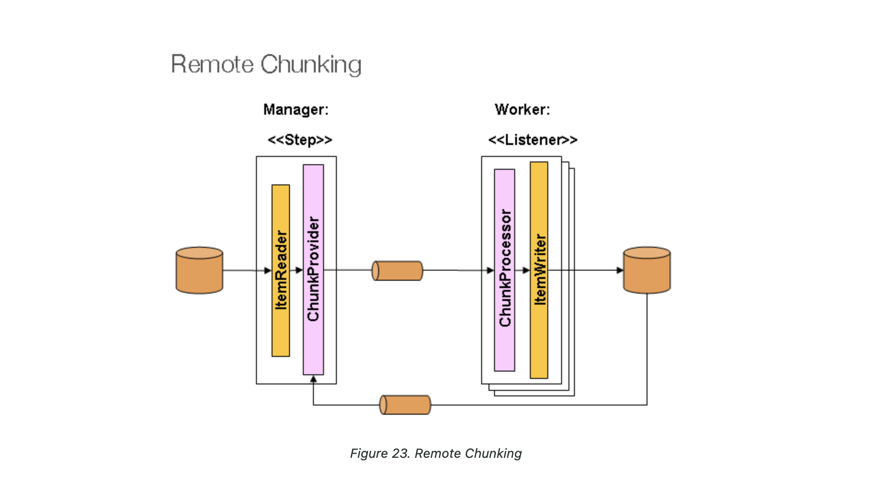
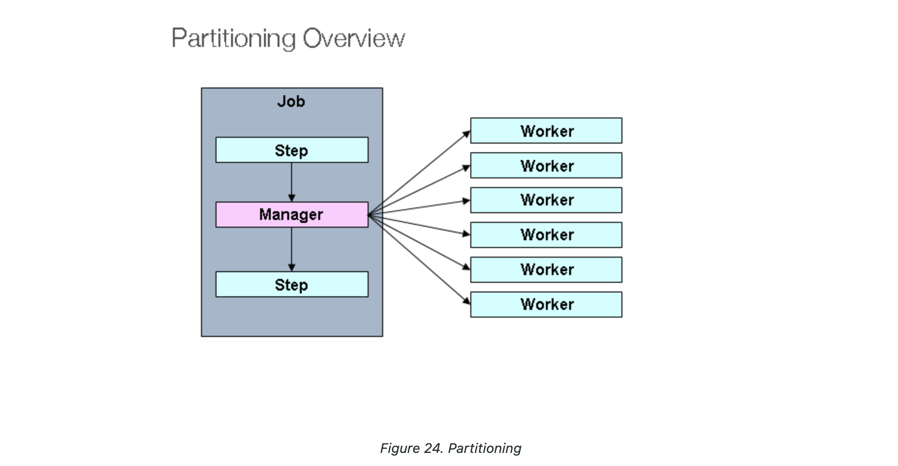

## Spring Batch 병렬 처리 종류
- [Spring 병렬 처리 공식 가이드](https://docs.spring.io/spring-batch/docs/current/reference/html/index-single.html#scalability)

### 1. Multi Thread Step (single process)
- single process 내에서 multi process를 활용함
- 한 Step 내에서 Chunk단위로 병렬 처리가 된다.
- 가장 구현이 간단한
```java
@Bean
public TaskExecutor taskExecutor() {
    return new SimpleAsyncTaskExecutor("spring_batch");
}

@Bean
public Step sampleStep(TaskExecutor taskExecutor, JobRepository jobRepository, PlatformTransactionManager transactionManager) {
	return new StepBuilder("sampleStep", jobRepository)
				.<String, String>chunk(10, transactionManager)
				.reader(itemReader())
				.writer(itemWriter())
				.taskExecutor(taskExecutor) // TaskExecutor 설정
				.build();
}
```

### 2. Parallel Step (single process)
- Step 단위로 병렬 처리가 된다.

```java
@Bean
public Job job(JobRepository jobRepository) {
    return new JobBuilder("job", jobRepository)
        .start(splitFlow())
        .next(step4())
        .build()        //builds FlowJobBuilder instance
        .build();       //builds Job instance
}

@Bean
public Flow splitFlow() {
    return new FlowBuilder<SimpleFlow>("splitFlow")
        .split(taskExecutor())
        .add(flow1(), flow2()) / 분기 처리할 flow 정의, 한 flow는 같은 thread로 실행됨,
        .build();
}

@Bean
public Flow flow1() {
    return new FlowBuilder<SimpleFlow>("flow1")
        .start(step1())
        .next(step2())
        .build();
}

@Bean
public Flow flow2() {
    return new FlowBuilder<SimpleFlow>("flow2")
        .start(step3())
        .build();
}

@Bean
public TaskExecutor taskExecutor() {
    return new SimpleAsyncTaskExecutor("spring_batch");
}
```

### 3. Remote Chunking (multi process)

- master - slave 방식으로 각 slave에 master가 작업을 나눠주는 방식
- master에서 지연이 발생하면 의미가 없어진다.

### 4. Partitioning (single process or multi process)

- 단일 프로세스에서 마스터 스텝과 워크 스텝을 두고, 마스터 스텝에서 생성해준 파티션 단위로 스텝을 병렬처리한다.

```java
    private static final int PARTITION_SIZE = 100;

    @Bean
    public Job partitioningJob(Step masterStep) {
        return jobBuilderFactory.get("partitioningJob")
                .incrementer(new RunIdIncrementer())
                .start(masterStep) // Master Step 하나만
                .build();
    }


    @JobScope
    @Bean // Master Step
    public Step masterStep(Partitioner partitioner,
                           PartitionHandler partitionHandler) {
        return stepBuilderFactory.get("masterStep")
                .partitioner("anotherStep", partitioner)
                .partitionHandler(partitionHandler)
                .build();
    }


    @StepScope
    @Bean
    public Partitioner partitioner() {
        SimplePartitioner partitioner = new SimplePartitioner();
        partitioner.partition(PARTITION_SIZE); // 파티션 
        return partitioner;
    }


    @StepScope
    @Bean
    public TaskExecutorPartitionHandler partitionHandler(Step anotherStep,
                                                         TaskExecutor taskExecutor) {
        TaskExecutorPartitionHandler partitionHandler = new TaskExecutorPartitionHandler();
        partitionHandler.setStep(anotherStep); // 동시에 실행할 Step 지정
        partitionHandler.setGridSize(PARTITION_SIZE); // Partitioner에 지정한 값과 같게
        partitionHandler.setTaskExecutor(taskExecutor);
        return partitionHandler;
    }
    
    @Bean
    public TaskExecutor taskExecutor() {
        SimpleAsyncTaskExecutor taskExecutor = new SimpleAsyncTaskExecutor("spring-batch-task-executor");
        taskExecutor.setConcurrencyLimit(4); // 동시에 실행하는 Thread 개수 제한
        return taskExecutor;
    }
```
- anotherStep이 100개(PARTITION_SIZE)가 생성돼서 실행됨