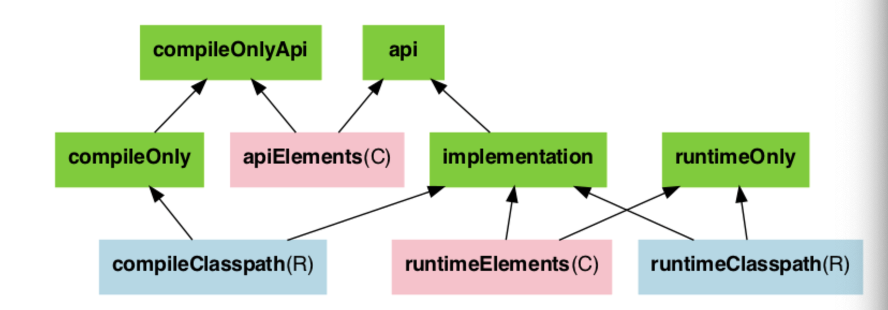

## Dependency Configuration

- 초록색은 사용자가 의존성 선언할 때 사용한다.
- 분홍색은 구성 요소가 라이브러리를 컴파일하거나 실행할 때 사용한다.
- 파란색은 구성 요소 자체 사용을 위해 구성 요소 내부에서 사용한다.

- 요소들
  - apiElements(분홍): 해당 라이브러리를 컴파일하는데 필요한 모든 요소를 검색할 때 사용한다.
  - runtimeElements(분홍): 해당 라이브러리를 실행하는 데 필요한 모든 요소를 검색할 때 사용한다.
  - compileClasspath(파랑): 컴파일 시점에 사용할 classpath
  - runtimeClasspath(파랑): 런타임 시점에 사용할 classpath
  - api: 컴파일, 런타임 시점에 사용자에게 의존성을 노출한다. 의조 라이브러리가 수정되면 해당 라이브러리를 의존하는 모든 모듈 재빌드.
  - implementation: 내부적으로만 사용되고 사용자에게 의존성 노출 X. 런타임에는 노출됨. 의존 라이브러리가 수정되면 본 모듈까지만 재빌드.
  - compileOnly: 컴파일 타임에만 필요한 라이브러리. 빌드 결과물에는 포함하지 않는다.
  - compileOnlyApi: 컴파일 타임에 필요한 라이브러리. CompileOnly와 동일하게 컴파일 시에만 빌드하고 결과물에서는 제외
  - runtimeOnly: 런타임 시점에만 필요한 라이브러리
  - annotationProcessor: annotation processor를 명시하기 위해 사용함

## api vs implementation
api: 의존 라이브러리 수정시 해당 모듈을 의존하고 있는 모듈들 또한 재빌드
- A(api) <- B <- C 일 때, C 에서 A 를 접근할 수 있음
- A 수정시 B 와 C 모두 재빌드
implementaion: 의존 라이브러리 수정시 본 모듈까지만 재빌드
- A(implementation) <- B <- C 일 때, C 에서 A 를 접근할 수 없음
- A 수정시 B 까지 재빌드

## Reference
- [Gradle의 라이브러리 의존성 옵션 정리](https://twinparadox.tistory.com/630)
- [api vs implementation](https://jongmin92.github.io/2019/05/09/Gradle/gradle-api-vs-implementation/)