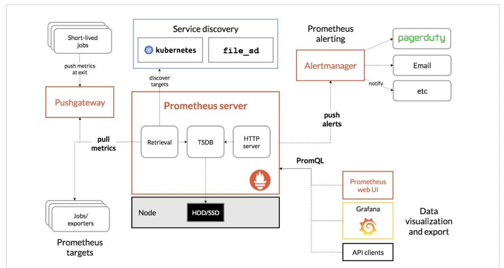
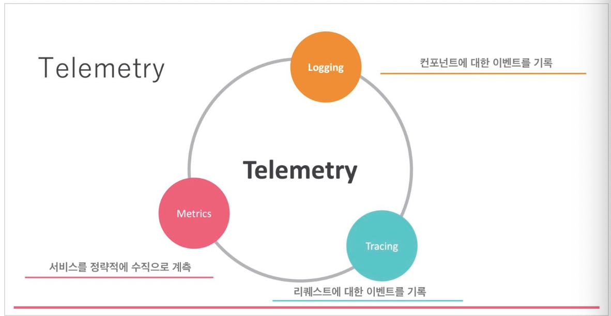

## Prometheus란?
- 시계열 DB를 채택하고 있다.
- Service Discovery 기능을 통해 자동 모니터링이 가능하다.
- PromQL이라는 전용 쿼리 언어를 사용해 간단하고 유연한 쿼리를 실행할 수 있다.
- Exporter를 통해 서버, 서비스를 모니터링 할 수 있다.
## Prometheus 아키텍처

- 구성
  - Prometheus Server(Prometheus 본체)
    - 모니터링 대상에서 Meterics을 수집하거나
    - 정기적으로 쿼리를 실행해 경고 여부를 확인한다
  - Service Discovery
    - 모니터링되는 정보를 자동으로 받아오는 구조
    - API를 주기적으로 호출하거나 인스턴스 정보를 주기적으로 받아옴
    - 덕분에 Prometheus 본체가 감시 대상을 설정하는 부분을 신경쓰지 않아도 됨 
  - Exporter라는 감시 에이전트
    - 모니터링 대상에서 Metrics를 수집하여 Prometheus 본체에 공개한다
    - 모니터링 대상과 Prometheus 사이에서 정보를 가공하는 역할
  - 경고의 기능을 잡는 Alert(경보)
    - 여러 Prometheus Server가 하나의 AlertManager를 사용할 수 있음
  - 그리고 쿼리의 언어인 PromQL
    - Prometheus Query Language
  - 시각화 기능인 Visualization
    - Prometheus Web UI
    - Grafana

## Observability란? (글쓴이가 생각하는 Observability란)
- Micro 서비스가 대세로 하나의 기능을 위해 여러 서버가 동작하게 되었다.
- 이러한 변화는 장애가 발생했을 때 원인을 특정하기 어렵게 만들었다.
- 복잡하게 얽혀있는 서버들의 관계를 한 눈에 파악할 수 있도록 만들자는 것이 Observability이다.
- 이때 Prometheus는 Observability를 달성하기 위해 사용될 수 있는 Tool이다.
- Service Discovery는 Kubernetes 환경에서 Observability를 달성하는데에 큰 역할을 한다.
  - 유동적으로 변화하는 서버들을 자동적으로 감시 대상에 넣었다가 빼주기 때문

- Observability를 위해서는 위 3가지를 모두 만족시켜야 한다.

## Reference
- [Prometheus의 특징과 아키텍처](https://www.devkuma.com/docs/prometheus/overview/)
- [Prometheus와 CNCF, Observability](https://www.devkuma.com/docs/prometheus/cncf-observability/)
- [Prometheus + Grafana + Docker Compose 설치](https://www.devkuma.com/docs/prometheus/docker-compose-install/)