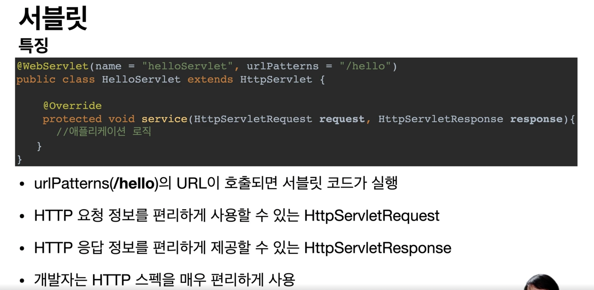

## 글 링크
- [스프링 MVC 1편 강의](https://www.inflearn.com/course/%EC%8A%A4%ED%94%84%EB%A7%81-mvc-1/)
## 내용 정리
### HTTP 통신 방식
1. 웹 브라우저가 HTTP 메시지를 생성하여 서버로 메시지를 보낸다.
2. 서버는 메시지를 처리하여 비즈니스 로직을 실행한다.
3. 서버는 응답 결과 메시지를 웹 브라우저로 보낸다

### HTTP 통신을 위해 서버가 해야할 일 
- TCP/IP 연결 대기, 소켓 연결
- HTTP 메시지 파징해서 읽기
  - 메서드, url, content-type, body 등등
- `비즈니스 로직 실행`
- HTTP 응답 메시지 생성
- TCP/IP에 응답 전달, 소켓 종료

### Servlet이란?

- 위에 작성된 HTTP 통신을 위한 일 중 `비즈니스 로직 실행`을 제외한 작업을 수행한다.
- urlPatterns의 url이 호출되면 HTTP요청/응답을 처리하는 작업을 수행해줌
- 동작 개요
  - WAS는 요청마다 Request, Response를 새로 만들어 서블릿 객체 호출
  - Request 객체에서 HTTP 요청 정보 사용
  - Response 객체에 응답 정보 입력
  - WAS는 Response 객체에 담겨있는 내용으로 HTTP 응답 정보를 생성

### Servlet Container란?
- 서블릿을 지원하는 WAS를 뜻함
  - 예: Tomcat
- 서블릿 컨테이너는 서브릴 객체의 생명주기를 관리함
- 서블릿 객체는 싱글톤으로 관리된다.
  - request/response 객체는 요청마다 다르기에 새로 생성되지만,
  - Servlet은 공통 작업이기에 싱글톤으로 관리됨 
  - 공유 변수 주의!
- 동시 요청을 위한 멀티 쓰레드 처리를 지원함