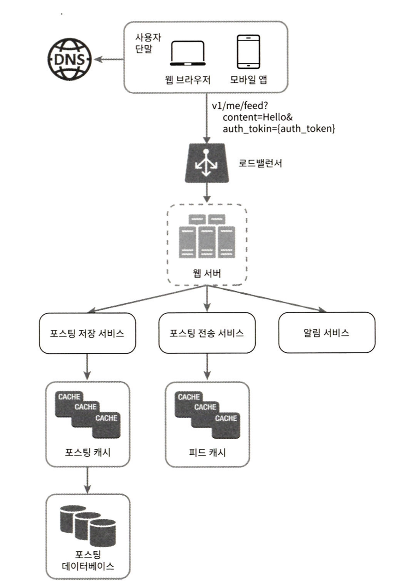
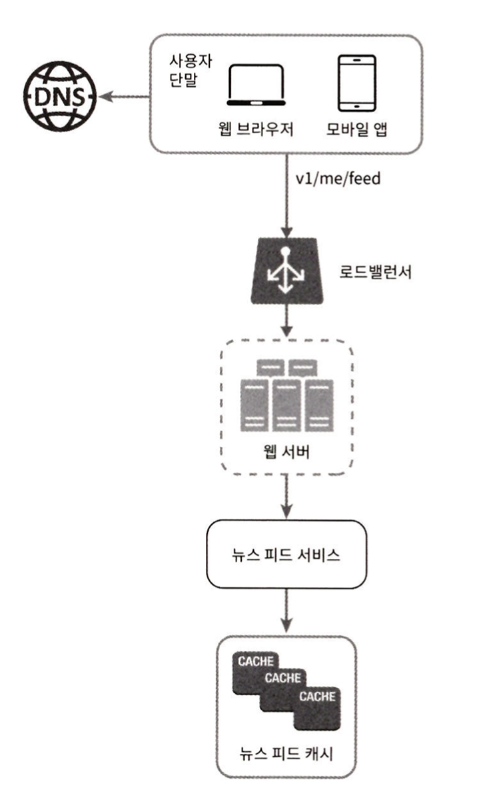

## 1. 뉴스 피드 시스템이란?
- 페이스북, 인스타그램, 트위터의 메인 페이지를 생각하면 될 것 같다.
- 지속적으로 업데이터되는 스토리, 사진, 영상이 올라오는 페이지를 뜻함

## 2. 설계 시 고민할 것들
- 지원 플랫폼: 모바일 앱 또는 웹 또는 둘 다
- 중요한 기능: 새로운 스토리가 올라갈 수 있어야 하고 / 친구들이 올리는 스토리를 볼 수 있어야 한다.
- 뉴스 피드 순서: 시간 흐름 역순 / 토픽 점수 기준 정렬 등
- 사용자의 최대 친구 수
- 트래픽 규모
- 피드에 올릴 수 있는 리소스 종류: 이미지, 비디오 등의 미디어 파일

## 3. 뉴스 피드 시스템 개략적인 설계도

### (1) 피드 발행
- 사용자가 스토리를 포스팅 -> 캐시, DB에 저장되고 친구들의 뉴스 피드에도 전송됨

#### 뉴스 피드 API
- 클라이언트가 서버와 통신하기 위해 사용하는 수단
- 기본적으로 POST, GET 메서드를 활용한 발행, 읽기 API가 필요하다.

#### 기본 구조

- 새 포스팅을 올리면 아래와 같은 작업들이 진행된다. 
  - 저장 서비스로 DB, 캐시에 데이터 저장 
  - 전송 서비스로 친구들의 뉴스 피드에 새 포스팅 push 
  - 알림 서비스로 친구들에게 새 포스팅 올라왔음을 알림

### (2) 뉴스 피드 생성

- 위 구조에서는 아래 핵심은 뉴스 피드 서비스와 뉴스 피드 캐시이다.
  - 뉴스 피드 캐시: 뉴스 피드를 렌더링할 때 필요한 피드 ID를 보관한다.
  - 뉴스 피드 서비스: 뉴스 피드 캐시를 활용해 뉴스 피드를 제공한다.

## 4. 상세 설계

- 웹 서버는 `인증`, `처리율 제한` 기능을 포함한다.
  - 또한 스팸이나 유해한 콘텐츠가 올라오는 것을 방지하는 기능도 고려할 수 있다.
- 포스팅 전송 서비스는 사용자의 포스팅을 친구 관계에 있는 사용자의 피드에 전달하는 역할을 한다.
  - 쓰기 시점 팬아웃: 신규 포스팅 기록 시점에 뉴스 피드를 갱신.
    - 실시간 갱신이 가능하며, 뉴스 피드를 읽는 시간이 적게 든다(이미 피드는 최신화 되어 있기 때문에)
    - 친구가 많은 사용자의 포스팅 시간이 오래 걸릴 수 있고(hotkey), 서비스를 자주 이용하지 않는 사용자의 피드에도 갱신된다.
  - 읽기 시점 팬아웃: 피드를 읽는 시점에 뉴스 피드를 갱신
    - 비활성화된 사용자가 많을 경우 불필요한 컴퓨팅 자원이 소모되지 않는다.
    - 친구의 수가 포스팅 속도에 영향을 주지 않는다.
    - 단, 뉴스 피드를 읽을 때 많은 시간이 소요된다.

### (1) 포스팅 전송 서비스 상세 설계
- 기본적으로 쓰기 시점 팬아웃을 사용하여 피드 읽기 속도를 빠르게 가져간다.
- 단, 팔로어가 아주 많은 사용자의 경우 읽기 시점 팬아웃을 적용해 시스템 과부하를 방지한다,
- 또한 안정 해시를 통해 요청과 데이터를 고르게 분산하여 hotkey문제를 해결한다.
#### 동작 순서
- DB에서 친구 ID 목록 select (Graph DB 추천)
- 사용자 정보 캐시에서 친구 정보 select / 사용자 설정에 따라 친구 filtering(피드 무시 설정)
- 친구 목록과 새 스토리 포스팅 ID를 메시지 Queue에 insert
- 팬아웃 작업 서버에서 메시지 큐 데이터 select
- 뉴스 피드 데이터를 뉴스 피드 캐시\<포스팅 ID, 사용자 ID>에 insert
  - 용량을 고려해 ID만을 캐시에 담는다
  - 뉴스 피드 캐시 구조가 정확히 이해가 안 감, 이렇게 되면 value로 key들을 검색해야 할텐데.
  - 사용자별 정렬 집합을 사용해도 될듯
  - key: 사용자 ID, values: 포스팅 ID들

### (2) 피드 읽기 상세 설계
- 사용자가 피드 읽기 API 요청을 보낸다
- 로드 밸런서가 요청을 웹 서버 중 한 곳으로 보낸다.
- 웹 서버는 뉴스 피드 서비스를 호출한다.
- 뉴스 피드 서비스는 뉴스 피드 캐시에서 포스팅 ID목록을 가져온다.
- 뉴스 피드에 표시할 사용자 이름, 사진, 콘텐츠 등을 캐시에서 가져와 완전한 뉴스 피드를 완성해 json 형태로 반환한다.

## 5. 추가로 고민하면 좋은 주제
- DB 규모 확장
  - 수직적 확장 vs 수평적 확장
  - SQL vs NoSQL
  - 주-부 다중화
  - 복제본 읽기 연산
  - 일관성 모델
  - DB 샤딩
- 웹 계층 무상태 운영 방법
- 데이터 캐시 전략
- 다중 데이터 센터 지원 전략
- 메시지큐 사용하여 결합도 낮추기
- 핵심 메트릭 모니터링