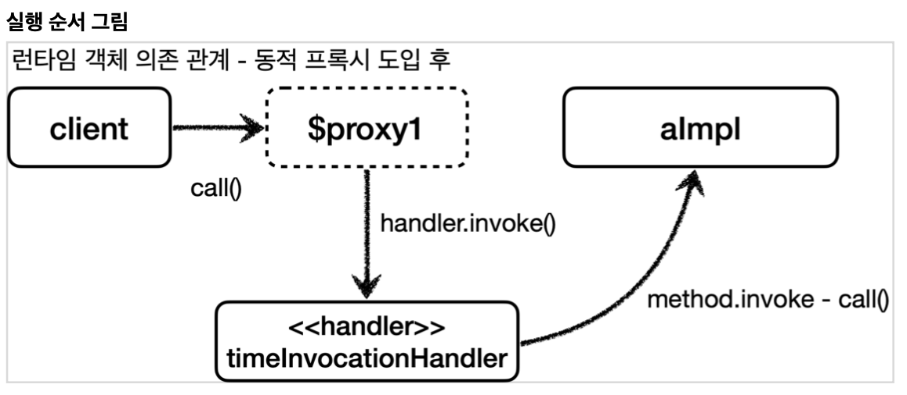
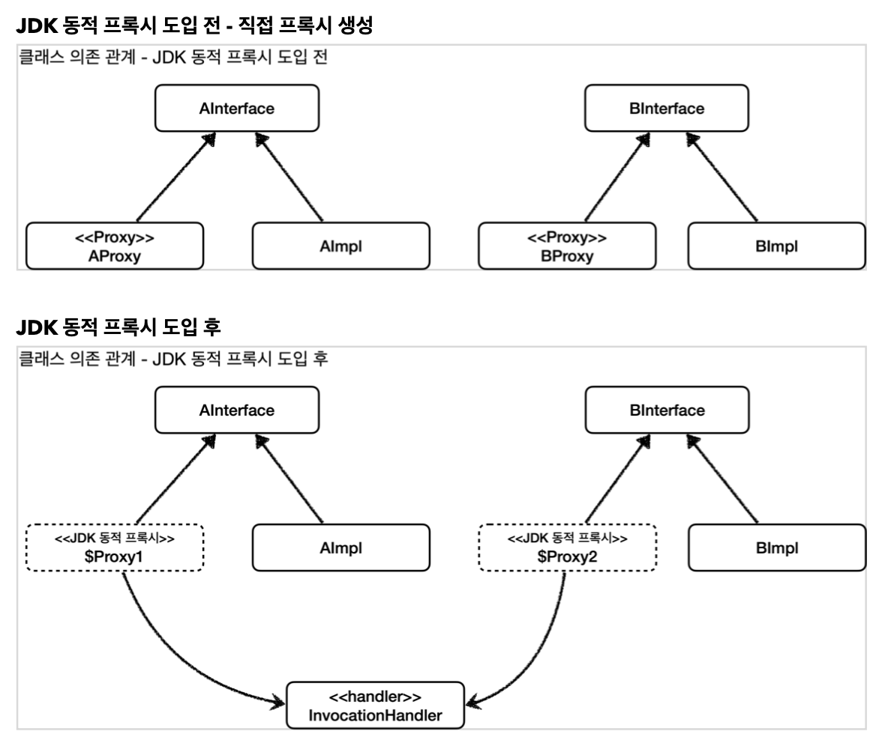
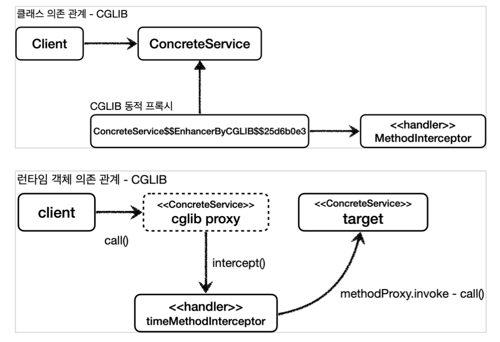

## 현재 문제점
- 대상 클래스 수 만큼 로그 추적을 위한 프록시 클래스를 만들어야 함
  - 같은 인터페이스를 구현하면서 실제 객체를 필드로 가진 클래스를 만들어야 했다.
- 하지만 프록시 클래스의 기본 코드 흐름은 거의 같고 적용 대상 정도만 차이가 있었다.

## 해결책
- JDK 동적 프록시 기술 / CGLIB 같은 프록시 생성 기술을 활용하면 프록시 객체를 계속 만들지 안하도 됨


## Java 리플렉션
```java
log.info("start");
String result = xxx(); //호출 대상이 다름, 동적 처리 필요
log.info("result={}", result);
```
- 공통 로직과 개별 메서드가 있다고 가정하자
- 이때 2번째 라인 즉, 매번 달라지는 부분을
- 클래스 / 메서드의 메타 정보를 사용해 동적으로 호출할 수 있는 기술이 리플렉션이다.


### 예시 1
```java
@Test
    void reflection1() throws Exception {
        // 클래스 정보 (해당 경로에 존재)
        Class classHello =
            Class.forName("hello.proxy.jdkdynamic.ReflectionTest$Hello");
            
        Hello target = new Hello(); 
        
        // callA 메서드 정보
        Method methodCallA = classHello.getMethod("callA");
        Object result1 = methodCallA.invoke(target);
        log.info("result1={}", result1);
        
        // callB 메서드 정보
        Method methodCallB = classHello.getMethod("callB");
        Object result2 = methodCallB.invoke(target); 
        log.info("result2={}", result2);
}
```
- 위와 같이 경로를 통해 Hello 클래스 메타 정보를 가져오고
- getMethod를 사용해 메서드의 메타정보를 가져올 수 있다.
  - target(Hello)의 callA / callB를 실행시킴
- 즉, 클래스나 메서드 정보를 동적으로 변경할 수 있다
  - callA() / callB()를 직접 호출하는 부분이 Method.invoke로 대체됨


### 예시 2
```java
@Test
void reflection2() throws Exception {
      Class classHello =
            Class.forName("hello.proxy.jdkdynamic.ReflectionTest$Hello");
  
  
      Hello target = new Hello();
      
      Method methodCallA = classHello.getMethod("callA");
      dynamicCall(methodCallA, target);
      
      Method methodCallB = classHello.getMethod("callB");
      dynamicCall(methodCallB, target);
}
  
private void dynamicCall(Method method, Object target) throws Exception {
      log.info("start");
      Object result = method.invoke(target);
      log.info("result={}", result);
}
```
- 리플렉션을 활용해 공통 로직과 개별 로직을 분리함
  - 개별 로직을 매개변수로 받는 메타정보와 적용 대상 객체르 대체

### 단점
- 리플렉션은 런타임에 동작하기에 컴파일 시점에 오류를 잡을 수 없다.


## JDK 동적 프록시
- 프록시 객체를 런타임에 만들어준다.
- 이 객체를 사용해 원하는 실행 로직을 지정하여 실행할 수 있음

### 예시
```java
// interface 
public interface AInterface {
    String call();
}

// 구현체
@Slf4j
public class AImpl implements AInterface {
    @Override
    public String call() {
        log.info("A 호출");
        return "a";
    }
}

// 공통 로직
@Slf4j
public class TimeInvocationHandler implements InvocationHandler {

    private final Object target;

    public TimeInvocationHandler(Object target) {
        this.target = target;
    }

    @Override
    public Object invoke(Object proxy, Method method, Object[] args) throws Throwable {
        log.info("TimeProxy 실행");
        long startTime = System.currentTimeMillis();

        Object result = method.invoke(target, args);

        long endTime = System.currentTimeMillis();
        long resultTime = endTime - startTime;
        log.info("TimeProxy 종료 resultTime={}", resultTime);
        return result;
    }
}

// 실행
@Test
void dynamicA() {
    AInterface target = new AImpl();
    TimeInvocationHandler handler = new TimeInvocationHandler(target);

    AInterface proxy = (AInterface) Proxy.newProxyInstance(AInterface.class.getClassLoader(), new Class[]{AInterface.class}, handler);

    proxy.call();
    log.info("targetClass={}", target.getClass());
    log.info("proxyClass={}", proxy.getClass());
}
```
- 이전 강의에서 프록시를 생성할 때
  - 인터페이스 - 구현체가 있을 떄 프록시 객체는 같은 인터페이스를 구현하면서 구현체를 필드로 가지고 있었다.
- 위 예시에서 `TimeInvocationHandler` 딱 프록시 객체이다.
- 마지막 테스트 예시를 확인하면
  - java.lang.reflect.Proxy를 활용하면 매개변수로 받은 인터페이스를 기반으로 동적 프록시를 생성한다.
  - 해당 객체를 실행하면 실제 객체와 똑같이 기능하지만
  - JDK 동적 프록시가 만든 프록시 객체이다.
  - 


### 정리

- AImpl에 대한 프록시를 만든 적 없다.
- 공통 로직을 가진 TimeInvocationHandler가 있고 적용하고 싶은 객체(AImpl)에 적용한 것 뿐이다.
  - TimeInvocationHandler와 AImpl은 같은 공통 interface를 구현하고 있지 않음
- 즉, JDK 동적 프록시를 이용하면 공통 로직을 구현한 클래스(TimeInvocationHandler와) 1개를 원하는 객체 N개에 적용할 수 있다. 
  - 공통 로직은 InvocationHandler를 구현한 클래스로 만들면 됨


## 남은 문제
- 이렇게 구현하면 구현체의 모든 메서드에 공통 로직이 적용된다.
- 원하는 메서드에만 공통 로직이 적용되게 하려면..?

### 예제
```java
public class LogTraceFilterHandler implements InvocationHandler {

    private final Object target;
    private final LogTrace logTrace;
    private final String[] patterns;

    public LogTraceFilterHandler(Object target, LogTrace logTrace, String[] patterns) {
        this.target = target;
        this.logTrace = logTrace;
        this.patterns = patterns;
    }

    @Override
    public Object invoke(Object proxy, Method method, Object[] args) throws Throwable {

        //메서드 이름 필터
        String methodName = method.getName();
        if (!PatternMatchUtils.simpleMatch(patterns, methodName)) {
            return method.invoke(target, args);
        }

        TraceStatus status = null;
        try {
            String message = method.getDeclaringClass().getSimpleName() + "." +
                    method.getName() + "()";
            status = logTrace.begin(message);

            //로직 호출
            Object result = method.invoke(target, args);
            logTrace.end(status);
            return result;
        } catch (Exception e) {
            logTrace.exception(status, e);
            throw e;
        }
    }
}
```
- invoke 메서드 구현부를 보면 스프링이 제공하는 PatternMatchUtils를 활용함
  - 공통 로직 적용 여부를 메서드 명으로 구분하게 됨


### JDK 동적 프록시의 한계
- 구현한 것들을 보면 알 수 있지만
- 인터페이스가 필수임.
  - 인터페이스 정보를 `Proxy.newProxyInstance()`에 넘겨줘야 함


## CGLIB
- 바이트코드를 조작해서 동적으로 클래스를 생성하는 기술
  - 인터페이스 필요 X
- 스프링 내부 소스코드에 포함되어 있음
- 실제로 CGLIB을 직접 사용하지는 않고 대개 ProxyFactory를 사용함

### 예제 - 프록시 객체
```java

@Slf4j
public class TimeMethodInterceptor implements MethodInterceptor {

    private final Object target;

    public TimeMethodInterceptor(Object target) {
        this.target = target;
    }

    @Override
    public Object intercept(Object obj, Method method, Object[] args, MethodProxy methodProxy) throws Throwable {
        log.info("TimeProxy 실행");
        long startTime = System.currentTimeMillis();

        Object result = methodProxy.invoke(target, args);

        long endTime = System.currentTimeMillis();
        long resultTime = endTime - startTime;
        log.info("TimeProxy 종료 resultTime={}", resultTime);
        return result;
    }
}
```
- object는 실행시킬 대상 객체
- MethodInterceptor를 구현하여 CGLIB 실행 로직을 정의할 수 있음
- 로직을 보면 method 대신 methodProxy를 사용했는데
  - 성능상 methodProxy 사용을 권장함

### 예제 - 인터페이스 없는 클래스에 적용 부분
```java
    @Test
    void cglib() {
        ConcreteService target = new ConcreteService();

        Enhancer enhancer = new Enhancer();
        enhancer.setSuperclass(ConcreteService.class);
        enhancer.setCallback(new TimeMethodInterceptor(target));
        ConcreteService proxy = (ConcreteService) enhancer.create();
        log.info("targetClass={}", target.getClass());
        log.info("proxyClass={}", proxy.getClass());

        proxy.call();
    }
```
- Enhancer를 사용해 프록시를 생성할 수 있다.
- setSuperClass: 상속을 통한 프록시 생성
- setCallback: 실행 로직 할상


### 정리

- 상속을 통한 프록시 객체 생성
- 상속에서 오는 단점들
  - 부모 클래스의 생성자를 체크해야 함.
    - 대상 객체에 기본 생성자가 필요하다.
  - 클래스에 final 키워드가 붙으면 상속이 불가능하다.
  - 메서드에 final 키워드가 붙으면 해당 메서드를 오버라이딩 할 수 없다.