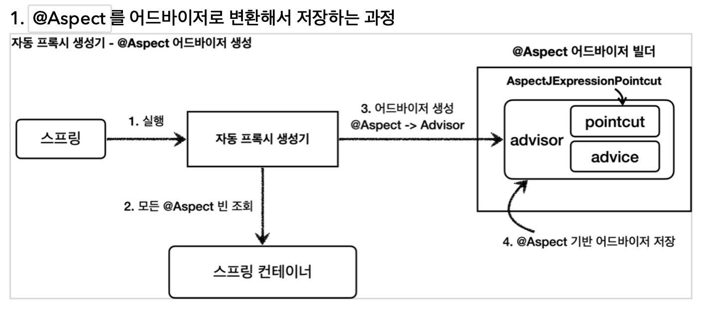
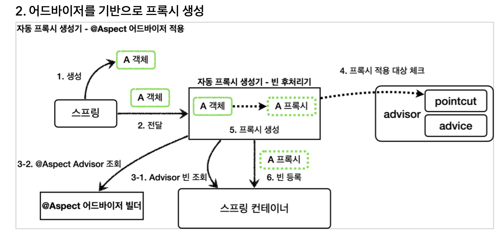
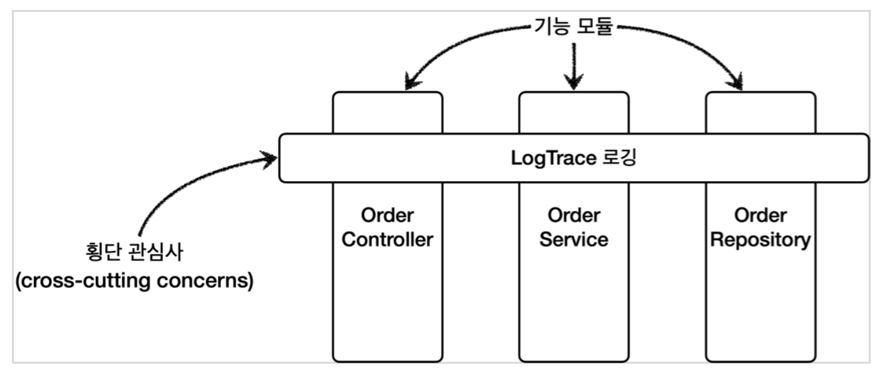

## Spring @Aspect 애노테이션
- 편리하게 Pointcut과 Advice로 구성된 Advisor를 생성해준다

### 원리
- spring-boot-starter-aop 적용 시 추가된 AnnotationAwareAspectJAutoProxyCreator가 @Aspect를 Advisor로 만들어준다
- 이렇게 만들어진 Advisor로도 Proxy객체를 생성하게 됨

1. App 실행
2. @Aspect 빈 조회
3. Advisor 생성: @Aspect 어드바이저 빌더를 통해
4. Advisor 저장: @Aspect 어드바이저 빌더 내부에



1. Bean 생성
2. 빈 후처리기에 Bean 전달
3. Advisor와 @Aspect 어드바이저 빌더 내부의 Advisor 조회
4. 프록시 적용 대상 체크
5. 프록시 생성
6. 빈 등록

### 예시
```java
@Aspect
public class LogTraceAspect {

    private final LogTrace logTrace;

    public LogTraceAspect(LogTrace logTrace) {
        this.logTrace = logTrace;
    }

    @Around("execution(* hello.proxy.app..*(..))")
    public Object execute(ProceedingJoinPoint joinPoint) throws Throwable {
        TraceStatus status = null;
        try {
            String message = joinPoint.getSignature().toShortString();
            status = logTrace.begin(message);

            //로직 호출
            Object result = joinPoint.proceed();

            logTrace.end(status);
            return result;
        } catch (Exception e) {
            logTrace.exception(status, e);
            throw e;
        }
    }
}

```
- `@Aspect`: 애노테이션 기반 프록시를 적용할 때 사용 / 애노테이션이 있어도 명시적으로 Bean 등록이 필요함
- `@Around`: 값 = pointcut / 메서드 = advice
- `ProceedingJoinPoint joinPoint`: advice의 MethodInvocation과 유사. 실제 호출 대상 / 인자 / 메타 정보 등을 가지고 있다.
- `proceed()`: 실제 Target 호출


## 정리

- 지금까지 다양한 방식으로 구현한 프록시 / 데코레이터 패턴을 알아봤다.
  - 프록시 패턴: 접근 제어가 목적
  - 데코레이터 패턴: 부가 기능 추가가 목적
- 결국 우리가 하고 싶은 것은 `여러 곳에서 사용되는 공통 로직을 한 곳으로 모으는 것!`
- 이러한 기능을 횡단 관심사라 부른다.